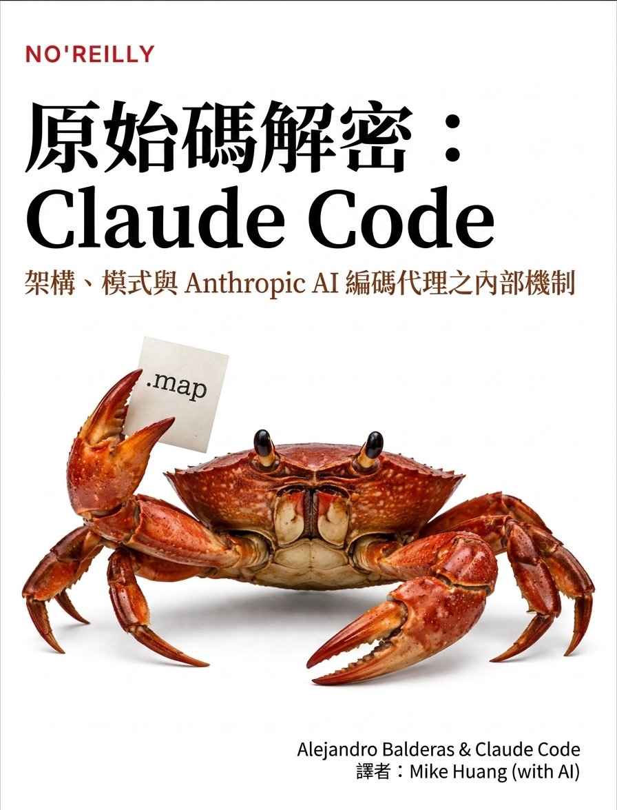

# Claude Code from Source

**Anthropic AI 编程代理的架构、模式与内部运作**

> [!NOTE]
> 本项目是 **Claude Code from Source** 的简体中文翻译版。
>
> - 原文：[alejandrobalderas/claude-code-from-source](https://github.com/alejandrobalderas/claude-code-from-source)（作者 [Alejandro Balderas](https://github.com/alejandrobalderas)）
> - 翻译底本：[wellwind/claude-code-from-source-zh-tw](https://github.com/wellwind/claude-code-from-source-zh-tw)（繁体中文版）
> - 本仓库在繁体中文版基础上进行简体中文本地化，包括术语统一（大陆技术写作规范）和语义意译。

  
    
  <a href="http://androidperformance.com/claude-code-from-source-zh-cn/"><strong>在线阅读：androidperformance.com/claude-code-from-source-zh-cn</strong></a>

---

> **本项目纯粹用于教育目的。** 不包含 Claude Code 的任何源码——一行都没有。所有代码块皆为原创伪代码，使用不同的变量名，用以说明架构模式。目标是帮助工程师理解生产环境的 AI 代理是如何构建的，而非复刻或分发专有软件。

---

当 Anthropic 将 Claude Code 发布到 npm 时，`.js.map` 源码映射（Source Map）中包含了 `sourcesContent` 字段，内含完整的原始 TypeScript 源码。本书即是研究该架构后的成果，将其中的模式、取舍与设计决策提炼为任何工程师都能学习的技术叙事。

**横跨 7 大篇章，共 18 个章节。** 印刷版约 400 页。

每个章节都具备分层深度：为技术领导者设计的叙事主线、为实现者准备的深入剖析段落，以及结尾的**「实践应用」**区块——从中提炼可迁移的模式，供你应用于自己的系统中。图表使用 [Mermaid](https://mermaid.js.org/) 绘制，可在 GitHub 上原生渲染。

---

## 本书适合谁

- **正在构建代理系统的资深工程师** —— 借鉴这些模式、理解其取舍、在你自己的技术栈中实现
- **评估架构的技术领导者** —— 跟着叙事走，不必逐行阅读每个代码块
- **任何好奇生产环境 AI 工具实际如何运作的人** —— 深入引擎盖下探究

---

## 目录

### 第一篇：基础
*在代理能思考之前，进程必须先存在。*

| # | 章节 | 你将学到 |
|---|------|----------|
| 1 | [AI 代理的架构](./book/ch01-architecture.md) | 六大关键抽象、数据流、权限系统、构建系统 |
| 2 | [启动引导——启动引导管道](./book/ch02-bootstrap.md) | 五阶段初始化、模块级 I/O 并行、信任边界 |
| 3 | [状态——双层架构](./book/ch03-state.md) | 启动引导单例、AppState 存储、黏性闩锁、成本追踪 |
| 4 | [与 Claude 对话——API 层](./book/ch04-api-layer.md) | 多供应商客户端、提示缓存、流、错误复原 |

### 第二篇：核心循环
*代理的心跳：流、行动、观察、重复。*

| # | 章节 | 你将学到 |
|---|------|----------|
| 5 | [代理循环](./book/ch05-agent-loop.md) | query.ts 深入剖析、四层压缩、错误复原、token 预算 |
| 6 | [工具——从定义到执行](./book/ch06-tools.md) | 工具接口、14 步管道、权限系统 |
| 7 | [并行工具执行](./book/ch07-concurrency.md) | 分割算法、流执行器、推测性执行 |

### 第三篇：多代理协作
*一个代理很强大。多个代理协同运作则能带来变革。*

| # | 章节 | 你将学到 |
|---|------|----------|
| 8 | [派生子代理](./book/ch08-sub-agents.md) | AgentTool、15 步 runAgent 生命周期、内置代理类型 |
| 9 | [分叉代理与提示缓存](./book/ch09-fork-agents.md) | 字节级相同前缀技巧、缓存共享、成本优化 |
| 10 | [任务、协调与群集](./book/ch10-coordination.md) | 任务状态机、协调者模式、群集消息传递 |

### 第四篇：持久化与智慧
*没有记忆的代理会永远犯同样的错误。*

| # | 章节 | 你将学到 |
|---|------|----------|
| 11 | [记忆——跨对话学习](./book/ch11-memory.md) | 基于文件的记忆、四类分类法、LLM 召回、过期处理 |
| 12 | [可扩展性——技能与钩子](./book/ch12-extensibility.md) | 两阶段技能加载、生命周期钩子、快照安全性 |

### 第五篇：接口
*用户看到的一切都通过这一层。*

| # | 章节 | 你将学到 |
|---|------|----------|
| 13 | [终端 UI](./book/ch13-terminal-ui.md) | 自定义 Ink 分支、渲染管道、双缓冲、对象池 |
| 14 | [输入与互动](./book/ch14-input-interaction.md) | 按键解析、键绑定、组合键支持、Vim 模式 |

### 第六篇：连接性
*代理的触及范围超越了 localhost。*

| # | 章节 | 你将学到 |
|---|------|----------|
| 15 | [MCP——通用工具协议](./book/ch15-mcp.md) | 八种传输方式、MCP OAuth、工具包装 |
| 16 | [远端控制与云端执行](./book/ch16-remote.md) | Bridge v1/v2、CCR、上游代理 |

### 第七篇：性能工程
*让一切快到人类察觉不到背后的机制。*

| # | 章节 | 你将学到 |
|---|------|----------|
| 17 | [性能——每一毫秒和每一个 Token 都重要](./book/ch17-performance.md) | 启动、上下文窗口、提示缓存、渲染、搜索 |
| 18 | [结语——我们学到了什么](./book/ch18-epilogue.md) | 五个架构赌注、可转移的知识、代理的未来方向 |

---

## 让它运作的 10 个模式

如果你只读一个段落：

1. **AsyncGenerator 作为代理循环** —— 产出 Messages、带类型的 Terminal 返回值、自然的背压与取消机制
2. **推测性工具执行** —— 在模型流式传输期间就启动只读工具，无需等待响应完成
3. **并行安全的批次处理** —— 按安全性分区工具，读取并行执行，写入串行化
4. **分叉代理实现缓存共享** —— 并行子代理共享字节级相同的提示前缀，节省约 95% 的输入 token
5. **四层上下文压缩** —— 裁剪、微压缩、折叠、自动压缩——每一层都比上一层更轻量
6. **文件式记忆搭配 LLM 召回** —— Sonnet 侧查询选择相关记忆，而非关键字匹配
7. **两阶段技能加载** —— 启动时仅加载前置数据，调用时才加载完整内容
8. **黏性闩锁确保缓存稳定性** —— 一旦发送 beta 请求头，就不再于会话中途取消
9. **槽位保留** —— 默认 8K 输出上限，命中时升级到 64K（在 99% 的请求中节省上下文）
10. **钩子设置快照** —— 启动时冻结，防止运行时注入攻击

---

## 本书的制作方式

源码从 npm 源码映射中提取。36 个 AI 代理分四个阶段分析了近两千个 TypeScript 文件：

1. **探索**：6 个并行代理读取了源码树中的每一个文件
2. **分析**：12 个代理编写了 494KB 的原始技术文件
3. **写作**：15 个代理从零开始将所有内容重写为叙事章节
4. **审阅与修订**：3 位编辑审阅者给出 900 行反馈；3 个修订代理应用了所有修正

整个过程——从源码提取到最终修订完成——大约耗时 6 小时。

---

## 免责声明

**本仓库不包含 Claude Code 的任何源码。** 所有代码块皆为原创伪代码，使用不同的变量名，用以说明架构模式。不包含任何专有提示文本、内部常量或精确的函数实现。本项目纯粹出于教育目的——帮助工程师理解生产级 AI 编程代理背后的设计模式。

「NO'REILLY」封面仅为戏仿/迷因，用于说明目的。本项目与 O'Reilly Media 无任何关联。那只螃蟹就只是一只螃蟹。

这是一份独立分析。Claude Code 是 Anthropic 的产品。本书与 Anthropic 无关联、未获其背书、亦未受其赞助。
