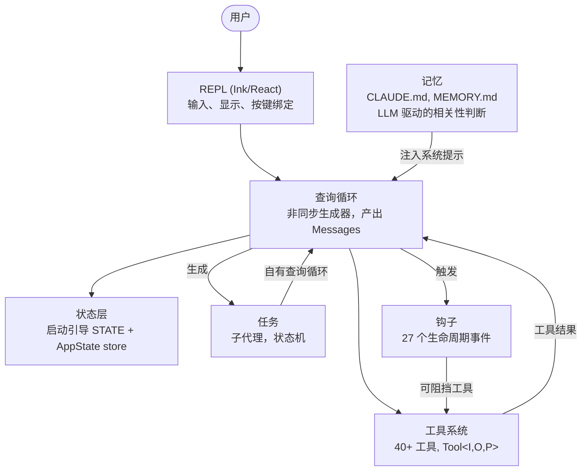
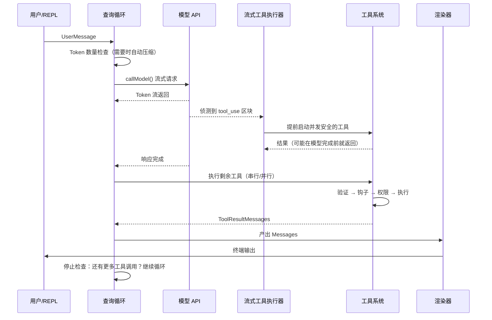
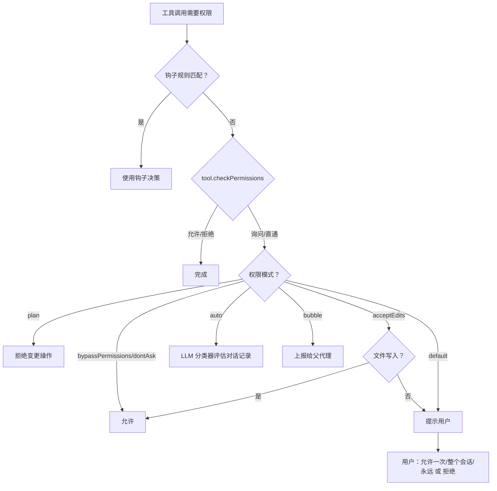
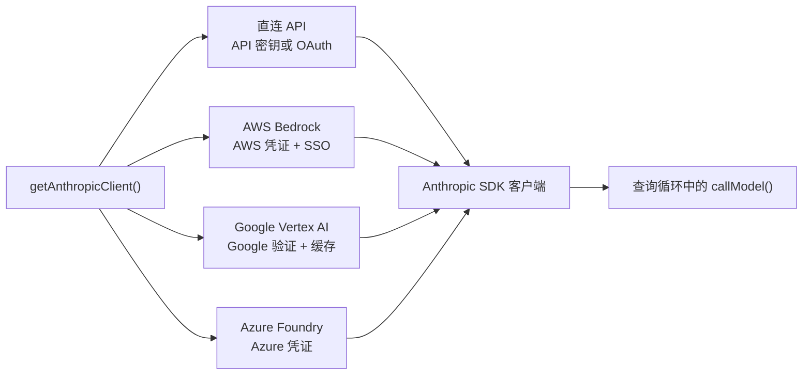
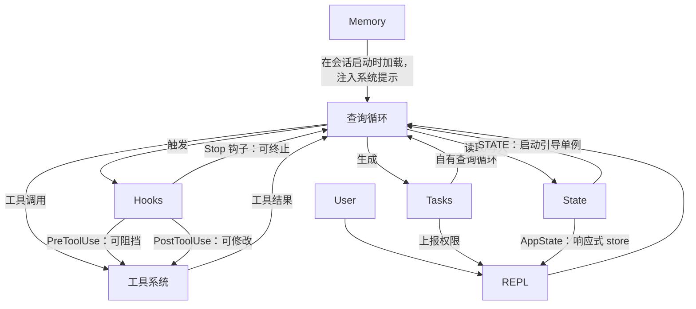

# 第一章：AI 代理的架构

## 你正在看的是什么

传统的 CLI 是一个函数。它接收参数、执行工作、然后结束。`grep` 不会自行决定顺便执行 `sed`。`curl` 不会打开一个文件然后根据下载的内容去修补它。契约很简单：一个命令、一个动作、确定性的输出。

代理式 CLI 打破了这个契约的每一个部分。它接收自然语言提示，决定要使用什么工具，以情况所需的任何顺序执行它们，评估结果，然后持续循环直到任务完成或用户停止它。这个「程序」不是一个固定的指令序列——它是一个围绕语言模型的循环，在运行时动态产生自己的指令序列。工具调用是副作用，模型的推理就是控制流程。

Claude Code 是 Anthropic 对这个理念的生产级实现：一个近两千个文件的 TypeScript 单体应用，将终端转变为由 Claude 驱动的完整开发环境。它已交付给数十万名开发者，这意味着每一个架构决策都承载着真实世界的后果。本章给你建立心智模型。六个抽象定义了整个系统。一条数据流将它们串联起来。一旦你内化了从按键到最终输出的黄金路径，后续每一章都是对这条路径某个区段的放大。

接下来的内容是一种回顾式的分解——这六个抽象并非事先在白板上设计出来的。它们是在将生产级代理交付给大量用户的压力下逐渐浮现的。以它们现在的样貌来理解它们，而非以它们被规划时的样貌，这为本书其余部分设置了正确的期望。

---

## 六大核心抽象

Claude Code 建立在六个核心抽象之上。其他所有东西——400 多个工具文件、分叉的终端渲染器、vim 模拟、成本追踪器——都是为了支撑这六个而存在。



以下是每一个抽象的功能与存在的理由。

**1. 查询循环**（`query.ts`，约 1,700 行）。一个异步生成器（async generator），是整个系统的心跳。它流模型响应、收集工具调用、执行它们、将结果附加到消息历史，然后循环。每一个互动——REPL、SDK、子代理（Sub-Agent）、无头模式的 `--print`——都流经这个单一函数。它产出（yield）`Message` 对象供 UI 消费。它的返回类型是一个称为 `Terminal` 的判别联合（discriminated union），精确编码了循环停止的原因：正常完成、用户中断、token 预算耗尽、停止钩子介入、最大回合数，或不可恢复的错误。生成器模式——而非回调或事件发射器——提供了自然的背压（backpressure）、干净的取消，以及带类型的终止状态。第五章完整涵盖循环的内部机制。

**2. 工具系统**（`Tool.ts`、`tools.ts`、`services/tools/`）。工具（Tool）是代理在世界中能做的任何事：读取文件、执行 shell 命令、编辑代码、搜索网络。这份简洁的目的背后隐藏着大量机制。每个工具实现了一个丰富的接口，涵盖身份、schema、执行、权限与渲染。工具不只是函数——它们携带自己的权限逻辑、并发声明、进度报告和 UI 渲染。系统将工具调用分割为并行和串行批次，而流执行器在模型尚未完成响应时就开始启动并发安全的工具。第六章涵盖完整的工具接口和执行管道（Pipeline）。

**3. 任务（Tasks）**（`Task.ts`、`tasks/`）。任务是后台任务单元——主要是子代理（Sub-Agent）。它们遵循一个状态机：`pending -> running -> completed | failed | killed`。`AgentTool` 创建一个新的 `query()` 生成器，带有自己的消息历史、工具集和权限模式。任务赋予 Claude Code 递归能力：一个代理可以委派给子代理，子代理又可以进一步委派。

**4. 状态（State）**（两层）。系统在两个层级维护状态。一个可变的单例（`STATE`）持有约 80 个字段的会话级基础设施：工作目录、模型设置、成本追踪、遥测计数器、会话 ID。它在启动时设置一次，之后直接修改——没有响应性。一个极简的响应式 store（34 行，Zustand 风格）驱动 UI：消息、输入模式、工具审批、进度指示。这种分离是刻意的：基础设施状态很少变动，不需要触发重新渲染；UI 状态持续变动，且必须触发。第三章深入涵盖两层式架构。

**5. 记忆（Memory）**（`memdir/`）。代理跨会话的持久化上下文。三个层级：项目级（仓库中的 `CLAUDE.md` 文件）、用户级（`~/.claude/MEMORY.md`）、以及团队级（通过符号链接共享）。在会话启动时，系统扫描所有记忆文件、解析 frontmatter，然后由 LLM 选择哪些记忆与当前对话相关。记忆是 Claude Code「记住」你的代码库惯例、架构决策和调试历史的方式。

**6. 钩子（Hooks）**（`hooks/`、`utils/hooks/`）。用户定义的生命周期拦截器，在 4 种执行类型中的 27 个不同事件上触发：shell 命令、单次 LLM 提示、多轮代理对话，以及 HTTP webhook。钩子可以阻止工具执行、修改输入、注入额外上下文，或短路整个查询循环。权限系统本身部分通过钩子实现——`PreToolUse` 钩子可以在交互式权限提示触发之前就拒绝工具调用。

---

## 黄金路径：从按键到输出

追踪一个请求穿过系统的过程。用户输入「为登录函数加上错误处理」然后按下 Enter。



关于这个流程，有三件事值得注意。

第一，查询循环是一个生成器，不是回调链。REPL 通过 `for await` 从中拉取消息，这意味着背压是自然的——如果 UI 跟不上，生成器就暂停。这是刻意选择了生成器而非事件发射器或可观察流。

第二，工具执行与模型流重叠。`StreamingToolExecutor` 不会等待模型完成才开始启动并发安全的工具。一个 `Read` 调用可以在模型仍在产生其余响应时就完成并返回结果。这是推测性执行——如果模型的最终输出使该工具调用无效（罕见但可能），结果会被丢弃。

第三，整个循环是可重入的。当模型发出工具调用时，结果被附加到消息历史，而循环用更新后的上下文再次调用模型。没有独立的「工具结果处理」阶段——全都在一个循环里。模型通过不再发出任何工具调用来决定何时完成。

---

## 权限系统

Claude Code 在你的机器上执行任意 shell 命令。它编辑你的文件。它可以产生子进程、发出网络请求、修改你的 git 历史。没有权限系统的话，这就是一场安全灾难。

系统定义了七种权限模式，从最宽松到最严格排列：

| 模式 | 行为 |
|------|------|
| `bypassPermissions` | 一切允许。不检查。仅内部/测试用。 |
| `dontAsk` | 全部允许，但仍记录。不提示用户。 |
| `auto` | 对话分类器（LLM）决定允许/拒绝。 |
| `acceptEdits` | 文件编辑自动批准；其他所有变更操作需提示。 |
| `default` | 标准互动模式。用户逐一批准每个操作。 |
| `plan` | 只读。所有变更操作被阻止。 |
| `bubble` | 将决策上报给父代理（子代理模式）。 |

当工具调用需要权限时，解析遵循一个严格的链路：



`auto` 模式值得特别关注。它执行一个独立的、轻量的 LLM 调用，将工具调用与对话记录进行分类。分类器看到工具输入的精简表示，然后决定该操作是否与用户的要求一致。这就是让 Claude Code 能半自主工作的模式——批准例行操作，同时标记任何看起来偏离用户意图的行为。

子代理默认为 `bubble` 模式，这意味着它们无法自行批准自己的危险操作。权限请求向上传播到父代理或最终到用户。这防止了子代理静默执行用户从未见过的破坏性命令。

---

## 多供应商架构

Claude Code 通过四条不同的基础设施路径与 Claude 通信，对系统其余部分完全透明。



关键洞见是 Anthropic SDK 为每个云端供应商提供了包装类，它们呈现与直连 API 客户端相同的接口。`getAnthropicClient()` 工厂函数读取环境变量和设置，以判定使用哪个供应商、构建适当的客户端、然后返回。从那一刻起，`callModel()` 和所有其他消费者都将其视为一个通用的 Anthropic 客户端。

供应商选择在启动时确定并存储在 `STATE` 中。查询循环从不检查哪个供应商处于活动状态。这意味着从直连 API 切换到 Bedrock 是一个设置变更，而非代码变更——代理循环（Agent Loop）、工具系统和权限模型完全与供应商无关。

---

## 构建系统

Claude Code 同时作为 Anthropic 内部工具和公开 npm 包发布。同一份代码库服务两者，通过编译时的功能标志控制哪些内容被包含。

```typescript
// 由功能标志守卫的条件导入
const reactiveCompact = feature('REACTIVE_COMPACT')
  ? require('./services/compact/reactiveCompact.js')
  : null
```

`feature()` 函数来自 `bun:bundle`，Bun 的内置打包器 API。在构建时，每个功能标志解析为一个布尔字面值。打包器的死码消除随后在标志为 false 时完全移除 `require()` 调用——模块永远不会被加载、不会被包含在包中、也不会被发布。

此模式是一致的：一个顶层的 `feature()` 守卫包裹一个 `require()` 调用。使用 `require()` 而非 `import` 是刻意的，因为动态 `require()` 在守卫为 false 时可以被打包器完全消除，而动态 `import()` 则不行（它返回一个 Promise，打包器必须保留）。

这里有一个值得一提的讽刺。早期 npm 发布版本附带的源码映射（Source Map）包含了 `sourcesContent`——完整的原始 TypeScript 源码，包括仅供内部使用的代码路径。功能标志成功地移除了运行时代码，却在映射文件中留下了源码。这就是 Claude Code 源码变得公开可读的原因。

---

## 各组件如何串联

六个抽象形成一个依赖图：



记忆作为系统提示的一部分注入查询循环。查询循环驱动工具执行。工具结果作为消息反馈到查询循环。任务是带有隔离消息历史的递归查询循环。钩子在定义的时间点拦截查询循环。状态被所有组件读写，响应式 store 则桥接到 UI。

查询循环与工具系统之间的循环依赖是系统的决定性特征。模型产生工具调用。工具执行并产生结果。结果被附加到消息历史。模型看到结果并决定下一步做什么。这个循环持续进行，直到模型停止产生工具调用，或外部约束（token 预算、最大回合数、用户中断）终止它。

以下是它们如何与后续章节串联：从输入到输出的黄金路径是贯穿整本书的主线。第二章追踪系统如何启动引导到这条路径可以执行的状态。第三章解释这条路径读写的两层式状态架构。第四章涵盖查询循环调用的 API 层。后续每一章都放大你刚才端到端看过的路径的某个区段。

---

## 实践应用

如果你正在构建代理式系统——任何由 LLM 在运行时决定采取什么行动的系统——以下是 Claude Code 架构中可迁移的模式。

**生成器循环模式。** 使用异步生成器作为你的代理循环，而非回调或事件发射器。生成器提供自然的背压（消费者按自己的节奏拉取）、干净的取消（对生成器调用 `.return()`），以及带类型的终止状态返回值。它解决的问题：在基于回调的代理循环中，很难知道循环何时「完成」以及为什么完成。生成器让终止成为类型系统的一等公民。

**自描述工具接口。** 每个工具应该声明自己的并发安全性、权限需求和渲染行为。不要将这些逻辑放在一个「了解」每个工具的中央协调器中。它解决的问题：中央协调器会变成一个上帝对象，每次新增工具都必须更新。自描述工具线性扩展——新增第 N+1 个工具不需要修改任何现有代码。

**将基础设施状态与响应式状态分离。** 并非所有状态都需要触发 UI 更新。会话设置、成本追踪和遥测属于一个普通的可变对象。消息历史、进度指示器和审批队列属于响应式 store。它解决的问题：让所有东西都变成响应式，会为那些在启动时设置一次、之后读取一千次的状态增加订阅开销和复杂性。两个层级对应两种访问模式。

**权限模式，而非权限检查。** 定义一小组命名的模式（plan、default、auto、bypass），并通过模式来解析每一个权限决策。不要在工具实现中分散 `if (isAllowed)` 检查。它解决的问题：不一致的权限执行。当每个工具都经过相同的基于模式的解析链时，你可以仅通过知道哪个模式处于活动状态就推理出系统的安全态势。

**通过任务实现递归代理架构。** 子代理应该是同一个代理循环的新实例，带有自己的消息历史，而非特殊处理的代码路径。权限提升通过 `bubble` 模式向上流动。它解决的问题：子代理逻辑与主代理循环分歧，导致行为和错误处理中的微妙差异。如果子代理是同一个循环，它就继承所有相同的保证。
