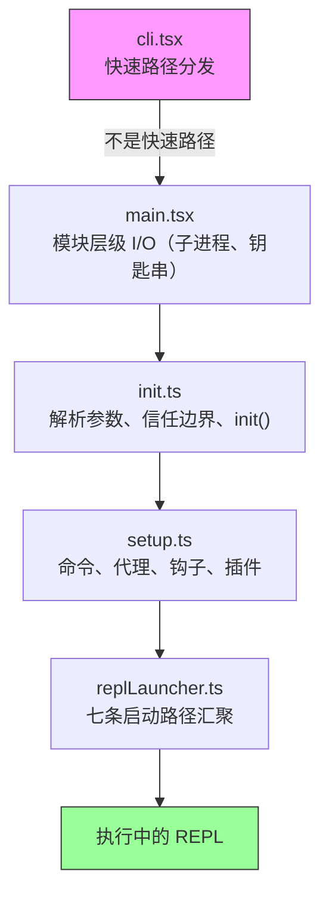
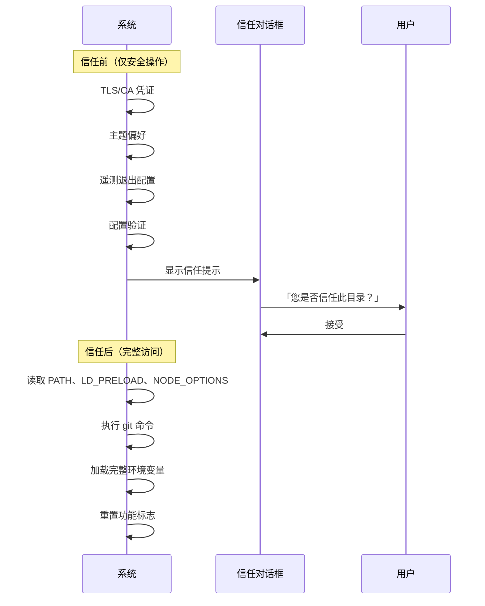

# 第二章：启动引导 —— 启动引导管道

如果第一章给了你 Claude Code 架构的地图，这一章则给你它抵达工作状态的路线。六大抽象层中的每个组件 —— 查询循环、工具系统、状态层、钩子（Hooks）、记忆 —— 都必须在用户看到游标之前完成初始化。所有这些的时间预算：300 毫秒。

三百毫秒是人类感知工具为「即时」的阈值。超过它，CLI 就会感觉迟钝。超出太多，开发者就会停止使用。本章中的一切都是为了不超过这条线。

启动引导（Bootstrap）必须完成四件事：验证环境、建立安全边界、配置通信层，以及渲染 UI。这四件事都必须在 300 毫秒内完成。架构上的洞见是，这四项工作可以部分重叠、精心排序，并积极剪裁，以便塞进对于如此复杂的系统而言看似不可能的预算里。

关于方法论的说明：本章中的时间戳是近似值，来自代码库自身的性能分析检查点。它们代表在现代硬件上典型的暖启动时序。冷启动会更慢。绝对数值的重要性不如相对结构：哪些操作重叠、哪些阻塞、哪些被延后。

---

## 管道的形状

启动管道存在于五个文件中，依次执行。每个文件缩小系统接下来需要做的事情的范围：



每个文件只做最少的必要工作，然后将控制权交给下一个。`cli.tsx` 试图在导入任何重量级模块之前就退出。`main.tsx` 在模块求值期间以副作用的方式触发慢速操作。`init.ts` 解析配置并建立信任边界。`setup.ts` 注册各项能力。`replLauncher.ts` 选择正确的入口点并启动 UI。

三种并行策略使其快速：

1. **模块级子进程分发。** 在*模块求值期间*以副作用的方式触发钥匙串和 MDM 读取。这些子进程在剩余约 135 毫秒的静态导入加载期间并行运行。
2. **设置阶段的 Promise 并行化。** Socket 绑定、钩子快照、命令加载和代理定义加载全都并行执行。
3. **渲染后延迟预取。** 用户在输入第一条消息之前不需要的所有东西 —— git 状态、模型能力、AWS 凭据 —— 都在提示符可见之后才执行。

第四种策略较不明显但同样重要：**动态导入以延迟模块求值**。代码库在至少十几个地方使用 `await import('./module.js')` 来避免在需要之前加载代码。OpenTelemetry（400KB + 700KB gRPC）只在遥测初始化时加载。React 组件只在渲染时加载。每个动态导入以冷路径延迟（首次使用时触发模块求值）换取热路径速度（启动时不需要为可能永远用不到的模块付出代价）。

---

## 阶段 0：快速路径分发（cli.tsx）

程序进入的第一个文件 `cli.tsx` 只有一个任务：判断是否真的需要完整的启动引导管道。许多调用方式 —— `claude --version`、`claude --help`、`claude mcp list` —— 只需要一个特定的回答，别无其他。加载 React、初始化遥测、读取钥匙串和设置工具系统都是纯粹的浪费。

模式是：检查 `argv`，动态导入你需要的处理器，然后在系统其余部分加载之前退出。

```typescript
// 快速路径模式的伪代码
if (args.length === 1 && args[0] === '--version') {
  const { printVersion } = await import('./commands/version.js')
  await printVersion()
  process.exit(0)
}
```

大约有十几条快速路径涵盖版本、帮助、配置、MCP 服务器管理和更新检查。具体细节不重要 —— 重要的是模式。每条路径动态导入恰好一个模块，调用一个函数，然后退出。代码库的其余部分永远不会加载。

这是启动引导中反复出现的一个原则的首次体现：**通过更了解意图来减少工作**。argv 数组揭示了用户的意图。如果意图是狭窄的，执行路径也应该是狭窄的。

如果没有匹配任何快速路径，`cli.tsx` 会直接进入完整的 `main.tsx` 导入，真正的启动开始。

---

## 阶段 1：模块级 I/O（main.tsx）

当 `main.tsx` 被导入时，它的模块级副作用在求值期间触发 —— 在文件中的任何函数被调用之前。这是整个启动引导中最关键的性能技巧：

```typescript
// 这些在导入时执行，而非在调用时执行
const mdmPromise = startMDMSubprocess()
const keychainPromise = readKeychainCredentials()
```

当 JavaScript 引擎求值 `main.tsx` 及其传递性导入的其余部分（约 138 毫秒的模块求值）时，这两个 Promise 已经在执行中了。MDM（移动设备管理）子进程检查组织的安全策略。钥匙串读取提取已存储的凭据。两者都是 I/O 密集型操作，否则会在关键路径上序列化。

洞见是：模块求值不是闲置时间 —— 它是你可以与 I/O 重叠的时间。当 `main.tsx` 的导出函数首次被调用时，这些 Promise 通常已经解析完成了。

这项技巧需要在相关文件中抑制 ESLint 的 top-level-await 和 side-effect-in-module-scope 规则。代码库有一条专门针对 `process.env` 访问模式的自定义 ESLint 规则，允许在模块范围内进行受控的副作用，同时防止其他地方出现不受控的副作用。

---

## 阶段 2：解析与信任（init.ts）

`init()` 函数是记忆化（memoized）的 —— 多次调用是安全的，且返回相同的结果。这很重要，因为多个入口点（REPL、打印模式、SDK 模式）可能各自调用 `init()`，而记忆化保证它只执行一次。

此函数通过 Commander 解析命令行参数，从多个来源（全局设置、项目设置、环境变量）加载配置，然后到达管道中最重要的边界。

### 信任边界

在信任边界之前，系统以受限模式运行。通过之后，完整能力可用。这个边界存在的原因是 Claude Code 会读取环境变量 —— 而环境变量可以被污染。



信任边界不是关于用户信任 Claude Code。而是关于 Claude Code 信任*环境*。恶意的 `.bashrc` 可以设置 `LD_PRELOAD` 将代码注入到每个子进程中。信任对话框确保用户明确同意在一个可能由他人配置的目录中操作。

系统有十个不同的信任敏感操作。在用户接受信任对话框之前，只有安全操作会执行：TLS 凭据配置、主题偏好、遥测退出。信任之后，系统读取可能危险的环境变量（PATH、LD_PRELOAD、NODE_OPTIONS），执行 git 命令，并应用完整的环境配置。

### preAction 钩子

Commander 的 `preAction` 钩子是架构的关键枢纽。Commander 解析命令结构（标志、子命令、位置参数）*而不*执行任何东西。`preAction` 钩子在解析之后、匹配的命令处理器执行之前触发：

```typescript
program.hook('preAction', async (thisCommand) => {
  await init(thisCommand)
})
```

这种分离意味着快速路径命令（在 Commander 加载之前在 `cli.tsx` 中处理的命令）永远不需要付出 `init()` 的代价。只有需要完整环境的命令才会触发初始化。

---

## 阶段 3：设置（setup.ts）

`init()` 完成后，`setup()` 注册系统所需的所有能力：

```mermaid
gantt
    title 阶段 3：并行配置
    dateFormat X
    axisFormat %Lms

    section 顺序
    命令注册   :0, 5
    section 并行
    代理定义      :5, 15
    钩子注册      :5, 12
    插件初始化  :5, 20
    MCP 服务器连接 :5, 25
```



命令、代理、钩子和插件在可能的范围内全部并行注册。设置阶段是系统从「我知道我的配置」转变为「我拥有所有能力」的地方。设置完成后，每个工具都已注册，每个钩子都已连接，系统准备好处理用户输入。

设置阶段也处理安全钩子快照。钩子配置从磁盘读取一次，冻结为不可变的快照，并在整个会话中使用。之后对磁盘上钩子配置文件的修改会被忽略。这防止攻击者在会话开始后修改钩子规则 —— 冻结的快照是权限决策的唯一真实来源。

---

## 阶段 4：启动（replLauncher.ts）

七条不同的代码路径汇聚在 `replLauncher.ts`：交互式 REPL、打印模式（`--print`）、SDK 模式、恢复（`--resume`）、继续（`--continue`）、管道模式和无头模式。启动器检查 `init()` 产生的配置，并分发到正确的入口点。

两个示例展示了这个范围：

**交互式 REPL** —— 标准情况。启动器挂载 React/Ink 组件树、启动终端渲染器，并进入事件循环。用户看到提示符，可以开始输入。

**打印模式**（`--print`）—— 从 argv 取得的单一提示。启动器建立一个没有 React 树的无头查询循环，执行到完成，将输出流到 stdout，然后退出。相同的代理循环，不同的呈现方式。

重要的细节：所有七条路径最终都调用 `query()` —— 第一章中相同的代理循环。启动路径决定循环*如何*呈现（交互式终端、单次执行、SDK 协议），而非它*做什么*。这种汇聚使架构可测试且可预测：无论用户如何调用 Claude Code，核心行为都是相同的。

---

## 启动时间线

以下是完整管道在时间上的样貌：

```mermaid
gantt
    title 启动引导时间线（约 240ms）
    dateFormat X
    axisFormat %Lms

    section 阶段 0
    快速路径检查          :0, 5

    section 阶段 1
    模块求值        :5, 143
    MDM 子进程（并行） :8, 60
    钥匙串读取（并行）  :8, 50

    section 阶段 2
    Commander 解析          :143, 146
    init()                   :146, 160
    信任边界           :160, 175

    section 阶段 3
    setup() + 并行注册 :175, 210

    section 阶段 4
    启动路径选择    :210, 215
    首次渲染             :215, 240
```



关键路径贯穿模块求值（整个最长的单一阶段，约 138 毫秒），然后是 Commander 解析、init 和 setup。并行 I/O 操作（MDM、钥匙串）与模块求值重叠，通常在被需要之前就已解析完成。

### 性能预算

| 阶段 | 时间 | 做了什么 |
|-------|------|-------------|
| 快速路径检查 | 约 5ms | 检查 argv，可能的话提早退出 |
| 模块求值 | 约 138ms | 导入树，触发并行 I/O |
| Commander 解析 | 约 3ms | 解析标志和子命令 |
| init() | 约 14ms | 配置解析、信任边界 |
| setup() | 约 35ms | 命令、代理、钩子、插件 |
| 启动 + 首次渲染 | 约 25ms | 选择路径、挂载 React、首次绘制 |
| **总计** | **约 240ms** | 在 300ms 预算之内 |

在现代机器上总计约 240 毫秒 —— 在 300 毫秒预算下有 60 毫秒的余裕。冷启动（重开机后首次执行、OS 缓存为空）可能将模块求值推到 200 毫秒以上，使总计更接近上限。

---

## 迁移系统

简要说明一个在 init 期间执行的子系统：Schema 迁移。Claude Code 将配置和会话数据存储在本地文件和目录中。当格式在版本之间变更时，迁移会在启动时自动执行。

每个迁移是一个带有版本号的函数。系统检查当前 Schema 版本与最高迁移版本的对比，依次执行待处理的迁移，然后更新版本。迁移是幂等且快速的（操作的是小型本地文件，而非数据库）。整个迁移过程通常在 5 毫秒内完成。如果迁移失败，它会记录错误并继续 —— 对于本地配置来说，可用性胜过严格一致性。

---

## 启动过程对系统设计的启示

启动引导管道是一项关于逐步缩小范围的研究。每个阶段都减少了可能性的空间：

- 阶段 0 从「任何 CLI 调用」缩小到「需要完整启动引导」
- 阶段 1 从「所有东西都必须加载」缩小到「与 I/O 并行加载」
- 阶段 2 从「未知环境」缩小到「受信任的已配置环境」
- 阶段 3 从「没有能力」缩小到「完全注册」
- 阶段 4 从「七种可能的模式」缩小到「一条具体的启动路径」

当 REPL 渲染时，每个决定都已经做出。查询循环接收到一个完全配置好的环境，对于它处于什么模式、哪些工具可用、或适用什么权限没有任何模糊之处。300 毫秒的预算不仅是性能目标 —— 它是一个强制函数，防止启动引导变成一个惰性初始化系统，在那里决策被延迟并分散在整个代码库中。

---

## 实践应用

**将 I/O 与初始化重叠。** 在模块求值时触发慢速操作（子进程启动、凭据读取、网络检查），在它们被需要之前。JavaScript 引擎无论如何都在做同步工作 —— 利用那段时间进行并行 I/O。模式是：在文件顶部 `const promise = startSlowThing()`，在使用点 `await promise`。

**尽早缩小范围。** 启动引导管道的五个文件形成一个漏斗：每个阶段消除后续阶段不需要做的工作。快速路径分发是最戏剧性的例子，但原则适用于各处。如果你能在解析时确定某条代码路径是不必要的，就跳过它。

**明确建立信任边界。** 如果你的应用从它无法控制的环境中读取（环境变量、配置文件、shell 设置），在「用户同意前可以安全读取」和「只在同意后读取」之间画一条清楚的线。信任边界防止一类攻击，在这类攻击中，恶意环境在用户有机会评估之前就污染了应用。

**记忆化你的 init 函数。** 使初始化具有幂等性 —— 调用两次产生相同的结果。这消除了当多个入口点可能各自触发初始化时的排序错误。记忆化模式很简单，但消除了整类重复初始化的错误。

**在让出控制权之前捕获早期输入。** 在事件驱动系统中，初始化期间到达的用户输入可能会遗失。Claude Code 在任何异步工作开始之前从 argv 捕获初始提示，确保 `claude "fix the bug"` 不会在初始化花费超出预期时丢弃提示。
