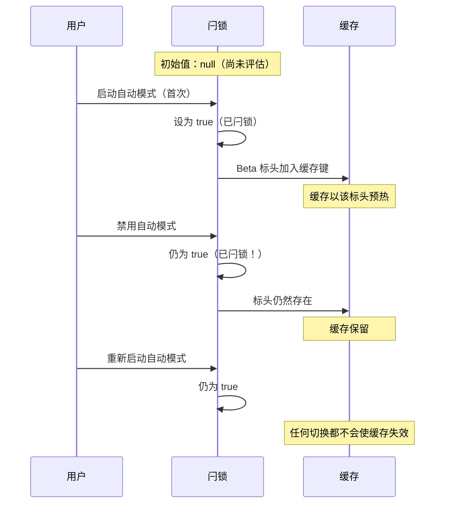
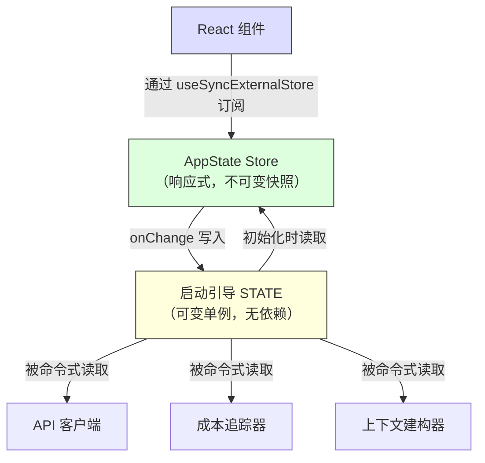

# 第三章：状态——双层架构

第二章追踪了从进程启动到首次渲染的启动引导管道。到最后，系统已拥有一个完整配置的环境。但配置了*什么*？Session ID 存在哪里？目前的模型呢？消息历史？成本追踪器？权限模式？状态存在哪里，又为什么存在那里？

每个长时间运行的应用最终都会面临这个问题。对于简单的 CLI 工具，答案很平凡——`main()` 里的几个变量就够了。但 Claude Code 不是简单的 CLI 工具。它是一个通过 Ink 渲染的 React 应用，进程生命周期横跨数小时，外挂系统在任意时间加载，API 层必须从缓存的上下文构建提示词，成本追踪器在进程重启后依然留存，还有数十个基础设施模块需要在不互相导入的情况下读写共享数据。

天真的做法——单一全域 store——会立即失败。如果成本追踪器更新的 store 同时也驱动 React 的重新渲染，那每次 API 调用都会触发完整的组件树协调（reconciliation）。基础设施模块（启动引导、上下文构建、成本追踪、遥测）无法导入 React。它们在 React 挂载之前就执行了。它们在 React 卸载之后还在执行。它们在根本不存在组件树的上下文中执行。把所有东西都放进 React 感知的 store 会在整个导入图中产生循环依赖。

Claude Code 用双层架构来解决这个问题：一个可变的进程单例用于基础设施状态，一个最小的响应式 store 用于 UI 状态。本章说明两个层级、桥接它们的副作用系统，以及依赖此基础的支持子系统。后续每一章都假设你理解状态存在哪里，以及为什么存在那里。

---

## 3.1 启动引导状态——进程单例

### 为什么用可变单例

启动引导状态模块（`bootstrap/state.ts`）是一个在进程启动时建立一次的单一可变对象：

```typescript
const STATE: State = getInitialState()
```

这一行上方的注解写着：`AND ESPECIALLY HERE`。类型定义上方两行则是：`DO NOT ADD MORE STATE HERE - BE JUDICIOUS WITH GLOBAL STATE`。这些注解带有一种语气，像是工程师们曾经亲身付出了放任全域对象失控的代价。

在这里，可变单例是正确的选择，原因有三。第一，启动引导状态必须在任何框架初始化之前就可用——在 React 挂载之前、在 store 建立之前、在外挂加载之前。模块作用域初始化是唯一在导入时就能保证可用性的机制。第二，这些数据本质上是进程范围的：session ID、遥测计数器、成本累加器、缓存路径。没有有意义的「先前状态」可以做差异比对，没有订阅者需要通知，没有复原历史。第三，这个模块必须是导入依赖图中的叶节点。如果它导入了 React、store 或任何服务模块，就会产生打断第二章描述的启动引导顺序的循环。由于它只依赖工具类型和 `node:crypto`，它可以从任何地方被导入。

### 约 80 个字段

`State` 类型包含大约 80 个字段。抽样即可看出其广度：

**身分识别与路径** —— `originalCwd`、`projectRoot`、`cwd`、`sessionId`、`parentSessionId`。`originalCwd` 在进程启动时通过 `realpathSync` 解析并进行 NFC 规范化。之后永不改变。

**成本与指标** —— `totalCostUSD`、`totalAPIDuration`、`totalLinesAdded`、`totalLinesRemoved`。这些在整个 session 中单调递增地累积，并在退出时持久化到磁盘。

**遥测** —— `meter`、`sessionCounter`、`costCounter`、`tokenCounter`。OpenTelemetry 的控制代码，全部可为 null（在遥测初始化之前为 null）。

**模型配置** —— `mainLoopModelOverride`、`initialMainLoopModel`。当用户在 session 中途切换模型时设置 override。

**Session 标志** —— `isInteractive`、`kairosActive`、`sessionTrustAccepted`、`hasExitedPlanMode`。在 session 期间控制行为的布尔值。

**缓存优化** —— `promptCache1hAllowlist`、`promptCache1hEligible`、`systemPromptSectionCache`、`cachedClaudeMdContent`。这些存在的目的是防止多余的运算和提示缓存失效。

### Getter/Setter 模式

`STATE` 对象永远不会被导出。所有访问都通过大约 100 个独立的 getter 和 setter 函数：

```typescript
// 虚拟码——说明此模式
export function getProjectRoot(): string {
  return STATE.projectRoot
}

export function setProjectRoot(dir: string): void {
  STATE.projectRoot = dir.normalize('NFC')  // 每个路径 setter 都做 NFC 正规化
}
```

这个模式强制实现了封装、每个路径 setter 的 NFC 规范化（防止 macOS 上的 Unicode 不匹配）、类型窄化，以及启动引导隔离。代价是冗长——八十个字段写了一百个函数。但在一个随意修改就可能搞坏 50,000 个 token 提示缓存的代码库中，明确性赢了。

### 信号模式

启动引导无法导入监听器（它是 DAG 的叶节点），因此它使用一个叫做 `createSignal` 的最小发布/订阅原语。`sessionSwitched` 信号恰好有一个消费者：`concurrentSessions.ts`，它负责让 PID 文件保持同步。信号以 `onSessionSwitch = sessionSwitched.subscribe` 的形式暴露，让调用者可以注册自己，而启动引导不需要知道它们是谁。

### 五个黏性闩锁

启动引导状态中最微妙的字段是五个布尔闩锁，它们遵循相同的模式：一旦某个特性在 session 中首次被启动，对应的标志就在 session 的剩余时间内保持为 `true`。它们全都为了同一个原因而存在：提示缓存的保存。



Claude 的 API 支持服务器端提示缓存。当连续的请求共享相同的系统提示词前缀时，服务器会重用已缓存的运算结果。但缓存键包含 HTTP 请求头和请求主体字段。如果一个 beta 请求头出现在第 N 个请求中但没出现在第 N+1 个，缓存就会失效——即使提示词内容完全相同。对于超过 50,000 个 token 的系统提示词，缓存未命中的代价非常昂贵。

五个闩锁：

| 闩锁 | 它防止什么 |
|-------|-----------|
| `afkModeHeaderLatched` | Shift+Tab 自动模式切换会使 AFK beta 请求头时开时关 |
| `fastModeHeaderLatched` | 快速模式冷却期进入/退出会切换快速模式请求头 |
| `cacheEditingHeaderLatched` | 远端功能标志的变更会使每个活跃用户的缓存失效 |
| `thinkingClearLatched` | 在确认缓存未命中（闲置 >1 小时）后触发。防止重新启用思考区块时使刚预热的缓存失效 |
| `pendingPostCompaction` | 一次性消费标志，用于遥测：区分因压缩引起的缓存未命中与因 TTL 过期引起的缓存未命中 |

五个都使用三态类型：`boolean | null`。初始值 `null` 表示「尚未评估」。`true` 表示「已闩锁」。一旦设为 `true` 就永远不会回到 `null` 或 `false`。这就是闩锁的定义特性。

实现模式：

```typescript
function shouldSendBetaHeader(featureCurrentlyActive: boolean): boolean {
  const latched = getAfkModeHeaderLatched()
  if (latched === true) return true       // 已闩锁——总是发送
  if (featureCurrentlyActive) {
    setAfkModeHeaderLatched(true)          // 首次启动——闩锁它
    return true
  }
  return false                             // 从未启动——不发送
}
```

为什么不直接总是发送所有 beta 请求头？因为请求头是缓存键的一部分。发送一个无法识别的请求头会建立一个不同的缓存命名空间。闩锁确保你只在真正需要时才进入某个缓存命名空间，然后就留在那里。

---

## 3.2 AppState——响应式 Store

### 34 行的实现

UI 状态 store 位于 `state/store.ts`：

Store 的实现大约 30 行：一个闭包包裹 `state` 变量，一个 `Object.is` 相等性检查以防止无意义的更新，同步的监听器通知，以及一个用于副作用的 `onChange` 回调。骨架看起来像：

```typescript
// 虚拟码——说明此模式
function makeStore(initial, onTransition) {
  let current = initial
  const subs = new Set()
  return {
    read:      () => current,
    update:    (fn) => { /* Object.is 守卫，然后通知 */ },
    subscribe: (cb) => { subs.add(cb); return () => subs.delete(cb) },
  }
}
```

三十四行。没有中介软件、没有开发者工具、没有时间旅行除错、没有 action 类型。只有一个闭包包裹可变变量，一个监听器 Set，以及一个 `Object.is` 相等性检查。这就是不带函数库的 Zustand。

值得审视的设计决策：

**更新器函数模式。** 没有 `setState(newValue)`——只有 `setState((prev) => next)`。每次修改都接收当前状态并必须产生下一个状态，消除了来自并行修改的过期状态 bug。

**`Object.is` 相等性检查。** 如果更新器返回相同的参照，修改就是空操作。没有监听器触发。没有副作用执行。这对性能至关重要——展开再设置但没有改变值的组件不会产生重新渲染。

**`onChange` 在监听器之前触发。** 可选的 `onChange` 回调接收新旧状态，并在任何订阅者被通知之前同步触发。这用于必须在 UI 重新渲染之前完成的副作用（3.4 节）。

**没有中介软件、没有开发者工具。** 这不是疏忽。当你的 store 恰好需要三个操作（get、set、subscribe）、一个 `Object.is` 相等性检查和一个同步的 `onChange` 钩子时，你拥有的 34 行代码比一个依赖更好。你控制精确的语义。你可以在三十秒内读完整个实现。

### AppState 类型

`AppState` 类型（约 452 行）是 UI 渲染所需的一切的形状。大多数字段都包裹在 `DeepImmutable<>` 中，明确排除包含函数类型的字段：

```typescript
export type AppState = DeepImmutable<{
  settings: SettingsJson
  verbose: boolean
  // ... 约 150 个以上的栏位
}> & {
  tasks: { [taskId: string]: TaskState }  // 包含 abort controller
  agentNameRegistry: Map<string, AgentId>
}
```

交叉类型让大多数字段保持深度不可变，同时豁免那些持有函数、Map 和可变参照的字段。完全不可变是默认的，对于类型系统会与执行时语义不兼容的地方则有精确的逃生口。

### React 整合

Store 通过 `useSyncExternalStore` 与 React 整合：

```typescript
// 标准 React 模式——useSyncExternalStore 搭配 selector
export function useAppState<T>(selector: (state: AppState) => T): T {
  const store = useContext(AppStoreContext)
  return useSyncExternalStore(
    store.subscribe,
    () => selector(store.getState()),
  )
}
```

Selector 必须返回一个已存在的子对象参照（而非新建的对象），这样 `Object.is` 比较才能防止不必要的重新渲染。如果你写 `useAppState(s => ({ a: s.a, b: s.b }))`，每次渲染都会产生新的对象参照，组件就会在每次状态变更时重新渲染。这与 Zustand 用户面临的限制相同——比较成本更低，但 selector 的作者必须理解参照相等性。

---

## 3.3 两个层级如何关联

两个层级通过明确、狭窄的接口进行通信。



启动引导状态在初始化时流入 AppState：`getDefaultAppState()` 从磁盘读取设置（启动引导帮忙定位的路径）、检查功能标志（启动引导评估过的）、并设置初始模型（启动引导从 CLI 参数和设置中解析出的）。

AppState 通过副作用回流到启动引导状态：当用户更改模型时，`onChangeAppState` 调用启动引导中的 `setMainLoopModelOverride()`。当设置变更时，启动引导中的凭据缓存会被清除。

但两个层级永远不共享参照。导入启动引导状态的模块不需要知道 React 的存在。读取 AppState 的组件不需要知道进程单例的存在。

一个具体的例子可以厘清数据流。当用户输入 `/model claude-sonnet-4`：

1. 命令处理器调用 `store.setState(prev => ({ ...prev, mainLoopModel: 'claude-sonnet-4' }))`
2. Store 的 `Object.is` 检查侦测到变更
3. `onChangeAppState` 触发，侦测到模型已变更，调用 `setMainLoopModelOverride()`（更新启动引导）以及 `updateSettingsForSource()`（持久化到磁盘）
4. 所有 store 订阅者触发——React 组件重新渲染以显示新的模型名称
5. 下一次 API 调用从启动引导状态中的 `getMainLoopModelOverride()` 读取模型

步骤 1-4 是同步的。步骤 5 中的 API 客户端可能在数秒后才执行。但它从启动引导状态（在步骤 3 中更新）读取，而非从 AppState。这就是双层交接：UI store 是用户选择了什么的真实来源，但启动引导状态是 API 客户端使用什么的真实来源。

DAG 特性——启动引导不依赖任何东西，AppState 在初始化时依赖启动引导，React 依赖 AppState——由一条 ESLint 规则强制执行，该规则防止 `bootstrap/state.ts` 导入其允许集合之外的模块。

---

## 3.4 副作用：onChangeAppState

`onChange` 回调是两个层级同步的地方。每次 `setState` 调用都会触发 `onChangeAppState`，它接收先前和新的状态，并决定要触发哪些外部效果。

**权限模式同步**是主要的使用情境。在这个集中化处理器出现之前，权限模式只有 8 个以上修改路径中的 2 个会同步到远端 session（CCR）。其他六个——Shift+Tab 循环切换、对话选项、斜线命令、回溯、桥接回调——全都修改了 AppState 却没有通知 CCR。外部的中继数据就此漂移失去同步。

修复方案：停止在各个修改点分散通知，改为在一个地方挂钩差异比对。源码中的注解列出了每个出问题的修改路径，并指出「上面那些分散的调用点不需要任何改动」。这就是集中化副作用的架构优势——覆盖率是结构性的，而非手动的。

**模型变更**让启动引导状态与 UI 渲染的内容保持同步。**设置变更**清除凭据缓存并重新套用环境变量。**详细模式切换**和**展开检视**被持久化到全域配置。

这个模式——基于可差异比对的状态转换的集中化副作用——本质上就是观察者模式应用在状态差异的粒度上，而非个别事件。它的扩展性优于分散的事件发射，因为副作用的数量增长远慢于修改点的数量增长。

---

## 3.5 上下文构建

`context.ts` 中的三个记忆化（memoized）异步函数构建了每次对话前缀的系统提示词上下文。每个函数在每个 session 中只计算一次，而非每回合都计算。

`getGitStatus` 并行执行五个 git 命令（`Promise.all`），产生一个包含当前分支、默认分支、最近提交和工作树状态的区块。`--no-optional-locks` 标志防止 git 取得写入锁，避免与另一个终端中的并行 git 操作发生干扰。

`getUserContext` 加载 CLAUDE.md 的内容并通过 `setCachedClaudeMdContent` 缓存到启动引导状态中。这个缓存打断了一个循环依赖：自动模式分类器需要 CLAUDE.md 的内容，但 CLAUDE.md 的加载经过文件系统，文件系统经过权限系统，权限系统调用分类器。通过缓存到启动引导状态（DAG 的叶节点），循环被打断了。

三个上下文函数全都使用 Lodash 的 `memoize`（计算一次，永久缓存），而非基于 TTL 的缓存。原因是：如果 git 状态每 5 分钟重新计算一次，变更就会使服务器端的提示缓存失效。系统提示词甚至告诉模型：「这是对话开始时的 git 状态。请注意，此状态是一个时间点的快照。」

---

## 3.6 成本追踪

每个 API 响应都流经 `addToTotalSessionCost`，它累计每个模型的使用量、更新启动引导状态、回报到 OpenTelemetry，并递归处理顾问工具使用（响应中的嵌套模型调用）。

成本状态通过存储和还原到项目配置档来存活过进程重启。Session ID 被用作守卫——只有当持久化的 session ID 与正在恢复的 session 匹配时，成本才会被还原。

直方图使用蓄水池取样（Algorithm R）来维持有界的内存使用量，同时准确地表示分布。1,024 个条目的蓄水池产生 p50、p95 和 p99 百分位数。为什么不用简单的移动平均？因为平均值隐藏了分布形状。一个 95% 的 API 调用花 200 毫秒而 5% 花 10 秒的 session，和一个所有调用都花 690 毫秒的 session 有相同的平均值，但用户体验截然不同。

---

## 3.7 我们学到了什么

这个代码库已经从一个简单的 CLI 成长为一个拥有约 450 行状态类型定义、约 80 个进程状态字段、一个副作用系统、多个持久化边界和缓存优化闩锁的系统。这些都不是事先设计好的。黏性闩锁是在缓存失效成为可量测的成本问题时才添加的。`onChange` 处理器是在发现 8 个权限同步路径中有 6 个出问题时才集中化的。CLAUDE.md 缓存是在循环依赖浮现时才添加的。

这是复杂应用中状态的自然成长模式。双层架构提供了足够的结构来容纳这种成长——新的启动引导字段不会影响 React 渲染，新的 AppState 字段不会产生导入循环——同时保持足够的弹性来容纳原始设计中未预见的模式。

---

## 3.8 状态架构摘要

| 属性 | 启动引导状态 | AppState |
|---|---|---|
| **位置** | 模块作用域单例 | React context |
| **可变性** | 通过 setter 可变 | 通过更新器产生不可变快照 |
| **订阅者** | 信号（发布/订阅）用于特定事件 | `useSyncExternalStore` 用于 React |
| **可用时机** | 导入时（React 之前） | Provider 挂载之后 |
| **持久化** | 进程退出处理器 | 通过 onChange 写入磁盘 |
| **相等性** | 不适用（命令式读取） | `Object.is` 参照检查 |
| **依赖** | DAG 叶节点（不导入任何东西） | 从整个代码库导入类型 |
| **测试重设** | `resetStateForTests()` | 建立新的 store 实例 |
| **主要消费者** | API 客户端、成本追踪器、上下文构建器 | React 组件、副作用 |

---

## 实践应用

**依访问模式分离状态，而非依领域。** Session ID 属于单例，不是因为它在抽象意义上是「基础设施」，而是因为它必须在 React 挂载之前就能读取，且写入时不需要通知订阅者。权限模式属于响应式 store，因为改变它必须触发重新渲染和副作用。让访问模式驱动层级选择，架构自然就跟上了。

**黏性闩锁模式。** 任何与缓存互动的系统（提示缓存、CDN、查询缓存）都面临相同的问题：在 session 中途改变缓存键的功能开关会导致失效。一旦某个特性被启动，它对缓存键的贡献就在整个 session 中保持启动。三态类型（`boolean | null`，意谓「尚未评估/开启/永不关闭」）让意图自我记录。当缓存不在你的掌控之下时，这特别有价值。

**在状态差异上集中化副作用。** 当多个代码路径可以改变相同的状态时，不要在各个修改点分散通知。挂钩 store 的 `onChange` 回调并侦测哪些字段发生了变化。覆盖率变成结构性的（任何修改都触发效果），而非手动的（每个修改点都必须记得通知）。

**偏好你拥有的 34 行代码，而非你不拥有的函数库。** 当你的需求恰好是 get、set、subscribe 和一个变更回调时，最小化的实现让你完全掌控语义。在一个状态管理 bug 可能花真金白银的系统中，这种透明度是有价值的。关键洞见是认清你什么时候*不需要*一个函数库。

**有意识地使用进程退出作为持久化边界。** 多个子系统在进程退出时持久化状态。代价是明确的：非优雅终止（SIGKILL、OOM）会丢失累积的数据。这是可接受的，因为这些数据是诊断性的而非交易性的，而且在每次状态变更时写入磁盘对于每个 session 递增数百次的计数器来说代价太高。