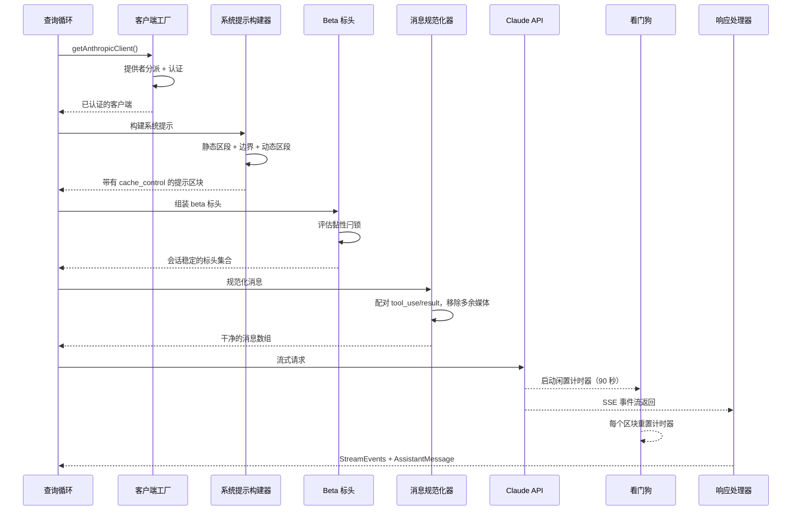
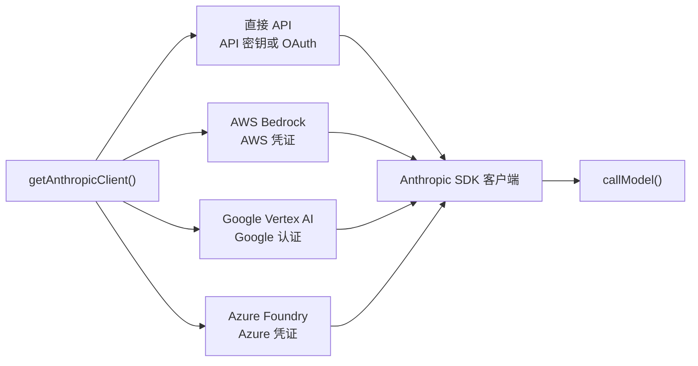
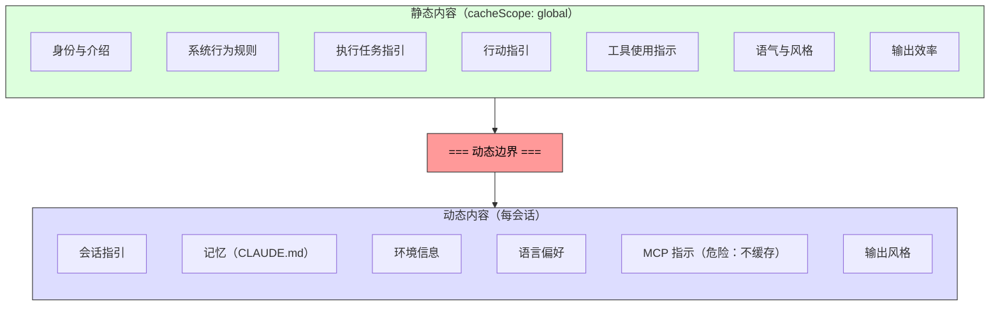

# 第四章：与 Claude 对话 —— API 层

第三章建立了状态的存储位置以及两个层级如何通信。现在我们追踪当状态被实际使用时会发生什么：系统需要与语言模型对话。Claude Code 中的一切——启动引导序列、状态系统、权限框架——都是为了服务这个时刻而存在的。

这个层处理的失败模式比系统中任何其他部分都多。它必须通过单一透明接口路由四个云端提供者。它必须以字节层级的精确度来构建系统提示，清楚了解服务器的提示缓存如何运作，因为一个错放的区段就能摧毁价值 50,000+ 个 token 的缓存。它必须在主动失败侦测下进行流响应，因为 TCP 连接会悄无声息地断开。而且它必须维护会话稳定的不变量，使得对话进行中的功能标志变更不会造成隐形的性能断崖。

让我们追踪一次从头到尾的 API 调用。

---

## 多提供者客户端工厂

`getAnthropicClient()` 函数是所有模型通信的单一工厂。它返回一个为目标部署的提供者配置好的 Anthropic SDK 客户端：

分派完全由环境变量驱动，以固定的优先顺序进行评估。所有四个提供者专用的 SDK 类都通过 `as unknown as Anthropic` 转型为 `Anthropic`。源码中的注释相当坦率：「我们一直在欺骗返回类型。」这种刻意的类型擦除意味着每个消费者看到的都是统一的接口。代码库的其余部分从不依据提供者进行分支。

每个提供者 SDK 都是动态导入的——`AnthropicBedrock`、`AnthropicFoundry`、`AnthropicVertex` 都是带有各自依赖树的重量级模块。动态导入确保未使用的提供者永远不会被加载。

提供者选择在启动时决定并存储在启动引导的 `STATE` 中。查询循环从不检查当前使用的是哪个提供者。从直接 API 切换到 Bedrock 是配置变更，而非代码变更。

### buildFetch 包装器

每个出站的 fetch 都会被包装以注入一个 `x-client-request-id` 请求头——这是每次请求产生的 UUID。当请求超时时，服务器不会为响应分配请求 ID。没有客户端的 ID，API 团队就无法将超时与服务端日志进行关联。这个请求头弥补了这个缺口。它只会传送给第一方 Anthropic 端点——第三方提供者可能会拒绝未知的请求头。

---

## 系统提示构建

系统提示是整个系统中对缓存最敏感的产物。Claude 的 API 提供服务端的提示缓存：跨请求的相同提示前缀可以被缓存，节省延迟和成本。一个 200K token 的对话可能有 50-70K 个 token 与前一轮完全相同。摧毁该缓存会迫使服务器重新处理全部内容。

### 动态边界标记

提示被构建为一个字符串区段的数组，有一条关键的分界线：

边界之前的所有内容在不同会话、用户和组织之间都是相同的——它获得最高层级的服务端缓存。边界之后的内容包含用户特定的数据，降级为每会话缓存。

区段的命名惯例刻意设计得很醒目。新增区段时必须在 `systemPromptSection`（安全，可缓存）和 `DANGEROUS_uncachedSystemPromptSection`（破坏缓存，需要原因字符串）之间做选择。`_reason` 参数在运行时未被使用，但作为强制性文档存在——每个破坏缓存的区段都在源码中携带其正当理由。

### 2^N 问题

`prompts.ts` 中的一条注释解释了为什么条件区段必须放在边界之后：

> 这里的每个条件都是一个运行时位，否则会导致 Blake2b 前缀哈希变体呈指数增长（2^N）。

边界之前的每个布尔条件都会使全局缓存条目的唯一数量翻倍。三个条件会产生 8 个变体；五个会产生 32 个。静态区段刻意设计为无条件的。编译期功能标志（由打包器解析）可以放在边界之前。运行时检查（这是 Haiku 吗？用户有启用自动模式吗？）必须放在边界之后。

这是那种在你违反之前都看不见的约束。一位好意的工程师如果在边界之前新增了一个受用户设置控制的区段，可能会悄无声息地碎片化全局缓存，并将整个服务集群的提示处理成本翻倍。

---

## 流

### 原始 SSE 优先于 SDK 抽象

流实现使用的是原始的 `Stream<BetaRawMessageStreamEvent>`，而非 SDK 较高阶的 `BetaMessageStream`。原因是：`BetaMessageStream` 在每个 `input_json_delta` 事件上都会调用 `partialParse()`。对于带有大量 JSON 输入的工具调用（包含数百行的文件编辑），这会在每个区块上从头重新解析不断增长的 JSON 字符串——O(n²) 的行为。Claude Code 自行处理工具输入的累积，因此部分解析完全是浪费。

### 闲置看门狗

TCP 连接可能在没有通知的情况下断开。服务器可能当机、负载平衡器可能静默地切断连接，或者企业代理服务器可能超时。SDK 的请求超时只涵盖最初的 fetch——一旦 HTTP 200 到达，超时就被满足了。如果流主体停止传送，没有任何机制能捕捉到。

看门狗的机制：一个 `setTimeout`，在每次收到区块时重置。如果 90 秒内没有区块到达，流就会被中止，系统回退到非流的重试。在 45 秒标记时会发出警告。当看门狗触发时，它会记录事件并附上客户端请求 ID 以便关联。

### 非流回退

当流在响应途中失败（网络错误、停滞、截断），系统会回退到同步的 `messages.create()` 调用。这处理了代理服务器故障的模式——代理服务器返回 HTTP 200 但带有非 SSE 的主体，或在流中途截断 SSE 流。

当流工具执行处于活动状态时，回退可以被禁用，因为回退会重新执行整个请求，并可能导致工具被执行两次。

---

## 提示缓存系统

### 三个层级

提示缓存在三个级别上运作：

**临时缓存**（默认）：每会话缓存，具有服务器定义的 TTL（约 5 分钟）。所有用户都能使用。

**1 小时 TTL**：符合资格的用户获得延长的缓存。资格由订阅状态决定，并在启动引导状态中闩锁——第三章的 `promptCache1hEligible` 黏性闩锁确保会话中途的超额切换不会改变 TTL。

**全局范围**：系统提示缓存条目获得跨会话、跨组织的共享。系统提示的静态部分对所有 Claude Code 用户都是相同的，因此单一的缓存副本即可服务所有人。当存在 MCP 工具时，全局范围会被禁用，因为 MCP 工具定义是用户特定的，会将缓存碎片化为数百万个唯一的前缀。

### 黏性闩锁的实际应用

第三章的五个黏性闩锁在此处——请求构建期间——被评估。每个闩锁最初为 `null`，一旦被设为 `true`，就在整个会话中保持 `true`。闩锁区块上方的注解很精确：「动态 beta 请求头的黏性开启闩锁。每个请求头一旦首次传送，就会在会话的剩余时间持续传送，这样会话中途的切换就不会改变服务端的缓存键并摧毁约 50-70K 个 token。」

参见第三章第 3.1 节，了解闩锁模式的完整说明、五个具体的闩锁，以及为什么「总是传送所有请求头」不是正确的解决方案。

---

## queryModel 生成器

`queryModel()` 函数是一个异步生成器（约 700 行），编排整个 API 调用的生命周期。它 yield `StreamEvent`、`AssistantMessage` 和 `SystemAPIErrorMessage` 对象。

请求组装遵循精心排列的顺序：

1. **终止开关检查**——最昂贵模型层级的安全阀
2. **Beta 请求头组装**——依模型而异，应用黏性闩锁
3. **工具 schema 构建**——通过 `Promise.all()` 并行处理，延迟工具在被发现之前排除
4. **消息规范化**——修复孤立的 tool_use/tool_result 不匹配、移除多余媒体、删除过时区块
5. **系统提示区块构建**——在动态边界处分割，分配缓存范围
6. **带有重试包装的流**——处理 529（过载）、模型回退、思考降级、OAuth 刷新

### 输出 Token 上限

默认的输出上限是 8,000 个 token，而非典型的 32K 或 64K。生产数据显示 p99 的输出为 4,911 个 token——标准限制过度保留了 8-16 倍。当响应达到上限时（不到 1% 的请求），它会以 64K 的上限进行一次干净的重试。这在服务集群规模下节省了可观的成本。

### 错误处理与重试

`withRetry()` 函数本身也是一个异步生成器，它 yield `SystemAPIErrorMessage` 事件，以便 UI 可以显示重试状态。重试策略：

- **529（过载）**：等待并重试，可选择降级快速模式
- **模型回退**：主要模型失败，尝试备用方案（例如 Opus 降至 Sonnet）
- **思考降级**：上下文窗口溢出触发缩减的思考预算
- **OAuth 401**：刷新 token 并重试一次

生成器模式意味着重试进度（「服务器过载，5 秒后重试...」）作为事件流的自然组成部分出现，而非作为旁路通知。

---

## 实践应用

**将提示缓存视为架构约束，而非功能开关。** 大多数 LLM 应用「开启」缓存。Claude Code 将其视为一种设计约束，形塑了提示顺序、区段备忘化、请求头闩锁和配置管理。良好结构化的提示（50K token 缓存命中）与结构不良的提示（每轮完全重新处理）之间的差异，是系统中最大的单一成本杠杆。

**使用 DANGEROUS 命名惯例来标记高成本的逃生口。** 当代码库有一个容易被意外违反的不变量时，用醒目的前缀命名逃生口可以做到三件事：使违反在代码审查中可见、强制编写文件（必要的原因参数），以及对安全默认值产生心理摩擦。这可以推广到缓存之外的任何具有隐形成本的操作。

**用看门狗构建流，而不只是用超时。** SDK 的请求超时在 HTTP 200 时就被满足，但响应主体可能在任何时刻停止传送。一个在每个区块上重置的 `setTimeout` 能捕捉到这种情况。非流回退处理了代理服务器的故障模式（带有非 SSE 主体的 HTTP 200、流中途截断），这些在企业环境中比你预期的更常见。

**将重试策略设计为基于 yield，而非基于异常。** 通过将重试包装器设计为 yield 状态事件的异步生成器，调用者可以将重试进度作为事件流的自然组成部分来显示。模型回退模式（Opus 失败，尝试 Sonnet）对生产环境的韧性特别有用。

**将快速路径与完整管道分开。** 不是每个 API 调用都需要工具搜索、顾问整合、思考预算和流基础设施。Claude Code 的 `queryHaiku()` 函数为内部操作（压缩、分类）提供了一条精简路径，跳过所有代理相关的关注点。一个具有简化接口的独立函数可以防止意外的复杂度泄漏。

---

## 展望

API 层是后续一切的基础。第五章将展示查询循环如何利用流响应来驱动工具执行——包括工具如何在模型完成响应之前就开始执行。第六章将解释压缩系统如何在对话接近上下文限制时保持缓存效率。第七章将展示每个代理线程如何获得自己的消息数组和请求链。

所有这些系统都继承了此处建立的约束：缓存稳定性作为架构不变量、通过客户端工厂实现提供者透明性，以及通过闩锁系统实现会话稳定的配置。API 层不仅仅是传送请求——它定义了其他每个系统运作的规则。