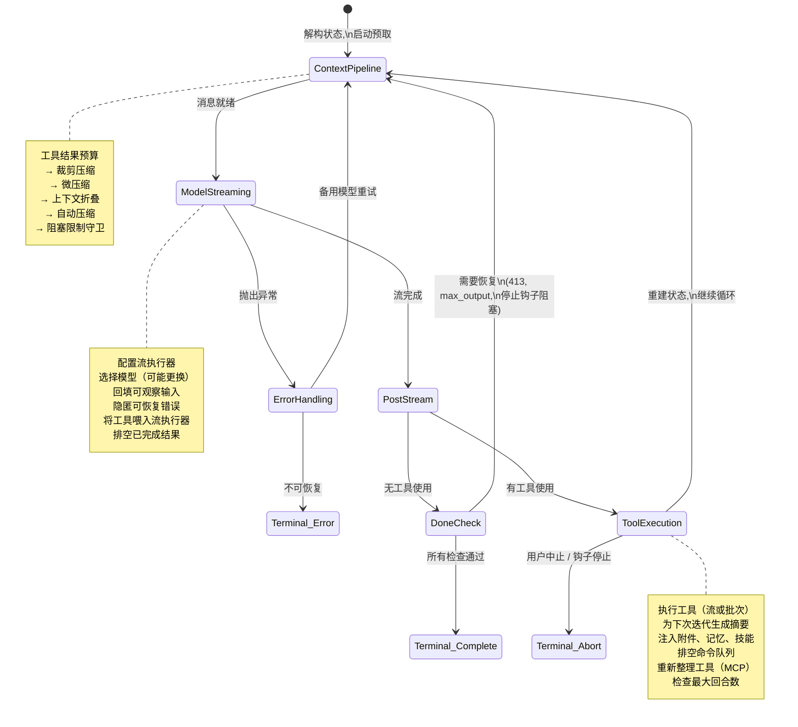
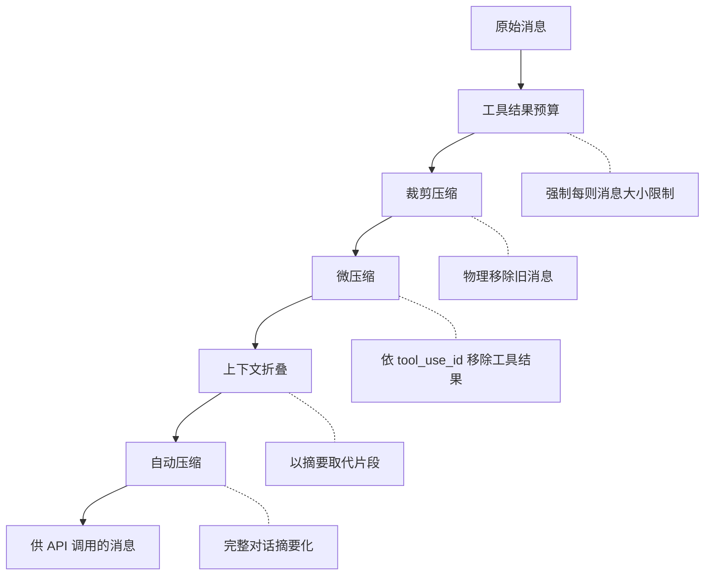
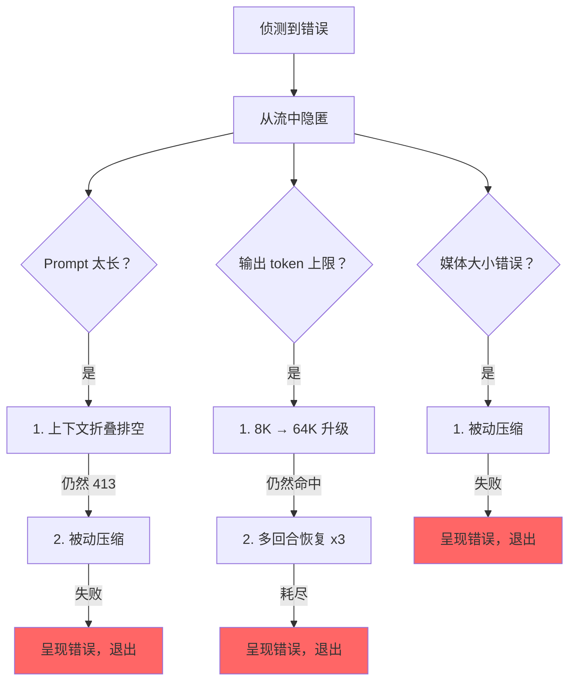

# 第五章：代理循环（Agent Loop）

## 跳动的心脏

第四章展示了 API 层如何将配置转化为流 HTTP 请求——客户端如何构建、系统提示词如何组装、响应如何以 server-sent events 抵达。那一层处理的是与模型对话的*机制*。但单一的 API 调用并不构成代理。代理是一个循环：调用模型、执行工具、将结果返回、再次调用模型，直到工作完成。

每个系统都有自己的重心。对数据库而言，是存储引擎。对编译器而言，是中间表示法。对 Claude Code 而言，是 `query.ts`——一个 1,730 行的文件，包含一个 async generator，驱动每一次互动，从 REPL 中第一次按键到 headless `--print` 调用的最后一个工具调用。

这不是夸张。只有唯一一条代码路径负责与模型对话、执行工具、管理上下文、从错误中恢复，以及决定何时停止。这条路径就是 `query()` 函数。REPL 调用它。SDK 调用它。子代理调用它。headless 执行器调用它。如果你正在使用 Claude Code，你就在 `query()` 里面。

这个文件很密集，但它的复杂不是那种纠缠的继承阶层式的复杂。它的复杂像潜艇一样：一个单一的船壳配上许多冗余系统，每一个都是因为海水找到了渗入的方式才被加上。每个 `if` 分支都有一个故事。每个被隐匿的错误消息都代表一个真实的 bug——某个 SDK 消费者在恢复过程中断开连接。每个断路器阈值都是根据真实的会话调校过的，那些会话曾在无限循环中烧掉数千次 API 调用。

本章追踪整个循环，从头到尾。读完之后，你不仅会理解发生了什么，还会理解每个机制为何存在，以及没有它会坏掉什么。

---

## 为什么用 Async Generator

第一个架构问题：为什么代理循环是 generator 而不是基于回调的事件发射器？

```typescript
// 简化——展示概念，非精确类型
async function* agentLoop(params: LoopParams): AsyncGenerator<Message | Event, TerminalReason>
```

实际的签名会 yield 数种消息和事件类型，并返回一个编码了循环停止原因的判别联合类型。

三个原因，按重要性排序。

**背压（Backpressure）。** 事件发射器无论消费者是否准备好都会触发。Generator 只在消费者调用 `.next()` 时才 yield。当 REPL 的 React 渲染器正忙着绘制前一帧时，generator 自然暂停。当 SDK 消费者正在处理工具结果时，generator 等待。没有缓冲区溢出，没有丢失消息，没有「快速生产者／慢速消费者」问题。

**返回值语意。** Generator 的返回类型是 `Terminal`——一个判别联合类型，精确编码循环停止的原因。是正常完成？用户中止？token 预算耗尽？停止钩子介入？最大轮次限制？不可恢复的模型错误？共有 10 种不同的终止状态。调用者不需要订阅一个「end」事件然后祈祷 payload 里有原因。他们从 `for await...of` 或 `yield*` 得到一个有类型的返回值。

**通过 `yield*` 的可组合性。** 外层的 `query()` 函数通过 `yield*` 委托给 `queryLoop()`，透明地转发每个 yield 的值和最终返回值。像 `handleStopHooks()` 这样的子 generator 使用同样的模式。这创造了一条干净的职责链，不需要回调，不需要 promise 包装 promise，不需要事件转发的样板代码。

这个选择有代价——JavaScript 中的 async generator 无法「倒转」或分叉。但代理循环两者都不需要。它是一个严格向前推进的状态机。

还有一个微妙之处：`function*` 语法让函数变得*惰性*。函数主体在第一次 `.next()` 调用之前不会执行。这代表 `query()` 立即返回——所有繁重的初始化（配置快照、内存预取、预算追踪器）只在消费者开始拉取值时才发生。在 REPL 中，这意味着 React 渲染管道在循环的第一行执行之前就已经设置好了。

---

## 调用者提供什么

在追踪循环之前，先了解输入内容会有帮助：

```typescript
// 简化——说明关键字段
type LoopParams = {
  messages: Message[]
  prompt: SystemPrompt
  permissionCheck: CanUseToolFn
  context: ToolUseContext
  source: QuerySource         // 'repl', 'sdk', 'agent:xyz', 'compact' 等
  maxTurns?: number
  budget?: { total: number }  // API 层级的任务预算
  deps?: LoopDeps             // 为测试而注入
}
```

值得注意的字段：

- **`querySource`**：一个字符串辨别值，如 `'repl_main_thread'`、`'sdk'`、`'agent:xyz'`、`'compact'` 或 `'session_memory'`。许多条件分支会根据它来判断。压缩代理使用 `querySource: 'compact'`，这样阻塞限制守卫就不会死锁（压缩代理需要执行才能*减少* token 数量）。

- **`taskBudget`**：API 层级的任务预算（`output_config.task_budget`）。与 `+500k` 自动继续 token 预算功能不同。`total` 是整个代理式回合的预算；`remaining` 在每次迭代中根据累计 API 使用量计算，并在压缩边界之间进行调整。

- **`deps`**：可选的依赖注入。默认为 `productionDeps()`。这是测试中替换假模型调用、假压缩和确定性 UUID 的接缝。

- **`canUseTool`**：一个返回给定工具是否被允许的函数。这是权限层——它检查信任设置、钩子决策和当前的权限模式。

---

## 两层式入口点

公开 API 是真正循环的薄封装：

外层函数包装内层循环，追踪在该回合中哪些排队的命令被消费了。内层循环完成后，已消费的命令被标记为 `'completed'`。如果循环抛出异常或 generator 通过 `.return()` 被关闭，完成通知永远不会触发——失败的回合不应将命令标记为成功处理。在回合中排入的命令（通过 `/` 斜线命令或任务通知）在循环内被标记为 `'started'`，在封装中被标记为 `'completed'`。如果循环抛出异常或 generator 通过 `.return()` 被关闭，完成通知永远不会触发。这是刻意的——失败的回合不应将命令标记为成功处理。

---

## 状态对象

循环将其状态携带在一个单一的类型化对象中：

```typescript
// 简化——说明关键字段
type LoopState = {
  messages: Message[]
  context: ToolUseContext
  turnCount: number
  transition: Continue | undefined
  // ... 加上恢复计数器、压缩追踪、待处理摘要等
}
```

十个字段。每一个都有其存在的意义：

| 字段 | 存在的原因 |
|------|-----------|
| `messages` | 对话历史，每次迭代增长 |
| `toolUseContext` | 可变上下文：工具、中止控制器、代理状态、选项 |
| `autoCompactTracking` | 追踪压缩状态：回合计数器、回合 ID、连续失败次数、已压缩标志 |
| `maxOutputTokensRecoveryCount` | 输出 token 上限的多回合恢复尝试次数（最多 3 次） |
| `hasAttemptedReactiveCompact` | 一次性守卫，防止无限的被动压缩循环 |
| `maxOutputTokensOverride` | 在升级期间设为 64K，之后清除 |
| `pendingToolUseSummary` | 来自前一次迭代的 Haiku 摘要 promise，在当前流期间解析 |
| `stopHookActive` | 在阻塞重试后防止重新执行停止钩子 |
| `turnCount` | 单调递增计数器，与 `maxTurns` 对照 |
| `transition` | 前一次迭代为何继续——首次迭代为 `undefined` |

### 可变循环中的不可变转换

以下是循环中每个 `continue` 语句都会出现的模式：

```typescript
const next: State = {
  messages: [...messagesForQuery, ...assistantMessages, ...toolResults],
  toolUseContext: toolUseContextWithQueryTracking,
  autoCompactTracking: tracking,
  turnCount: nextTurnCount,
  maxOutputTokensRecoveryCount: 0,
  hasAttemptedReactiveCompact: false,
  pendingToolUseSummary: nextPendingToolUseSummary,
  maxOutputTokensOverride: undefined,
  stopHookActive,
  transition: { reason: 'next_turn' },
}
state = next
```

每个 continue 站点都构建一个完整的新 `State` 对象。不是 `state.messages = newMessages`。不是 `state.turnCount++`。而是完全重建。好处是每个转换都是自我文档化的。你可以阅读任何 `continue` 站点，确切地看到哪些字段变更了、哪些被保留了。新状态上的 `transition` 字段记录了循环*为何*继续——测试会对此进行断言，以验证正确的恢复路径被触发。

---

## 循环主体

以下是单次迭代的完整执行流程，压缩为其骨架：



这就是整个循环。Claude Code 中的每个功能——从记忆到子代理到错误恢复——都是输入到或消费自这个单一迭代结构。

---

## 上下文管理：四层压缩

在每次 API 调用之前，消息历史会通过最多四个上下文管理阶段。它们以特定顺序执行，而这个顺序很重要。



### 第 0 层：工具结果预算

在任何压缩之前，`applyToolResultBudget()` 对工具结果强制执行每则消息的大小限制。没有有限 `maxResultSizeChars` 的工具会被豁免。

### 第 1 层：裁剪压缩

最轻量的操作。裁剪（Snip）从数组中物理移除旧消息，yield 一个边界消息以向 UI 通知移除。它回报释放了多少 token，而这个数字会被传入自动压缩的阈值检查。

### 第 2 层：微压缩

微压缩移除不再需要的工具结果，通过 `tool_use_id` 识别。对于缓存微压缩（会编辑 API 缓存），边界消息会延迟到 API 响应之后。原因是：客户端的 token 估算不可靠。API 响应中实际的 `cache_deleted_input_tokens` 才能告诉你真正释放了多少。

### 第 3 层：上下文折叠

上下文折叠以摘要取代对话片段。它在自动压缩之前执行，而这个顺序是刻意的：如果折叠将上下文降到自动压缩阈值以下，自动压缩就变成空操作。这样可以保留细粒度的上下文，而不是将所有东西替换为单一的整体摘要。

### 第 4 层：自动压缩

最重量级的操作：它分叉整个 Claude 对话来摘要历史。实现中有一个断路器——连续失败 3 次后就停止尝试。这防止了在生产环境中观察到的噩梦场景：会话卡在上下文限制之上，每天烧掉 250K 次 API 调用，陷入无限的压缩-失败-重试循环。

### 自动压缩阈值

阈值由模型的上下文窗口推导：

```
effectiveContextWindow = contextWindow - min(modelMaxOutput, 20000)

阈值（相对于 effectiveContextWindow）：
  自动压缩触发：      effectiveWindow - 13,000
  阻塞限制（硬性）：   effectiveWindow - 3,000
```

| 常数 | 值 | 用途 |
|------|-----|------|
| `AUTOCOMPACT_BUFFER_TOKENS` | 13,000 | 在有效窗口下方为自动压缩触发保留的剩余空间 |
| `MANUAL_COMPACT_BUFFER_TOKENS` | 3,000 | 保留空间以确保 `/compact` 仍然可用 |
| `MAX_CONSECUTIVE_AUTOCOMPACT_FAILURES` | 3 | 断路器阈值 |

13,000 token 的缓冲代表自动压缩在硬限制之前就会触发。自动压缩阈值和阻塞限制之间的间隙是被动压缩运作的区域——如果主动的自动压缩失败或被禁用，被动压缩会在收到 413 错误时按需压缩。

### Token 计数

权威函数 `tokenCountWithEstimation` 结合了来自 API 回报的权威 token 计数（来自最近一次响应）和对该响应之后新增消息的粗略估算。这个近似值偏向保守——它倾向于较高的计数，这意味着自动压缩会稍微提早触发，而非稍微太晚。

---

## 模型流

### callModel() 循环

API 调用发生在一个 `while(attemptWithFallback)` 循环内，该循环启用模型备用：

```typescript
let attemptWithFallback = true
while (attemptWithFallback) {
  attemptWithFallback = false
  try {
    for await (const message of deps.callModel({ messages, systemPrompt, tools, signal })) {
      // 处理每个流消息
    }
  } catch (innerError) {
    if (innerError instanceof FallbackTriggeredError && fallbackModel) {
      currentModel = fallbackModel
      attemptWithFallback = true
      continue
    }
    throw innerError
  }
}
```

启用时，`StreamingToolExecutor` 会在流期间 `tool_use` 区块一到达就开始执行工具——而非等到完整响应完成之后。工具如何被编排成并行批次是第七章的主题。

### 隐匿模式

这是文件中最重要的模式之一。可恢复的错误会从 yield 流中被抑制：

```typescript
let withheld = false
if (contextCollapse?.isWithheldPromptTooLong(message)) withheld = true
if (reactiveCompact?.isWithheldPromptTooLong(message)) withheld = true
if (isWithheldMaxOutputTokens(message)) withheld = true
if (!withheld) yield yieldMessage
```

为什么要隐匿？因为 SDK 消费者——Cowork、桌面应用——会在收到任何带有 `error` 字段的消息时终止会话。如果你 yield 了一个 prompt-too-long 错误然后通过被动压缩成功恢复，消费者已经断开了。恢复循环继续运行，但没有人在听。所以错误被隐匿，推入 `assistantMessages` 以便下游恢复检查能找到它。如果所有恢复路径都失败了，被隐匿的消息才最终浮出。

### 模型备用

当捕获到 `FallbackTriggeredError`（主要模型高需求）时，循环切换模型并重试。但 thinking 签名是模型绑定的——将一个受保护的 thinking 区块从一个模型重播到不同的备用模型会导致 400 错误。代码在重试前会剥离签名区块。所有来自失败尝试的孤立助手消息都会被标记为墓碑（tombstone），好让 UI 移除它们。

---

## 错误恢复：升级阶梯

query.ts 中的错误恢复不是单一策略。它是一个逐步升级的干预阶梯，每一步在前一步失败时触发。



### 死亡螺旋守卫

最危险的失败模式是无限循环。代码有多重守卫：

1. **`hasAttemptedReactiveCompact`**：一次性标志。被动压缩每种错误类型只触发一次。
2. **`MAX_OUTPUT_TOKENS_RECOVERY_LIMIT = 3`**：多回合恢复尝试的硬上限。
3. **自动压缩的断路器**：连续失败 3 次后，自动压缩完全停止尝试。
4. **错误响应不执行停止钩子**：代码在最后一则消息是 API 错误时，会在到达停止钩子之前明确返回。注释解释道：「error → hook blocking → retry → error → ...（钩子在每个循环中注入更多 token）。」
5. **跨停止钩子重试保留 `hasAttemptedReactiveCompact`**：当停止钩子返回阻塞错误并强制重试时，被动压缩守卫会被保留。注释记录了这个 bug：「在这里重置为 false 导致了一个无限循环，烧掉了数千次 API 调用。」

每一个守卫都是因为有人在生产环境中触发了对应的失败模式才被新增的。

---

## 实际示例：「修复 auth.ts 中的 Bug」

为了让循环更具体，让我们追踪一个真实互动的三次迭代。

**用户输入：** `Fix the null pointer bug in src/auth/validate.ts`

**迭代 1：模型读取文件。**

循环进入。上下文管理执行（不需要压缩——对话很短）。模型流响应：「让我看看这个文件。」它发出一个 `tool_use` 区块：`Read({ file_path: "src/auth/validate.ts" })`。流执行器看到一个并行安全的工具并立即启动它。在模型完成响应文字之前，文件内容已经在内存中了。

后流处理：模型使用了工具，所以我们进入工具使用路径。Read 结果（带行号的文件内容）被推入 `toolResults`。一个 Haiku 摘要 promise 在背景中启动。状态以新消息重建，`transition: { reason: 'next_turn' }`，循环继续。

**迭代 2：模型编辑文件。**

上下文管理再次执行（仍在阈值以下）。模型流：「我在第 42 行看到 bug——`userId` 可能是 null。」它发出 `Edit({ file_path: "src/auth/validate.ts", old_string: "const user = getUser(userId)", new_string: "if (!userId) return { error: 'unauthorized' }\nconst user = getUser(userId)" })`。

Edit 不是并行安全的，所以流执行器将它排队直到响应完成。然后 14 步执行管道触发：Zod 验证通过，输入回填展开路径，PreToolUse 钩子检查权限（用户批准），编辑被应用。迭代 1 的待处理 Haiku 摘要在流期间解析——其结果作为 `ToolUseSummaryMessage` 被 yield。状态重建，循环继续。

**迭代 3：模型声明完成。**

模型流：「我已经通过新增守卫子句修复了 null 指针 bug。」没有 `tool_use` 区块。我们进入「完成」路径。需要 prompt-too-long 恢复？不需要。Max output tokens？没有。停止钩子执行——没有阻塞错误。token 预算检查通过。循环返回 `{ reason: 'completed' }`。

总计：三次 API 调用、两次工具执行、一次用户权限提示。循环处理了流工具执行、与 API 调用重叠的 Haiku 摘要，以及完整的权限管道——全部通过同一个 `while(true)` 结构。

---

## Token 预算

用户可以为一个回合请求 token 预算（例如 `+500k`）。预算系统在模型完成响应后决定继续还是停止。

`checkTokenBudget` 用三个规则做出二元的继续／停止决策：

1. **子代理总是停止。** 预算只是顶层概念。
2. **完成阈值在 90%。** 如果 `turnTokens < budget * 0.9`，继续。
3. **边际递减侦测。** 在 3 次以上的继续之后，如果当前和前一次的增量都低于 500 个 token，提前停止。模型每次继续产生的输出越来越少。

当决策是「继续」时，一则推动消息被注入，告诉模型剩余多少预算。

---

## 停止钩子：强制模型继续工作

停止钩子在模型完成且未请求任何工具使用时执行——它认为自己完成了。钩子评估它是否*真的*完成了。

管道执行范本工作分类、触发后台任务（提示建议、记忆提取），然后执行停止钩子本身。当停止钩子返回阻塞错误——「你说你完成了，但 linter 发现了 3 个错误」——错误被附加到消息历史，循环以 `stopHookActive: true` 继续。这个标志防止在重试时重新执行相同的钩子。

当停止钩子发出 `preventContinuation` 信号时，循环立即以 `{ reason: 'stop_hook_prevented' }` 退出。

---

## 状态转换：完整目录

循环的每个出口都是两种类型之一：`Terminal`（循环返回）或 `Continue`（循环迭代）。

### 终止状态（10 种原因）

| 原因 | 触发条件 |
|------|---------|
| `blocking_limit` | Token 计数达硬限制，自动压缩关闭 |
| `image_error` | ImageSizeError、ImageResizeError 或不可恢复的媒体错误 |
| `model_error` | 不可恢复的 API／模型异常 |
| `aborted_streaming` | 模型流期间用户中止 |
| `prompt_too_long` | 所有恢复耗尽后隐匿的 413 |
| `completed` | 正常完成（无工具使用、预算耗尽、或 API 错误） |
| `stop_hook_prevented` | 停止钩子明确阻止继续 |
| `aborted_tools` | 工具运行时间用户中止 |
| `hook_stopped` | PreToolUse 钩子停止继续 |
| `max_turns` | 达到 `maxTurns` 限制 |

### 继续状态（7 种原因）

| 原因 | 触发条件 |
|------|---------|
| `collapse_drain_retry` | 上下文折叠在 413 时排空已暂存的折叠 |
| `reactive_compact_retry` | 被动压缩在 413 或媒体错误后成功 |
| `max_output_tokens_escalate` | 命中 8K 上限，升级到 64K |
| `max_output_tokens_recovery` | 64K 仍然命中，多回合恢复（最多 3 次尝试） |
| `stop_hook_blocking` | 停止钩子返回阻塞错误，必须重试 |
| `token_budget_continuation` | Token 预算未耗尽，注入推动消息 |
| `next_turn` | 正常工具使用继续 |

---

## 孤立工具结果：协议安全网

API 协议要求每个 `tool_use` 区块后面都跟着一个 `tool_result`。函数 `yieldMissingToolResultBlocks` 为模型发出但从未获得对应结果的每个 `tool_use` 区块建立错误 `tool_result` 消息。没有这个安全网，流期间的崩溃会留下孤立的 `tool_use` 区块，导致下一次 API 调用出现协议错误。

它在三个地方触发：外层错误处理器（模型崩溃）、备用处理器（流中途切换模型）和中止处理器（用户中断）。每条路径有不同的错误消息，但机制是一样的。

---

## 中止处理：两条路径

中止可以发生在两个时间点：流期间和工具运行时间。各自有不同的行为。

**流期间中止**：流执行器（如果启用）排空剩余结果，为排队的工具产生合成 `tool_results`。没有执行器时，`yieldMissingToolResultBlocks` 填补空缺。`signal.reason` 检查区分硬中止（Ctrl+C）和提交中断（用户输入了新消息）——提交中断跳过中断消息，因为排队的用户消息本身已经提供了上下文。

**工具运行时间中止**：类似的逻辑，在中断消息上带有 `toolUse: true` 参数，向 UI 发出工具正在进行的信号。

---

## Thinking 规则

Claude 的 thinking/redacted_thinking 区块有三条不可违反的规则：

1. 包含 thinking 区块的消息必须属于 `max_thinking_length > 0` 的查询
2. Thinking 区块不能是消息的最后一个区块
3. Thinking 区块必须在整个助手轨迹期间被保留

违反任何一条都会产生不透明的 API 错误。代码在多个地方处理它们：备用处理器剥离签名区块（它们是模型绑定的）、压缩管道保留受保护的尾部，而微压缩层从不碰 thinking 区块。

---

## 依赖注入

`QueryDeps` 类型刻意精简——四个依赖，不是四十个：

四个注入的依赖：模型调用器、压缩器、微压缩器和 UUID 生成器。测试将 `deps` 传入循环参数以直接注入假对象。使用 `typeof fn` 作为类型定义让签名自动保持同步。除了可变的 `State` 和可注入的 `QueryDeps` 之外，不可变的 `QueryConfig` 在 `query()` 进入时快照一次——功能标志、会话状态和环境变量一次提取且永不重读。三方分离（可变状态、不可变配置、可注入依赖）让循环可测试，也让最终重构为纯粹的 `step(state, event, config)` reducer 变得直接了当。

---

## 实践应用：构建你自己的代理循环

**使用 generator，而非回调。** 背压是免费的。返回值语意是免费的。通过 `yield*` 的可组合性是免费的。代理循环是严格向前推进的——你永远不需要倒转或分叉。

**让状态转换明确。** 在每个 `continue` 站点重建完整的状态对象。冗长就是功能——它防止部分更新的 bug，并让每个转换自我文档化。

**隐匿可恢复的错误。** 如果你的消费者在收到错误时断开连接，不要在确认恢复失败之前 yield 错误。将它们推入内部缓冲区，尝试恢复，只在耗尽时才浮出。

**分层你的上下文管理。** 轻量操作优先（移除），重量操作放最后（摘要化）。这在可能的情况下保留细粒度的上下文，只在必要时才回退到整体摘要。

**为每个重试增加断路器。** `query.ts` 中的每个恢复机制都有明确的限制：3 次自动压缩失败、3 次 max-output 恢复尝试、1 次被动压缩尝试。没有这些限制，第一个触发重试失败循环的生产环境会话会在一夜之间烧掉你的 API 预算。

如果你从零开始，最小的代理循环骨架：

```
async function* agentLoop(params) {
  let state = initState(params)
  while (true) {
    const context = compressIfNeeded(state.messages)
    const response = await callModel(context)
    if (response.error) {
      if (canRecover(response.error, state)) { state = recoverState(state); continue }
      return { reason: 'error' }
    }
    if (!response.toolCalls.length) return { reason: 'completed' }
    const results = await executeTools(response.toolCalls)
    state = { ...state, messages: [...context, response.message, ...results] }
  }
}
```

Claude Code 循环中的每个功能都是这些步骤之一的延伸。四层压缩延伸步骤 3（压缩）。隐匿模式延伸模型调用。升级阶梯延伸错误恢复。停止钩子延伸「无工具使用」的出口。从这个骨架开始。只在你碰到某个问题时才加入对应的延伸。

---

## 总结

代理循环是 1,730 行的单一 `while(true)`，它做所有事情。它流模型响应、并行执行工具、通过四层压缩上下文、从五种类别的错误中恢复、以边际递减侦测追踪 token 预算、执行可以强制模型回去工作的停止钩子、管理记忆和技能的预取管道，并产生一个精确记录为何停止的类型化判别联合。

它是系统中最重要的文件，因为它是唯一触碰所有其他子系统的文件。上下文管道输入到它。工具系统从中输出。错误恢复环绕在它周围。钩子拦截它。状态层通过它持续。UI 从中渲染。

如果你理解了 `query()`，你就理解了 Claude Code。其他一切都是外围设备。
