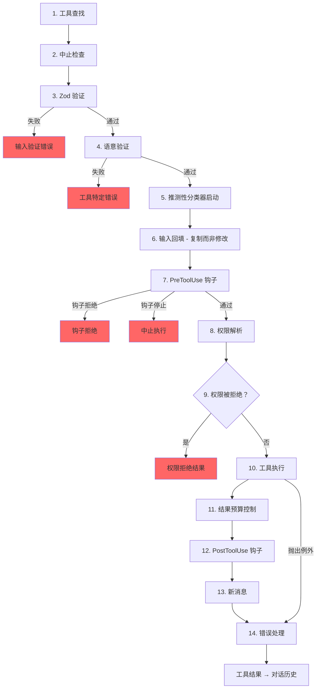

# 第六章：工具（Tool）—— 从定义到执行

## 神经系统

第五章展示了代理循环（Agent Loop）—— 那个 `while(true)` 不断流模型响应、收集工具调用、再把结果喂回去。循环是心跳。但如果没有一套神经系统来将「模型想要执行 `git status`」转译为实际的 shell 命令——带有权限检查、结果预算控制和错误处理——心跳就毫无意义。

工具系统就是那套神经系统。它涵盖了 40 多个工具实现、一个带有功能标志（feature flag）闸控的集中式注册表、一条 14 步骤的执行管道、一个具备七种模式的权限解析器，以及一个能在模型完成响应之前就启动工具的流执行器。

Claude Code 中的每一次工具调用——每一次文件读取、每一次 shell 命令、每一次 grep、每一次子代理派遣——都流经同一条管道。统一性正是关键：无论工具是内置的 Bash 执行器还是第三方 MCP 服务器，它都得到相同的验证、相同的权限检查、相同的结果预算控制、相同的错误分类。

`Tool` 接口大约有 45 个成员。听起来令人望而生畏，但要理解系统如何运作，只有五个是重要的：

1. **`call()`** —— 执行工具
2. **`inputSchema`** —— 验证并解析输入
3. **`isConcurrencySafe()`** —— 这个工具可以并行执行吗？
4. **`checkPermissions()`** —— 这个操作被允许吗？
5. **`validateInput()`** —— 这个输入在语意上说得通吗？

其他所有东西——那 12 个渲染方法、分析钩子、搜索提示——都是用来支持 UI 和遥测层的。从这五个开始，其余的自然水到渠成。

---

## 工具接口

### 三个类型参数

每个工具都以三个类型来参数化：

```typescript
Tool<Input extends AnyObject, Output, P extends ToolProgressData>
```

`Input` 是一个 Zod 对象 schema，身兼二职：它生成发送给 API 的 JSON Schema（让模型知道该提供哪些参数），同时也在执行时通过 `safeParse` 验证模型的响应。`Output` 是工具结果的 TypeScript 类型。`P` 是工具在运行时间发出的进度事件类型——BashTool 发出 stdout 片段、GrepTool 发出匹配计数、AgentTool 发出子代理的对话记录。

### buildTool() 与失败关闭默认值

没有任何工具定义会直接构建 `Tool` 对象。每个工具都经过 `buildTool()`，这是一个工厂函数，它将默认对象展开在工具特定定义之下：

```typescript
// 虚拟码 — 说明失败关闭（fail-closed）的默认值模式
const SAFE_DEFAULTS = {
  isEnabled:         () => true,
  isParallelSafe:    () => false,   // 失败关闭：新工具以序列方式执行
  isReadOnly:        () => false,   // 失败关闭：视为写入操作
  isDestructive:     () => false,
  checkPermissions:  (input) => ({ behavior: 'allow', updatedInput: input }),
}

function buildTool(definition) {
  return { ...SAFE_DEFAULTS, ...definition }  // 定义覆盖默认值
}
```

在攸关安全的地方，默认值刻意采用失败关闭策略。一个忘记实现 `isConcurrencySafe` 的新工具会默认为 `false`——它只能序列执行，永远不会并行。一个忘记 `isReadOnly` 的工具默认为 `false`——系统会把它当作写入操作。一个忘记 `toAutoClassifierInput` 的工具返回空字符串——自动模式安全性分类器会跳过它，意味着由通用权限系统来处理，而不是由自动化的绕过机制处理。

唯一*不是*失败关闭的默认值是 `checkPermissions`，它返回 `allow`。这看似有悖常理，除非你理解了分层权限模型：`checkPermissions` 是工具特定的逻辑，它在通用权限系统已经评估过规则、钩子和基于模式的策略*之后*才执行。工具从 `checkPermissions` 返回 `allow` 的意思是「我没有工具特定的异议」——并不是授予无条件访问。分组到子对象（`options`，具名字段如 `readFileState`）提供了聚焦接口会提供的结构，而无需在 40 多个调用站点上声明、实现并串联五个独立的接口类型。

### 并行性取决于输入

`isConcurrencySafe(input: z.infer<Input>): boolean` 的签名接受已解析的输入，因为同一个工具对某些输入可能是安全的，对其他输入则不是。BashTool 是经典示例：`ls -la` 是只读且可并行安全的，但 `rm -rf /tmp/build` 则不是。工具会解析命令，将每个子命令对照已知安全的集合分类，只有当所有非中性部分都是搜索或读取操作时才返回 `true`。

### ToolResult 返回类型

每个 `call()` 都返回一个 `ToolResult<T>`：

```typescript
type ToolResult<T> = {
  data: T
  newMessages?: (UserMessage | AssistantMessage | AttachmentMessage | SystemMessage)[]
  contextModifier?: (context: ToolUseContext) => ToolUseContext
}
```

`data` 是类型化的输出，会被序列化为 API 的 `tool_result` 内容区块。`newMessages` 让工具可以向对话中注入额外的消息——AgentTool 用它来附加子代理的对话记录。`contextModifier` 是一个函数，用来为后续工具修改 `ToolUseContext`——这就是 `EnterPlanMode` 切换权限模式的方式。上下文修改器只对非并行安全的工具生效；如果你的工具是并行执行的，它的修改器会被排队等到批次完成后才套用。

---

## ToolUseContext：上帝对象

`ToolUseContext` 是贯穿每个工具调用的庞大上下文包。它大约有 40 个字段。以任何合理的定义来看，它就是一个上帝对象。它之所以存在，是因为替代方案更糟。

像 BashTool 这样的工具需要中止控制器、文件状态缓存、应用状态、消息历史、工具集合、MCP 连接，以及半打 UI 回调。如果把这些作为独立参数传递，会产生 15 个以上参数的函数签名。务实的解决方案是单一上下文对象，按关注点分组：

**配置**（`options` 子对象）：工具集合、模型名称、MCP 连接、除错标志。在查询开始时设置一次，大部分是不可变的。

**执行状态**：用于取消的 `abortController`、作为 LRU 文件缓存的 `readFileState`、完整对话历史的 `messages`。这些在运行时间会变化。

**UI 回调**：`setToolJSX`、`addNotification`、`requestPrompt`。只在交互式（REPL）上下文中接线。SDK 和无头模式会让它们保持未定义。

**代理上下文**：`agentId`、`renderedSystemPrompt`（为分叉子代理冻结的父提示——重新渲染可能因功能标志的暖机而产生分歧，进而破坏缓存）。

子代理变体的 `ToolUseContext` 特别值得关注。当 `createSubagentContext()` 为子代理构建上下文时，它会刻意选择哪些字段要共享、哪些要隔离：`setAppState` 对异步代理变成空操作（no-op）、`localDenialTracking` 取得一个全新的对象、`contentReplacementState` 从父代理复制。每一个选择都编码了一个从生产环境错误中学到的教训。

---

## 注册表

### getAllBaseTools()：唯一真实来源

函数 `getAllBaseTools()` 返回目前程序中可能存在的所有工具的完整清单。永远存在的工具排在前面，然后是由功能标志闸控的条件式工具：

```typescript
const SleepTool = feature('PROACTIVE') || feature('KAIROS')
  ? require('./tools/SleepTool/SleepTool.js').SleepTool
  : null
```

从 `bun:bundle` 导入的 `feature()` 在打包时期解析。当 `feature('AGENT_TRIGGERS')` 静态为 false 时，打包器会消除整个 `require()` 调用——死码消除让二进位档保持精简。

### assembleToolPool()：合并内置与 MCP 工具

最终送达模型的工具集来自 `assembleToolPool()`：

1. 取得内置工具（经过拒绝规则过滤、REPL 模式隐藏和 `isEnabled()` 检查）
2. 依拒绝规则过滤 MCP 工具
3. 将每个分区依名称字母顺序排序
4. 串联内置工具（前缀）+ MCP 工具（后缀）

先排序再串联的做法不是出于美感偏好。API 服务器在最后一个内置工具之后放置提示缓存断点。如果对所有工具做扁平排序，会把 MCP 工具交错插入内置清单中，而新增或移除某个 MCP 工具就会移动内置工具的位置，导致缓存失效。

---

## 14 步骤执行管道

函数 `checkPermissionsAndCallTool()` 是意图变为行动的地方。每一次工具调用都经过这 14 个步骤。



### 步骤 1-4：验证

**工具查找**会退回到 `getAllBaseTools()` 进行别名匹配，处理来自旧版本会话——其中工具已被更名——的对话记录。**中止检查**防止在 Ctrl+C 传播之前就已排队的工具调用浪费运算。**Zod 验证**捕捉类型不匹配；对于延迟加载的工具，错误会附加一个提示，建议先调用 ToolSearch。**语意验证**超越了 schema 一致性——FileEditTool 拒绝空操作的编辑，BashTool 在 MonitorTool 可用时阻止单独的 `sleep`。

### 步骤 5-6：准备

**推测性分类器启动**为 Bash 命令并行启动自动模式安全性分类器，在常见路径上节省数百毫秒。**输入回填**复制已解析的输入并添加衍生字段（将 `~/foo.txt` 展开为绝对路径），供钩子和权限使用，同时保留原始输入以确保对话记录的稳定性。

### 步骤 7-9：权限

**PreToolUse 钩子**是扩充机制——它们可以做出权限决策、修改输入、注入上下文，或完全停止执行。**权限解析**桥接钩子和通用权限系统：如果钩子已经做出决定，那就是最终结果；否则 `canUseTool()` 会触发规则匹配、工具特定检查、基于模式的默认值和交互式提示。**权限拒绝处理**构建错误消息并执行 `PermissionDenied` 钩子。

### 步骤 10-14：执行与清理

**工具执行**使用原始输入执行实际的 `call()`。**结果预算控制**将超大输出持久化到 `~/.claude/tool-results/{hash}.txt` 并用预览替换。**PostToolUse 钩子**可以修改 MCP 输出或阻止继续执行。**新消息**被附加（子代理对话记录、系统提醒）。**错误处理**为遥测分类错误，从可能被混淆的名称中提取安全字符串，并发出 OTel 事件。

---

## 权限系统

### 七种模式

| 模式 | 行为 |
|------|------|
| `default` | 工具特定检查；对无法识别的操作提示用户 |
| `acceptEdits` | 自动允许文件编辑；对其他操作提示 |
| `plan` | 只读——拒绝所有写入操作 |
| `dontAsk` | 自动拒绝任何正常情况下会提示的操作（背景代理） |
| `bypassPermissions` | 允许所有操作，不提示 |
| `auto` | 使用对话记录分类器来决定（由功能标志控制） |
| `bubble` | 子代理用的内部模式，将权限请求上报给父代理 |

### 解析链

当一个工具调用到达权限解析时：

1. **钩子决策**：如果一个 PreToolUse 钩子已经返回了 `allow` 或 `deny`，那就是最终结果。
2. **规则匹配**：三组规则集——`alwaysAllowRules`、`alwaysDenyRules`、`alwaysAskRules`——按工具名称和可选的内容模式进行匹配。`Bash(git *)` 匹配任何以 `git` 开头的 Bash 命令。
3. **工具特定检查**：工具的 `checkPermissions()` 方法。大多数返回 `passthrough`。
4. **基于模式的默认值**：`bypassPermissions` 允许所有操作。`plan` 拒绝写入。`dontAsk` 拒绝提示。
5. **交互式提示**：在 `default` 和 `acceptEdits` 模式下，未解析的决策会显示提示。
6. **自动模式分类器**：两阶段分类器（快速模型，然后对模棱两可的情况使用延伸思考）。

`safetyCheck` 变体有一个 `classifierApprovable` 布尔值：`.claude/` 和 `.git/` 的编辑是 `classifierApprovable: true`（不寻常但有时合理），而 Windows 路径绕过尝试是 `classifierApprovable: false`（几乎总是恶意的）。

### 权限规则与匹配

权限规则以 `PermissionRule` 对象存储，包含三个部分：追踪来源的 `source`（userSettings、projectSettings、localSettings、cliArg、policySettings、session 等）、`ruleBehavior`（allow、deny、ask）以及带有工具名称和可选内容模式的 `ruleValue`。

`ruleContent` 字段启用了细粒度匹配。`Bash(git *)` 允许任何以 `git` 开头的 Bash 命令。`Edit(/src/**)` 只允许对 `/src` 内的文件进行编辑。`Fetch(domain:example.com)` 允许从特定域名提取。没有 `ruleContent` 的规则匹配该工具的所有调用。

BashTool 的权限匹配器通过 `parseForSecurity()`（一个 bash AST 解析器）解析命令，并将复合命令拆分为子命令。如果 AST 解析失败（带有 heredoc 或巢状子 shell 的复杂语法），匹配器返回 `() => true`——失败安全（fail-safe），意味着钩子总是会执行。其假设是：如果命令复杂到无法解析，就复杂到无法有信心地排除在安全检查之外。

### 子代理的气泡模式

协调者-工作者模式中的子代理无法显示权限提示——它们没有终端。`bubble` 模式使权限请求向上传播到父上下文。运行在主线程且拥有终端访问权的协调者代理处理提示，并将决策传回。

---

## 工具延迟加载

带有 `shouldDefer: true` 的工具会以 `defer_loading: true` 发送给 API——只有名称和描述，没有完整的参数 schema。这减少了初始提示的大小。要使用延迟加载的工具，模型必须先调用 `ToolSearchTool` 来加载其 schema。失败模式很有启发性：调用延迟工具而不先加载它会导致 Zod 验证失败（所有类型化参数都以字符串形式到达），系统会附加一个有针对性的恢复提示。

延迟加载也改善了缓存命中率：以 `defer_loading: true` 发送的工具只将其名称贡献到提示中，因此新增或移除一个延迟加载的 MCP 工具只会改变提示中几个 token，而不是数百个。

---

## 结果预算控制

### 每个工具的大小限制

每个工具声明 `maxResultSizeChars`：

| 工具 | maxResultSizeChars | 原因 |
|------|-------------------|------|
| BashTool | 30,000 | 对大多数有用的输出已足够 |
| FileEditTool | 100,000 | 差异档可以很大，但模型需要它们 |
| GrepTool | 100,000 | 带有上下文行的搜索结果累加很快 |
| FileReadTool | Infinity | 通过自身的 token 限制来自我约束；持久化会造成循环的 Read 循环 |

当结果超过阈值时，完整内容会存储到磁盘并替换为包含预览和文件路径的 `<persisted-output>` 包装。模型之后可以在需要时使用 `Read` 来访问完整输出。

### 每次对话的聚合预算

除了每个工具的限制外，`ContentReplacementState` 追踪整个对话的聚合预算，防止千刀万剐——许多工具各自返回其个别限制的 90% 仍然可以压垮上下文窗口。

---

## 个别工具亮点

### BashTool：最复杂的工具

BashTool 是系统中迄今为止最复杂的工具。它解析复合命令、将子命令分类为只读或写入、管理背景任务、通过魔术字节侦测影像输出，并实现 sed 模拟以进行安全的编辑预览。

复合命令解析特别有趣。`splitCommandWithOperators()` 将像 `cd /tmp && mkdir build && ls build` 这样的命令拆分为个别子命令。每个子命令会对照已知安全的命令集合（`BASH_SEARCH_COMMANDS`、`BASH_READ_COMMANDS`、`BASH_LIST_COMMANDS`）进行分类。一个复合命令只有在所有非中性部分都安全时才是只读的。中性集合（echo、printf）被忽略——它们不会让命令变成只读，但也不会让命令变成写入。

sed 模拟（`_simulatedSedEdit`）值得特别关注。当用户在权限对话框中核准一个 sed 命令时，系统会预先在沙箱中执行该 sed 命令并提取输出来计算结果。预先计算的结果作为 `_simulatedSedEdit` 注入到输入中。当 `call()` 执行时，它直接套用编辑，绕过 shell 执行。这保证了用户预览的内容就是实际写入的内容——而不是重新执行后可能因为文件在预览和执行之间发生变化而产生不同结果。

### FileEditTool：过期侦测

FileEditTool 与 `readFileState` 整合，后者是在对话期间维护的文件内容和时间戳记的 LRU 缓存。在套用编辑之前，它会检查文件自模型上次读取以来是否已被修改。如果文件已过期——被背景程序、另一个工具或用户修改——编辑会被拒绝，并附带一则消息告诉模型先重新读取文件。

`findActualString()` 中的模糊匹配处理了模型在空白处理上略有偏差的常见情况。它在匹配之前标准化空白和引号样式，因此目标为带有尾随空格的 `old_string` 的编辑仍然可以匹配文件的实际内容。`replace_all` 标志启用批次替换；没有它，非唯一的匹配会被拒绝，要求模型提供足够的上下文来识别单一位置。

### FileReadTool：万用读取器

FileReadTool 是唯一 `maxResultSizeChars: Infinity` 的内置工具。如果 Read 的输出被持久化到磁盘，模型就需要 Read 那个被持久化的文件，而那个文件本身可能超过限制，造成无限循环。这个工具改为通过 token 估算来自我约束，并在来源端截断。

这个工具用途非常广泛：它读取带行号的文字文件、影像（返回 base64 多模态内容区块）、PDF（通过 `extractPDFPages()`）、Jupyter notebook（通过 `readNotebook()`）以及目录（退回到 `ls`）。它阻止危险的设备路径（`/dev/zero`、`/dev/random`、`/dev/stdin`），并处理 macOS 屏幕截图文件名的怪癖（「Screen Shot」文件名中的 U+202F 窄不换行空格 vs 普通空格）。

### GrepTool：通过 head_limit 分页

GrepTool 包装了 `ripGrep()` 并通过 `head_limit` 添加了分页机制。默认值为 250 个条目——足以产生有用的结果，但又小到能避免上下文膨胀。当截断发生时，响应会包含 `appliedLimit: 250`，提示模型在下一次调用中使用 `offset` 来分页。明确的 `head_limit: 0` 会完全禁用限制。

GrepTool 自动排除六个版本控制系统目录（`.git`、`.svn`、`.hg`、`.bzr`、`.jj`、`.sl`）。搜索 `.git/objects` 内部几乎永远不是模型想要的，而意外包含二进位 pack 文件会直接突破 token 预算。

### AgentTool 与上下文修改器

AgentTool 派生子代理，子代理运行自己的查询循环。它的 `call()` 返回包含子代理对话记录的 `newMessages`，以及可选的 `contextModifier` 将状态变更传播回父代理。因为 AgentTool 默认不是并行安全的，单一响应中的多个 Agent 工具调用会序列执行——每个子代理的上下文修改器在下一个子代理启动之前就被套用。在协调者模式中，模式会反转：协调者为独立任务派遣子代理，而 `isAgentSwarmsEnabled()` 检查会解锁并行代理执行。

---

## 工具如何与消息历史互动

工具结果不仅仅是将数据返回给模型。它们作为结构化消息参与对话。

API 期望工具结果是通过 ID 参照原始 `tool_use` 区块的 `ToolResultBlockParam` 对象。大多数工具序列化为文字。FileReadTool 可以序列化为影像内容区块（base64 编码）以支持多模态响应。BashTool 通过检查 stdout 中的魔术字节来侦测影像输出，并相应地切换为影像区块。

`ToolResult.newMessages` 是工具在简单的调用与响应模式之外扩充对话的方式。**代理对话记录**：AgentTool 将子代理的消息历史注入为附件消息。**系统提醒**：记忆工具注入出现在工具结果之后的系统消息——在下一轮对模型可见，但在 `normalizeMessagesForAPI` 边界被剥离。**附件消息**：钩子结果、额外上下文和错误详情携带结构化的中继数据，模型可以在后续轮次中参照。

`contextModifier` 函数是工具改变执行环境的机制。当 `EnterPlanMode` 执行时，它返回一个将权限模式设置为 `'plan'` 的修改器。当 `ExitWorktree` 执行时，它修改工作目录。这些修改器是工具影响后续工具的唯一途径——直接修改 `ToolUseContext` 是不可能的，因为上下文在每次工具调用之前都会被展开复制。序列限制由编排层强制执行：如果两个并行工具都修改工作目录，哪一个赢？

---

## 实践应用：设计工具系统

**失败关闭的默认值。** 新工具应该保持保守，直到被明确标记为其他状态。忘记设置标志的开发者会得到安全的行为，而不是危险的行为。

**取决于输入的安全性。** `isConcurrencySafe(input)` 和 `isReadOnly(input)` 接受已解析的输入，因为同一个工具在不同输入下有不同的安全性设置档。一个将 BashTool 标记为「永远序列」的工具注册表是正确的，但是浪费的。

**分层你的权限。** 工具特定检查、基于规则的匹配、基于模式的默认值、交互式提示和自动化分类器各自处理不同的情况。没有任何单一机制是足够的。

**预算控制结果，而非只是输入。** 对输入的 token 限制是标准做法。但工具结果可以是任意大小的，且它们会跨轮次累积。每个工具的限制防止个别爆炸。对话的聚合限制防止累积性溢位。

**让错误分类对遥测安全。** 在经过最小化的构建中，`error.constructor.name` 会被混淆。`classifyToolError()` 函数提取最有信息量的安全字符串——对遥测安全的消息、errno 代码、稳定的错误名称——而不会将原始错误消息记录到分析系统中。

---

## 接下来

本章追踪了一次工具调用如何从定义流经验证、权限、执行和结果预算控制。但模型很少一次只请求一个工具。工具如何被编排成并行批次，是第七章的主题。
