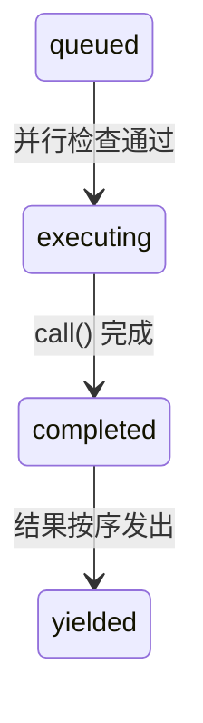

# 第七章：并行工具执行

## 等待的代价

第六章追踪了单一工具调用的生命周期——从 API 响应中的原始 `tool_use` 区块，经过输入验证、权限检查、执行，到结果格式化。那条管道处理的是一个工具。但模型很少只请求一个。

典型的 Claude Code 互动每个回合涉及三到五个工具调用。「读取这两个文件，grep 搜索这个模式，然后编辑这个函数。」模型在单一响应中发出所有这些请求。如果每个工具需要 200 毫秒，串行执行就要花整整一秒。如果 Read 和 Grep 调用是独立的——它们确实是——并行执行可以将时间压缩到 200 毫秒。五比一的提升，免费的。

但并非所有工具都是独立的。修改 `config.ts` 的 Edit 不能与另一个修改 `config.ts` 的 Edit 并行执行。建立目录的 Bash 命令必须在向该目录写入文件的 Bash 命令之前完成。并行性不是工具的全局属性，而是特定工具调用搭配特定输入的属性。

这就是驱动整个并行系统的洞见：**安全性是逐调用判定的，而非逐工具类型判定的。** `Bash("ls -la")` 可以安全地并行化。`Bash("rm -rf build/")` 则不行。相同的工具，不同的输入，不同的并行分类。系统必须在决定之前检查输入。

Claude Code 实现了两层并行优化。第一层是**批次编排**：在模型的响应完全接收后，将工具调用分区为并行和序列群组，然后适当地执行每个群组。第二层是**推测性执行**：在*模型仍在流响应的同时*就开始执行工具，在响应完成之前就收割结果。这两个机制结合起来，消除了大部分原本会花在等待上的挂钟时间。

---

## 分区算法

入口点是 `toolOrchestration.ts` 中的 `partitionToolCalls()`。它接收一个有序的 `ToolUseBlock` 消息数组，产生一个批次数组，其中每个批次要嘛是「全部并行安全」，要嘛是「单一序列工具」。

```typescript
// 伪代码 — 示意分区算法
type Group = { parallel: boolean; calls: ToolCall[] }

function groupBySafety(calls: ToolCall[], registry: ToolRegistry): Group[] {
  return calls.reduce((groups, call) => {
    const def = registry.lookup(call.name)
    const input = def?.schema.safeParse(call.input)
    // 失败封闭：解析失败或异常 → 序列
    const safe = input?.success
      ? tryCatch(() => def.isParallelSafe(input.data), false)
      : false
    // 将连续的安全调用合并到同一群组
    if (safe && groups.at(-1)?.parallel) {
      groups.at(-1)!.calls.push(call)
    } else {
      groups.push({ parallel: safe, calls: [call] })
    }
    return groups
  }, [] as Group[])
}
```

算法从左到右走访数组。对于每个工具调用：

1. **依名称查找工具定义。**
2. **用工具的 Zod schema 通过 `safeParse()` 解析输入。** 如果解析失败，该工具会被保守地归类为非并行安全。
3. **调用工具定义上的 `isConcurrencySafe(parsedInput)`。** 这是逐输入分类发生的地方。Bash 工具解析命令字符串，检查每个子命令是否为只读（`ls`、`grep`、`cat`、`git status`），并且只有在整个复合命令都是纯读取时才返回 `true`。Read 工具总是返回 `true`。Edit 工具总是返回 `false`。调用被包在 try-catch 中——如果 `isConcurrencySafe` 抛出异常（比方说 Bash 命令字符串无法被 shell-quote 函数库解析），该工具默认为序列。
4. **合并或建立批次。** 如果当前工具是并行安全的，且最近的批次也是并行安全的，就附加到该批次。否则，开始一个新批次。

结果是一个在并行群组和个别序列项目之间交替的批次序列。走过一个具体示例：

```
模型请求：[Read, Read, Grep, Edit, Read]

步骤 1：Read  → 并行安全   → 新批次    {safe, [Read]}
步骤 2：Read  → 并行安全   → 附加      {safe, [Read, Read]}
步骤 3：Grep  → 并行安全   → 附加      {safe, [Read, Read, Grep]}
步骤 4：Edit  → 非安全     → 新批次    {serial, [Edit]}
步骤 5：Read  → 并行安全   → 新批次    {safe, [Read]}

结果：3 个批次
  批次 1：[Read, Read, Grep]  — 并行执行
  批次 2：[Edit]              — 单独执行
  批次 3：[Read]              — 并行执行（仅一个工具）
```

分区是贪婪且保序的。连续的安全工具累积到单一批次中。任何不安全的工具都会中断累积并开始新批次。这意味着模型发出工具调用的顺序很重要——如果它在两个 Read 之间穿插一个 Write，你会得到三个批次而非两个。在实践中，模型倾向于将读取操作聚集在一起，这正是算法所优化的常见情况。

---

## 批次执行

`runTools()` 生成器遍历分区后的批次，并将每个批次分派到适当的执行器。

### 并行批次

对于并行批次，`runToolsConcurrently()` 使用 `all()` 工具函数并行发射所有工具，该函数将活跃生成器数量限制在并行上限内：

```typescript
// 伪代码 — 示意并行分派模式
async function* dispatchParallel(calls, context) {
  yield* boundedAll(
    calls.map(async function* (call) {
      context.markInProgress(call.id)
      yield* executeSingle(call, context)
      context.markComplete(call.id)
    }),
    MAX_CONCURRENCY,  // 默认：10
  )
}
```

并行上限默认为 10，可通过 `CLAUDE_CODE_MAX_TOOL_USE_CONCURRENCY` 设置。十是很宽裕的——你很少在单一模型响应中看到超过五到六个工具调用。这个限制是作为病态情况的安全阀存在的，而非典型约束。

`all()` 工具函数是 `Promise.all` 的生成器感知版本，带有有界并行。它同时启动最多 N 个生成器，从最先完成的那个 yield 结果，并在每个完成时启动下一个排队的生成器。机制类似于信号量守护的任务池，但适应了会 yield 中间结果的异步生成器。

**上下文修改器排队**是微妙之处。某些工具会产生*上下文修改器*——转换后续工具的 `ToolUseContext` 的函数。当工具并行执行时，你不能立即应用这些修改器，因为同一批次中的其他工具正在读取相同的上下文。取而代之的是，修改器被收集在一个以工具使用 ID 为键的 map 中：

```typescript
const queuedContextModifiers: Record<
  string,
  ((context: ToolUseContext) => ToolUseContext)[]
> = {}
```

在整个并行批次完成后，修改器按工具顺序（而非完成顺序）应用，保持确定性的上下文演进：

```typescript
for (const block of blocks) {
  const modifiers = queuedContextModifiers[block.id]
  if (!modifiers) continue
  for (const modifier of modifiers) {
    currentContext = modifier(currentContext)
  }
}
```

实际上，目前没有任何并行安全的工具会产生上下文修改器——代码库中的注释明确承认了这一点。但基础设施之所以存在，是因为工具可以由 MCP 服务器新增，而自定义的只读 MCP 工具可能合理地需要修改上下文（例如更新「已查看文件」集合）。

### 序列批次

序列执行很直观。每个工具执行，其上下文修改器立即应用，下一个工具就能看到更新后的上下文：

```typescript
for (const toolUse of toolUseMessages) {
  for await (const update of runToolUse(toolUse, /* ... */)) {
    if (update.contextModifier) {
      currentContext = update.contextModifier.modifyContext(currentContext)
    }
    yield { message: update.message, newContext: currentContext }
  }
}
```

这是关键差异。序列工具可以为后续工具改变世界。Edit 修改文件；下一个 Read 看到的是修改后的版本。Bash 命令建立目录；下一个 Bash 命令写入该目录。上下文修改器是这种依赖关系的形式化：它们让工具说「执行环境已经改变了，以下是改变的方式。」

---

## 流工具执行器

批次编排消除了模型响应*到达后*不必要的序列化。但有一个更大的机会：模型的响应需要时间流。典型的多工具响应可能需要 2-3 秒才能完全到达。第一个工具调用在 500 毫秒后就可以解析了。为什么要等剩下的 2 秒？

`StreamingToolExecutor` 类实现了推测性执行。当模型流其响应时，每个 `tool_use` 区块在完全解析的瞬间就被交给执行器。执行器立即开始执行它——而模型仍在产生下一个工具调用。当响应完成流时，可能已有数个工具完成了。

```mermaid
gantt
    title 串行 vs 流工具执行
    dateFormat X
    axisFormat %Ls

    section 串行
    模型流响应               :a1, 0, 2500
    工具 1 (0.2s)              :a2, after a1, 200
    工具 2 (0.3s)              :a3, after a2, 300
    工具 3 (0.1s)              :a4, after a3, 100

    section 流执行器
    模型流响应               :b1, 0, 2500
    工具 1 在 0.5s 启动        :b2, 500, 700
    工具 2 在 1.2s 启动        :b3, 1200, 1500
    工具 3 流后排空          :b4, 2500, 2600
```



串行总计：3.1 秒。流总计：2.6 秒——工具 1 和 2 在流期间完成，节省了 16% 的挂钟时间。

节省效果会累积。当模型请求五个只读工具且响应需要 3 秒流时，所有五个工具都可以在那 3 秒内启动并完成。流后的排空阶段无事可做。用户几乎在模型响应的最后一个字符出现后就立即看到结果。

### 工具生命周期

执行器追踪的每个工具会经历四种状态：



- **queued（排队）**：`tool_use` 区块已被解析并注册。等待并行条件允许执行。
- **executing（执行中）**：工具的 `call()` 函数正在执行。结果累积在缓冲区中。
- **completed（已完成）**：执行完毕。结果准备好被 yield 到对话中。
- **yielded（已产出）**：结果已被发出。终态。

### addTool()：流期间的排队

```typescript
addTool(block: ToolUseBlock, assistantMessage: AssistantMessage): void
```

每当一个完整的 `tool_use` 区块到达时，由流响应解析器调用。此方法：

1. 查找工具定义。如果找不到，立即建立一个带有错误消息的 `completed` 项目——排队一个不存在的工具没有意义。
2. 解析输入并使用与 `partitionToolCalls()` 相同的逻辑判定 `isConcurrencySafe`。
3. 推入一个状态为 `'queued'` 的 `TrackedTool`。
4. 调用 `processQueue()`——这可能会立即启动该工具。

对 `processQueue()` 的调用是即发即忘的（`void this.processQueue()`）。执行器不会 await 它。这是刻意的：`addTool()` 是从流解析器的事件处理器中调用的，在那里阻塞会使响应解析停滞。工具在背景开始执行，同时解析器继续消费流。

### processQueue()：准入检查

准入检查是一个单一述词：

```typescript
// 伪代码 — 示意互斥规则
canRun = noToolsRunning || (newToolIsSafe && allRunningAreSafe)
```

一个工具可以开始执行，若且唯若：
- **目前没有工具在执行**（队列为空），或
- **新工具和所有正在执行的工具都是并行安全的。**

这是一个互斥契约。非并行工具需要独占访问——其他什么都不能在执行。并行工具可以与其他并行工具共享跑道，但执行集合中单一个非并行工具就会阻止所有人。

`processQueue()` 方法按顺序遍历所有工具。对于每个排队的工具，它检查 `canExecuteTool()`。如果工具可以执行，就启动它。如果一个非并行工具还不能执行，循环会 *break*——它完全停止检查后续工具，因为非并行工具必须维持排序。如果一个并行工具不能执行（被正在执行的非并行工具阻止），循环会 *continue*——但实际上这很少有帮助，因为非并行阻止者之后的并行工具通常依赖于它的结果。

### executeTool()：核心执行循环

这个方法是真正复杂度所在之处。它管理中断控制器、错误级联、进度报告和上下文修改器。

**子中断控制器。** 每个工具都有自己的 `AbortController`，是共享的兄弟层级控制器的子项。

这个层次结构有三层深度：查询层级控制器（由 REPL 拥有，在用户按 Ctrl+C 时触发）是兄弟控制器（由流执行器拥有，在 Bash 错误时触发）的父项，而兄弟控制器又是每个工具的个别控制器的父项。中断兄弟控制器会终止所有正在执行的工具。中断工具的个别控制器只会终止该工具——但如果中断原因不是兄弟错误，它也会向上冒泡到查询控制器。这个向上冒泡防止系统在例如权限拒绝应该结束整个回合时，静默地丢弃执行器。

这个向上冒泡对权限拒绝至关重要。当用户在权限对话框中拒绝一个工具时，该工具的中断控制器触发。该信号必须到达查询循环，使其能够结束回合。没有它，查询循环会继续执行，就好像什么都没发生一样，向模型发送一个过时的拒绝消息。

**兄弟错误级联。** 当一个工具产生错误结果时，执行器检查是否要取消兄弟工具。规则：**只有 Bash 错误会级联。** 当 shell 命令出错时，执行器记录失败，捕获出错工具的描述，并中断兄弟控制器——这会取消批次中所有其他正在执行的工具。

这个理由是务实的。Bash 命令经常形成隐式的依赖链：`mkdir build && cp src/* build/ && tar -czf dist.tar.gz build/`。如果 `mkdir` 失败，执行 `cp` 和 `tar` 是毫无意义的。立即取消兄弟可以节省时间并避免令人困惑的错误消息。

相比之下，Read 和 Grep 的错误是独立的。如果某个文件读取因为文件被删除而失败，这对正在搜索不同目录的并行 grep 没有任何影响。取消 grep 会无谓地浪费工作。

错误级联为兄弟工具产生合成的错误消息：

```
Cancelled: parallel tool call Bash(mkdir build) errored
```

描述包含出错工具的命令或文件路径的前 40 个字符，给模型足够的上下文来理解发生了什么。

**进度消息**与结果分开处理。结果会被缓冲并按序 yield，而进度消息（如「正在读取文件...」或「搜索中...」等状态更新）则进入 `pendingProgress` 数组，并通过 `getCompletedResults()` 立即 yield。一个 resolve 回调在新进度到达时唤醒 `getRemainingResults()` 循环，防止 UI 在长时间执行的工具期间看起来冻结。

**队列重新处理。** 每个工具完成后，`processQueue()` 会再次被调用：

```typescript
void promise.finally(() => {
  void this.processQueue()
})
```

这就是被并行批次阻止的序列工具如何被启动的。当最后一个并行工具完成时，后续非并行工具的 `canExecuteTool()` 检查通过，它就开始执行。

### 结果收割

流执行器公开两个收割方法，为响应生命周期的两个不同阶段而设计。

**`getCompletedResults()` — 流中收割。** 这是一个同步生成器，在流 API 响应的区块之间调用。它按顺序走访工具数组，并为任何已完成的工具 yield 结果：

`getCompletedResults()` 是一个同步生成器，按提交顺序走访工具数组。对于每个工具，它首先排空任何待处理的进度消息。如果工具已完成，它 yield 结果并将其标记为已产出。关键规则：如果一个非并行工具仍在执行，走访会 **break**——它之后的任何东西都不能被 yield，即使后续工具已经完成。序列工具之后的结果可能依赖于其上下文修改，因此必须等待。对于并行工具，此限制不适用；循环跳过正在执行的并行工具并继续检查后续项目。

这个 break 就是保序机制。如果一个非并行工具仍在执行，它之后的任何东西都不能被 yield——即使后续工具已经完成。序列工具之后的结果可能依赖于其上下文修改，因此必须等待。对于并行工具，此限制不适用；循环跳过正在执行的并行工具并继续检查后续项目。

**`getRemainingResults()` — 流后排空。** 在模型的响应完全接收后调用。这个异步生成器循环直到每个工具都被 yield：

`getRemainingResults()` 是流后排空。它循环直到每个工具都被 yield。每次迭代中，它处理队列（启动任何新解除阻止的工具），通过 `getCompletedResults()` yield 任何已完成的结果，然后——如果工具仍在执行但没有新的完成——使用 `Promise.race` 空闲等待最先完成的那个：任何正在执行的工具的 promise，或进度可用信号。这避免了忙碌轮询，同时仍在有事发生的瞬间醒来。当没有工具完成且没有新的可以启动时，执行器等待任何正在执行的工具完成（或进度到达）。这避免了忙碌轮询，同时仍在有事发生的瞬间醒来。

### 保序

结果按工具*接收*的顺序 yield，而非*完成*的顺序。这是一个刻意的设计选择。

考虑一个模型响应请求 `[Read("a.ts"), Read("b.ts"), Read("c.ts")]`。三个都并行启动。`c.ts` 最先完成（它比较小），然后是 `a.ts`，然后是 `b.ts`。如果结果按完成顺序 yield，对话会显示：

```
工具结果：c.ts 内容
工具结果：a.ts 内容
工具结果：b.ts 内容
```

但模型是按 a-b-c 顺序发出它们的。对话历史必须符合模型的预期，否则下一个回合会搞不清楚哪个结果对应哪个请求。通过按到达顺序 yield，对话保持连贯：

```
工具结果：a.ts 内容  （第二个完成，第一个 yield）
工具结果：b.ts 内容  （第三个完成，第二个 yield）
工具结果：c.ts 内容  （第一个完成，第三个 yield）
```

代价很小：如果工具 1 很慢而工具 2-5 很快，快速的结果会待在缓冲区直到工具 1 完成。但替代方案——对话不连贯——远比这糟糕得多。

### discard()：流回退的逃生舱口

当 API 响应流在中途失败（网络错误、服务器断线）时，系统会用新的 API 调用重试。但流执行器可能已经从失败的尝试中启动了工具。那些结果现在是孤儿——它们对应的是一个从未完全接收的响应。

```typescript
discard(): void {
  this.discarded = true
}
```

设置 `discarded = true` 会导致：
- `getCompletedResults()` 立即返回，不带任何结果。
- `getRemainingResults()` 立即返回，不带任何结果。
- 任何开始执行的工具会检查 `getAbortReason()`，看到 `streaming_fallback`，并得到一个合成错误而非真正执行。

被丢弃的执行器被弃置。一个新的执行器为重试尝试而建立。

---

## 工具并行属性

每个内置工具通过 `isConcurrencySafe()` 方法声明其并行特性。这个分类不是任意的——它反映了工具对共享状态的实际影响。

| 工具 | 并行安全 | 条件 | 理由 |
|------|---------|------|------|
| **Read** | 总是 | -- | 纯读取。无副作用。 |
| **Grep** | 总是 | -- | 纯读取。封装 ripgrep。 |
| **Glob** | 总是 | -- | 纯读取。文件列表。 |
| **Fetch** | 总是 | -- | HTTP GET。无本地副作用。 |
| **WebSearch** | 总是 | -- | 对搜索提供者的 API 调用。 |
| **Bash** | 有时 | 仅只读命令 | `isReadOnly()` 解析命令并分类子命令。`ls`、`git status`、`cat`、`grep` 是安全的。`rm`、`mkdir`、`mv` 则不是。 |
| **Edit** | 从不 | -- | 修改文件。两个并行编辑同一文件会损坏它。 |
| **Write** | 从不 | -- | 建立或覆盖文件。相同的损坏风险。 |
| **NotebookEdit** | 从不 | -- | 修改 `.ipynb` 文件。 |

Bash 工具的分类值得细说。它使用 `splitCommandWithOperators()` 来分解复合命令（`&&`、`||`、`;`、`|`），然后将每个子命令与已知安全集合进行分类：

- **搜索命令**：`grep`、`rg`、`find`、`fd`、`ag`、`ack`
- **读取命令**：`cat`、`head`、`tail`、`wc`、`jq`、`less`、`file`、`stat`
- **列表命令**：`ls`、`tree`、`du`、`df`
- **中性命令**：`echo`、`printf`（无副作用但不算「读取」）

复合命令只有在每个非中性子命令都在搜索、读取或列表集合中时才是只读的。`ls -la && cat README.md` 是安全的。`ls -la && rm -rf build/` 则不是——`rm` 污染了整个命令。

---

## 中断行为契约

当工具正在执行时，用户可以输入新消息。应该发生什么？答案取决于工具。

每个工具声明一个 `interruptBehavior()` 方法，返回 `'cancel'` 或 `'block'`：

- **`'cancel'`**：立即停止工具，丢弃部分结果，并处理新的用户消息。用于部分执行无害的工具（读取、搜索）。
- **`'block'`**：保持工具执行到完成。用户的新消息等待。用于中断会使系统处于不一致状态的工具（进行中的写入、长时间执行的 bash 命令）。这是默认值。

流执行器追踪当前工具集合的可中断状态：

可中断状态通过检查所有正在执行的工具来更新：只有当每个正在执行的工具都支持取消时，集合才是可中断的。如果哪怕只有一个工具的中断行为是 `'block'`，整个集合就被视为不可中断。

UI 只在所有正在执行的工具都支持取消时才显示「可中断」指示器。如果哪怕只有一个工具是 `'block'`，整个集合就被视为不可中断。这是保守但正确的：你无法有意义地中断一个其中一个工具无论如何都会继续执行的批次。

当用户确实中断且所有工具都可取消时，中断控制器以原因 `'interrupt'` 触发。执行器的 `getAbortReason()` 方法逐一检查每个工具的中断行为——`'cancel'` 工具得到一个合成的 `user_interrupted` 错误，而 `'block'` 工具（在完全可中断的集合中不会出现，但代码处理了这个边界情况）继续执行。

---

## 上下文修改器：仅序列契约

上下文修改器是类型为 `(context: ToolUseContext) => ToolUseContext` 的函数。它们让工具说「我改变了执行环境的某些东西，后续工具需要知道这件事。」

契约很简单：**上下文修改器只为序列（非并行安全）工具应用。** 这在源码中被明确说明：

```typescript
// 注意：我们目前不支持并行工具的上下文修改器。
//       目前没有在使用中，但如果我们想在并行工具中使用
//       它们，我们需要在这里支持。
if (!tool.isConcurrencySafe && contextModifiers.length > 0) {
  for (const modifier of contextModifiers) {
    this.toolUseContext = modifier(this.toolUseContext)
  }
}
```

在批次编排路径（`toolOrchestration.ts`）中，并行批次的修改器在批次完成后，按工具提交顺序收集和应用。这意味着同一批次内的并行工具看不到彼此的上下文变更，但它们之后的批次可以。

这种不对称是刻意的。如果工具 A 修改上下文而工具 B 读取该上下文，它们就有数据依赖。数据依赖意味着它们不能并行执行。按定义，如果两个工具是并行安全的，任何一方都不应该依赖另一方的上下文修改。系统通过延迟应用来强制执行这一点。

---

## 实践应用

Claude Code 中的并行模式可以推广到任何编排多个独立操作的系统。有三个原则值得提取。

**依安全性分区，而非依类型分区。** `isConcurrencySafe(input)` 方法接收的是解析后的输入，而非仅仅是工具名称。这种逐调用的分类比静态的「此工具类型总是安全的」声明更精确。在你自己的系统中，在决定是否并行化之前先检查操作的引数。数据库读取可以安全地并行化；对同一行的数据库写入则不行。单靠操作类型不能告诉你足够的信息。

**在 I/O 等待期间进行推测性执行。** 流执行器在 API 响应仍在到达时就开始工具。相同的模式适用于任何有慢生产者和快消费者的场景：在后续项目仍在产生时就开始处理早期项目。HTTP/2 服务器推送、编译器管道并行化和推测性 CPU 执行都共享这个结构。关键要求是你能在完整的指令集可用之前就识别出独立的工作。

**在结果中保持提交顺序。** 按完成顺序 yield 结果很诱人——它能最小化到第一个结果的延迟。但如果消费者（在这个案例中是语言模型）期望结果以特定顺序呈现，重新排序会造成混乱，而解决这种混乱所花的时间比延迟节省还要多。缓冲已完成的结果，并按请求的顺序释放它们。实现成本只是一个简单的数组走访；正确性的收益是绝对的。

流执行器模式对代理系统特别强大。任何时候你的代理循环涉及一个「思考，然后行动」的循环，而思考阶段产生多个独立的动作，你都可以将思考的尾部与行动的开头重叠。节省的程度与思考时间对行动时间的比例成正比。对于语言模型代理，思考时间（API 响应产生）占主导地位，节省相当可观。

---

## 总结

Claude Code 的并行系统在两个层级运作。分区算法（`partitionToolCalls`）将连续的并行安全工具分组为并行执行的批次，同时将不安全的工具隔离到序列批次中，其中每个工具能看到前一个的效果。流工具执行器（`StreamingToolExecutor`）更进一步，在模型响应流期间推测性地启动到达的工具，让工具执行与响应产生重叠。

安全模型在设计上是保守的。并行安全性通过检查解析后的输入逐调用判定。未知工具默认为序列。解析失败默认为序列。安全检查中的异常默认为序列。系统从不猜测某东西可以安全地并行化——工具必须肯定地声明它。

错误处理遵循工具的依赖结构。Bash 错误级联到兄弟，因为 shell 命令经常形成隐式的管道。Read 和搜索错误是隔离的，因为它们是独立操作。中断控制器层次结构——查询控制器、兄弟控制器、逐工具控制器——给予每个层级取消其范围而不干扰上层的能力。

结果是一个从模型的工具请求中提取最大并行性的系统，同时维持对话历史反映连贯、有序的动作序列这一不变量。模型按它请求的顺序看到结果。用户看到工具以底层操作允许的最快速度完成。这两者之间的差距——执行速度对上呈现顺序——由缓冲来弥合，而那个缓冲是整个系统中最简单的部分。
