# 第八章：派生子代理（Sub-Agent）

## 智能的倍增

单一代理已经很强大。它能读取文件、编辑代码、执行测试、搜索网页，并对结果进行推理。但在单一对话中，一个代理能做的事有一个硬上限：上下文窗口会被填满、任务会分岔到需要不同能力的方向，而工具执行的序列本质会成为瓶颈。解决方案不是更大的模型，而是更多的代理。

Claude Code 的子代理（Sub-Agent）系统让模型能够请求协助。当父代理遇到一个适合委派的任务——一个不应该污染主对话的代码库搜索、一个需要对抗性思维的验证步骤、一组可以并行执行的独立编辑——它会调用 `Agent` 工具。该调用会产生一个子代理：一个完全独立的代理，拥有自己的对话循环、自己的工具集、自己的权限边界，以及自己的中止控制器。子代理完成工作并返回结果。父代理永远看不到子代理的内部推理，只看到最终输出。

这不是一个便利功能。它是从并行文件探索到协调者——工作者阶层体系再到多代理群集团队等一切的架构基础。而且一切都流经两个文件：`AgentTool.tsx` 定义了模型面对的接口，而 `runAgent.ts` 实现了生命周期。

设计挑战是显着的。子代理需要足够的上下文来完成工作，但又不能多到在无关信息上浪费 token。它需要足够严格以确保安全但又足够灵活以维持实用性的权限边界。它需要能清理它接触过的所有资源的生命周期管理，而不需要调用者记得要清理什么。而且所有这些都必须适用于各种代理类型——从廉价、快速、只读的 Haiku 搜索器，到昂贵、彻底的 Opus 驱动的验证代理，在背景中执行对抗性测试。

本章追踪从模型的「我需要帮助」到一个完全运作的子代理的路径。我们将检视模型看到的工具定义、建立执行环境的十五步骤生命周期、六种内置代理类型及各自的优化方向、让用户定义自定义代理的 frontmatter 系统，以及从所有这些中浮现的设计原则。

术语说明：在本章中，「父代理」指的是调用 `Agent` 工具的代理，「子代理」指的是被产生的代理。父代理通常（但不总是）是顶层 REPL 代理。在协调者模式中，协调者产生工作者，工作者就是子代理。在巢状场景中，子代理本身可以产生孙代理——同样的生命周期递归适用。

协调层横跨大约 40 个文件，分布在 `tools/AgentTool/`、`tasks/`、`coordinator/`、`tools/SendMessageTool/` 和 `utils/swarm/` 中。本章聚焦于产生机制——AgentTool 定义和 runAgent 生命周期。下一章涵盖运行时：进度追踪、结果提取，以及多代理协调模式。

---

## AgentTool 定义

`AgentTool` 以名称 `"Agent"` 注册，并带有一个遗留别名 `"Task"` 以向后兼容旧的 transcript、权限规则和钩子设置。它使用标准的 `buildTool()` 工厂构建，但它的 schema 比系统中任何其他工具都更具动态性。

### 输入 Schema

输入 schema 通过 `lazySchema()` 延迟构建——这是我们在第六章看过的模式，将 zod 编译延迟到首次使用时。有两个层次：一个基础 schema 和一个加入多代理及隔离参数的完整 schema。

基础字段始终存在：

| 字段 | 类型 | 必填 | 用途 |
|------|------|------|------|
| `description` | `string` | 是 | 任务的 3-5 字简短摘要 |
| `prompt` | `string` | 是 | 给代理的完整任务描述 |
| `subagent_type` | `string` | 否 | 使用哪种专门代理 |
| `model` | `enum('sonnet','opus','haiku')` | 否 | 此代理的模型覆盖 |
| `run_in_background` | `boolean` | 否 | 异步启动 |

完整 schema 加入了多代理参数（当群集功能启用时）和隔离控制：

| 字段 | 类型 | 用途 |
|------|------|------|
| `name` | `string` | 使代理可通过 `SendMessage({to: name})` 定址 |
| `team_name` | `string` | 产生时的团队上下文 |
| `mode` | `PermissionMode` | 产生的队友的权限模式 |
| `isolation` | `enum('worktree','remote')` | 文件系统隔离策略 |
| `cwd` | `string` | 工作目录的绝对路径覆盖 |

多代理字段启用了第九章涵盖的群集模式：具名代理可以在并行执行时通过 `SendMessage({to: name})` 互相发送消息。隔离字段启用文件系统安全：worktree 隔离建立一个临时 git worktree，让代理在仓库的副本上操作，防止多个代理同时在同一代码库上工作时产生冲突的编辑。

使这个 schema 不寻常的是它**由功能标志动态塑形**：

```typescript
// 虚拟码 — 展示功能旗标控制的 schema 模式
inputSchema = lazySchema(() => {
  let schema = baseSchema()
  if (!featureEnabled('ASSISTANT_MODE')) schema = schema.omit({ cwd: true })
  if (backgroundDisabled || forkMode)    schema = schema.omit({ run_in_background: true })
  return schema
})
```

当 fork 实验启用时，`run_in_background` 完全从 schema 中消失，因为在该路径下所有产生都被强制为异步。当背景任务被禁用时（通过 `CLAUDE_CODE_DISABLE_BACKGROUND_TASKS`），该字段也会被移除。当 KAIROS 功能标志关闭时，`cwd` 被省略。模型永远看不到它不能使用的字段。

这是一个微妙但重要的设计选择。Schema 不仅仅是验证——它是模型的使用手册。Schema 中的每个字段都在模型读取的工具定义中描述。移除模型不应该使用的字段比在提示中加上「不要使用这个字段」更有效。模型无法误用它看不到的东西。

### 输出 Schema

输出是一个可判别的联合类型（discriminated union），有两个公开变体：

- `{ status: 'completed', prompt, ...AgentToolResult }` —— 同步完成，包含代理的最终输出
- `{ status: 'async_launched', agentId, description, prompt, outputFile }` —— 背景启动确认

另外还有两个内部变体（`TeammateSpawnedOutput` 和 `RemoteLaunchedOutput`），但它们被排除在导出的 schema 之外，以在外部构建中启用死码消除。打包器在对应的功能标志禁用时会移除这些变体及其关联的代码路径，使分发的二进位档更小。

`async_launched` 变体值得注意的是它包含了什么：代理结果完成时将被写入的 `outputFile` 路径。这让父代理（或任何其他消费者）可以轮询或监看该文件以取得结果，提供一个能在程序重启后存活的基于文件系统的通信通道。

### 动态提示

`AgentTool` 的提示由 `getPrompt()` 产生，且是上下文敏感的。它根据可用代理（内嵌列出或作为附件以避免破坏提示缓存）、fork 是否启用（加入「何时 fork」指引）、会话是否处于协调者模式（精简提示，因为协调者系统提示已涵盖用法）、以及订阅层级来调适。非专业版用户会得到一条关于同时启动多个代理的说明。

基于附件的代理列表值得强调。代码库的注解提到「大约 10.2% 的 fleet cache_creation token」是由动态工具描述造成的。将代理列表从工具描述移到附件消息中，可以保持工具描述为静态，这样连接 MCP 服务器或加载外挂程序就不会在每次后续 API 调用时破坏提示缓存。

这个模式值得内化，适用于任何使用带有动态内容的工具定义的系统。Anthropic API 缓存提示前缀——系统提示、工具定义和对话历史——并在后续共享相同前缀的请求中重用缓存的计算。如果工具定义在 API 调用之间改变（因为加入了代理或连接了 MCP 服务器），整个缓存就会失效。将易变内容从工具定义（它是缓存前缀的一部分）移到附件消息（它附加在缓存部分之后），可以在仍然向模型传递信息的同时保留缓存。

理解了工具定义后，我们现在可以追踪模型实际调用它时会发生什么。

### 功能闸控

子代理系统拥有代码库中最复杂的功能闸控。至少十二个功能标志和 GrowthBook 实验控制哪些代理可用、哪些参数出现在 schema 中、以及走哪条代码路径：

| 功能闸门 | 控制内容 |
|----------|----------|
| `FORK_SUBAGENT` | Fork 代理路径 |
| `BUILTIN_EXPLORE_PLAN_AGENTS` | Explore 和 Plan 代理 |
| `VERIFICATION_AGENT` | 验证代理 |
| `KAIROS` | `cwd` 覆盖、助理强制异步 |
| `TRANSCRIPT_CLASSIFIER` | 交接分类、`auto` 模式覆盖 |
| `PROACTIVE` | 主动模块整合 |

每个闸门使用 Bun 的死码消除系统中的 `feature()`（编译时期）或 GrowthBook 的 `getFeatureValue_CACHED_MAY_BE_STALE()`（运行时 A/B 测试）。编译时期的闸门在构建期间进行字符串替换——当 `FORK_SUBAGENT` 为 `'ant'` 时，整个 fork 代码路径被包含；当它为 `'external'` 时，可能被完全排除。GrowthBook 闸门允许即时实验：`tengu_amber_stoat` 实验可以 A/B 测试移除 Explore 和 Plan 代理是否改变用户行为，而无需发布新的二进位档。

### call() 决策树

在 `runAgent()` 被调用之前，`AgentTool.tsx` 中的 `call()` 方法将请求路由通过一个决策树，该树决定要产生*什么类型*的代理以及*如何*产生它：

```
1. 这是队友生成吗？（team_name + name 都有配置）
   是 -> spawnTeammate() -> 返回 teammate_spawned
   否 -> 继续

2. 解析有效代理类型
   - 提供了 subagent_type -> 使用它
   - 未提供 subagent_type，fork 启用 -> undefined（fork 路径）
   - 未提供 subagent_type，fork 禁用 -> "general-purpose"（默认）

3. 这是 fork 路径吗？（effectiveType === undefined）
   是 -> 递归 fork 守卫检查 -> 使用 FORK_AGENT 定义

4. 从 activeAgents 列表解析代理定义
   - 依权限拒绝规则过滤
   - 依 allowedAgentTypes 过滤
   - 若未找到或被拒绝则抛出错误

5. 检查必要的 MCP 服务器（等待待处理的最多 30 秒）

6. 解析隔离模式（参数覆盖代理定义）
   - "remote" -> teleportToRemote() -> 返回 remote_launched
   - "worktree" -> createAgentWorktree()
   - null -> 正常执行

7. 判断同步 vs 非同步
   shouldRunAsync = run_in_background || selectedAgent.background ||
                    isCoordinator || forceAsync || isProactiveActive

8. 组装工作者工具池

9. 建构系统提示和提示消息

10. 执行（非同步 -> registerAsyncAgent + void 生命周期；同步 -> 迭代 runAgent）
```

步骤 1 到 6 是纯路由——还没有建立任何代理。实际的生命周期从 `runAgent()` 开始，同步路径直接迭代它，异步路径将它包装在 `runAsyncAgentLifecycle()` 中。

路由在 `call()` 而非 `runAgent()` 中完成是有原因的：`runAgent()` 是一个纯粹的生命周期函数，不知道队友、远端代理或 fork 实验的存在。它接收一个已解析的代理定义并执行它。决定要解析*哪个*定义、*如何*隔离代理、以及*是否*同步或异步执行属于上层。这种分离使 `runAgent()` 可测试且可重用——它从正常的 AgentTool 路径和从恢复背景代理时的异步生命周期包装器中都会被调用。

步骤 3 中的 fork 守卫值得关注。Fork 子代理在其工具池中保留 `Agent` 工具（为了与父代理保持缓存相同的工具定义），但递归 fork 将是病态的。两个守卫防止这种情况：`querySource === 'agent:builtin:fork'`（设置在子代理的上下文选项上，在 autocompact 后仍然存在）和 `isInForkChild(messages)`（扫描对话历史寻找 `<fork-boilerplate>` 标签作为后备）。双重保险——主要守卫快速且可靠；后备守卫捕捉 querySource 未被串联的边界情况。

---

## runAgent 生命周期

`runAgent.ts` 中的 `runAgent()` 是一个异步生成器，驱动子代理的整个生命周期。它在代理工作时 yield `Message` 对象。每个子代理——fork、内置、自定义、协调者工作者——都流经这个单一函数。该函数大约 400 行，每一行都有其存在的理由。

函数签名揭示了问题的复杂度：

```typescript
export async function* runAgent({
  agentDefinition,       // 什么类型的代理
  promptMessages,        // 告诉它什么
  toolUseContext,        // 父代理的执行上下文
  canUseTool,           // 权限回调
  isAsync,              // 背景还是阻塞？
  canShowPermissionPrompts,
  forkContextMessages,  // 父代理的历史（仅 fork）
  querySource,          // 来源追踪
  override,             // 系统提示、中止控制器、代理 ID 覆盖
  model,                // 调用者的模型覆盖
  maxTurns,             // 回合限制
  availableTools,       // 预先组装的工具池
  allowedTools,         // 权限范围
  onCacheSafeParams,    // 背景摘要的回调
  useExactTools,        // Fork 路径：使用父代理的精确工具
  worktreePath,         // 隔离目录
  description,          // 人类可读的任务描述
  // ...
}: { ... }): AsyncGenerator<Message, void>
```

十七个参数。每一个都代表生命周期必须处理的一个变化维度。这不是过度工程——它是一个函数同时服务 fork 代理、内置代理、自定义代理、同步代理、异步代理、worktree 隔离代理和协调者工作者的自然结果。替代方案会是七个不同的生命周期函数加上重复的逻辑，那更糟。

`override` 对象特别重要——它是 fork 代理和恢复代理的逃生口，需要将预先计算的值（系统提示、中止控制器、代理 ID）注入生命周期而不重新衍生它们。

以下是十五个步骤。

### 步骤 1：模型解析

```typescript
const resolvedAgentModel = getAgentModel(
  agentDefinition.model,                    // 代理声明的偏好
  toolUseContext.options.mainLoopModel,      // 父代理的模型
  model,                                    // 调用者的覆盖（来自输入）
  permissionMode,                           // 目前的权限模式
)
```

解析链是：**调用者覆盖 > 代理定义 > 父代理模型 > 默认值**。`getAgentModel()` 函数处理特殊值如 `'inherit'`（使用父代理正在用的）和特定代理类型的 GrowthBook 闸控覆盖。例如，Explore 代理对外部用户默认使用 Haiku——最便宜且最快的模型，适合每周执行 3,400 万次的只读搜索专家。

为什么这个顺序很重要：调用者（父模型）可以通过在工具调用中传入 `model` 参数来覆盖代理定义的偏好。这让父代理能在特别复杂的搜索中将通常廉价的代理提升到更强大的模型，或在任务简单时降级昂贵的代理。但代理定义的模型是默认值，而不是父代理的——一个 Haiku Explore 代理不应该仅仅因为没有人指定而意外继承父代理的 Opus 模型。

理解模型解析链很重要，因为它建立了一个在整个生命周期中反复出现的设计原则：**明确的覆盖优先于声明，声明优先于继承，继承优先于默认值。** 同样的原则管辖权限模式、中止控制器和系统提示。这种一致性使系统可预测——一旦你理解了一条解析链，你就理解了所有的。

### 步骤 2：代理 ID 建立

```typescript
const agentId = override?.agentId ? override.agentId : createAgentId()
```

代理 ID 遵循 `agent-<hex>` 模式，其中 hex 部分衍生自 `crypto.randomUUID()`。品牌类型 `AgentId` 在类型层级防止意外的字符串混淆。覆盖路径存在于需要为 transcript 连续性保持原始 ID 的恢复代理。

### 步骤 3：上下文准备

Fork 代理和全新代理在这里分岔：

```typescript
const contextMessages: Message[] = forkContextMessages
  ? filterIncompleteToolCalls(forkContextMessages)
  : []
const initialMessages: Message[] = [...contextMessages, ...promptMessages]

const agentReadFileState = forkContextMessages !== undefined
  ? cloneFileStateCache(toolUseContext.readFileState)
  : createFileStateCacheWithSizeLimit(READ_FILE_STATE_CACHE_SIZE)
```

对于 fork 代理，父代理的整个对话历史被克隆到 `contextMessages` 中。但有一个关键过滤器：`filterIncompleteToolCalls()` 移除任何缺少匹配 `tool_result` 区块的 `tool_use` 区块。没有这个过滤器，API 会拒绝格式错误的对话。这发生在父代理在 fork 的那一刻正在执行工具中途——tool_use 已经发出但结果尚未到达。

文件状态缓存遵循同样的 fork 或全新模式。Fork 子代理得到父代理缓存的克隆（它们已经「知道」哪些文件已被读取）。全新代理从空开始。克隆是浅拷贝——文件内容字符串通过引用共享，而非复制。这对内存很重要：一个拥有 50 个文件缓存的 fork 子代理不会复制 50 份文件内容，它复制的是 50 个指标。LRU 逐出行为是独立的——每个缓存根据自己的访问模式进行逐出。

### 步骤 4：CLAUDE.md 移除

像 Explore 和 Plan 这样的只读代理在其定义中有 `omitClaudeMd: true`：

```typescript
const shouldOmitClaudeMd =
  agentDefinition.omitClaudeMd &&
  !override?.userContext &&
  getFeatureValue_CACHED_MAY_BE_STALE('tengu_slim_subagent_claudemd', true)
const { claudeMd: _omittedClaudeMd, ...userContextNoClaudeMd } = baseUserContext
const resolvedUserContext = shouldOmitClaudeMd
  ? userContextNoClaudeMd
  : baseUserContext
```

CLAUDE.md 文件包含关于提交消息、PR 惯例、lint 规则和编码标准的项目特定指示。一个只读搜索代理不需要这些——它不能提交、不能建立 PR、不能编辑文件。父代理拥有完整的上下文并会解读搜索结果。在此处移除 CLAUDE.md 每周在整个 fleet 上节省数十亿 token——这是一个累计的成本降低，足以证明条件式上下文注入的额外复杂度是值得的。

类似地，Explore 和 Plan 代理从系统上下文中移除了 `gitStatus`。在会话开始时提取的 git 状态快照可能高达 40KB，而且明确标记为过时的。如果这些代理需要 git 信息，它们可以自己执行 `git status` 取得新鲜数据。

这些不是过早优化。以每周 3,400 万次 Explore 产生来计算，每个不必要的 token 都会累积成可衡量的成本。终止开关（`tengu_slim_subagent_claudemd`）默认为 true，但如果移除导致回归可以通过 GrowthBook 翻转。

### 步骤 5：权限隔离

这是最复杂的步骤。每个代理得到一个自定义的 `getAppState()` 包装器，将其权限设置叠加在父代理的状态之上：

```typescript
const agentGetAppState = () => {
  const state = toolUseContext.getAppState()
  let toolPermissionContext = state.toolPermissionContext

  // 覆盖模式，除非父代理处于 bypassPermissions、acceptEdits 或 auto
  if (agentPermissionMode && canOverride) {
    toolPermissionContext = {
      ...toolPermissionContext,
      mode: agentPermissionMode,
    }
  }

  // 对无法显示 UI 的代理自动拒绝提示
  const shouldAvoidPrompts =
    canShowPermissionPrompts !== undefined
      ? !canShowPermissionPrompts
      : agentPermissionMode === 'bubble'
        ? false
        : isAsync
  if (shouldAvoidPrompts) {
    toolPermissionContext = {
      ...toolPermissionContext,
      shouldAvoidPermissionPrompts: true,
    }
  }

  // 限定工具允许规则的范围
  if (allowedTools !== undefined) {
    toolPermissionContext = {
      ...toolPermissionContext,
      alwaysAllowRules: {
        cliArg: state.toolPermissionContext.alwaysAllowRules.cliArg,
        session: [...allowedTools],
      },
    }
  }

  return { ...state, toolPermissionContext, effortValue }
}
```

有四个不同的关注点分层在一起：

**权限模式级联。** 如果父代理处于 `bypassPermissions`、`acceptEdits` 或 `auto` 模式，父代理的模式始终胜出——代理定义无法弱化它。否则，套用代理定义的 `permissionMode`。这防止自定义代理在用户已为会话明确设置宽松模式时降级安全。

**提示回避。** 背景代理无法显示权限对话框——没有终端附着。所以 `shouldAvoidPermissionPrompts` 被设为 `true`，导致权限系统自动拒绝而非阻塞。例外是 `bubble` 模式：这些代理将提示浮现到父代理的终端，所以无论同步/异步状态如何它们都可以显示提示。

**自动检查排序。** *能*显示提示的背景代理（bubble 模式）设置 `awaitAutomatedChecksBeforeDialog`。这意味着分类器和权限钩子先执行；只有在自动解析失败时才中断用户。对于后台任务，多等一秒等分类器完成是可以的——用户不应该被不必要地中断。

**工具权限范围限定。** 当提供了 `allowedTools` 时，它完全取代会话级别的允许规则。这防止父代理的核准泄漏到有范围限定的代理。但 SDK 级别的权限（来自 `--allowedTools` CLI 标志）被保留——那些代表嵌入应用的明确安全策略，应该到处适用。

### 步骤 6：工具解析

```typescript
const resolvedTools = useExactTools
  ? availableTools
  : resolveAgentTools(agentDefinition, availableTools, isAsync).resolvedTools
```

Fork 代理使用 `useExactTools: true`，将父代理的工具数组原封不动地传递。这不仅仅是方便——它是一个缓存优化。不同的工具定义序列化方式不同（不同的权限模式产生不同的工具元数据），任何工具区块的差异都会破坏提示缓存。Fork 子代理需要字节相同的前缀。

对于普通代理，`resolveAgentTools()` 套用一个分层过滤器：
- `tools: ['*']` 表示所有工具；`tools: ['Read', 'Bash']` 表示只有那些
- `disallowedTools: ['Agent', 'FileEdit']` 从池中移除那些
- 内置代理和自定义代理有不同的基础不允许工具集
- 异步代理通过 `ASYNC_AGENT_ALLOWED_TOOLS` 过滤

结果是每种代理类型只看到它应该拥有的工具。Explore 代理不能调用 FileEdit。验证代理不能调用 Agent（不允许从验证器递归产生）。自定义代理比内置代理有更严格的默认拒绝列表。

### 步骤 7：系统提示

```typescript
const agentSystemPrompt = override?.systemPrompt
  ? override.systemPrompt
  : asSystemPrompt(
      await getAgentSystemPrompt(
        agentDefinition, toolUseContext,
        resolvedAgentModel, additionalWorkingDirectories, resolvedTools
      )
    )
```

Fork 代理通过 `override.systemPrompt` 接收父代理预先渲染的系统提示。这从 `toolUseContext.renderedSystemPrompt` 串联而来——父代理在其上次 API 调用中使用的精确字节。通过 `getSystemPrompt()` 重新计算系统提示可能会产生差异。GrowthBook 功能可能在父代理的调用和子代理的调用之间从冷变热。系统提示中的单一字节差异就会破坏整个提示缓存前缀。

对于普通代理，`getAgentSystemPrompt()` 调用代理定义的 `getSystemPrompt()` 函数，然后用环境细节增强——绝对路径、表情符号指引（Claude 在某些上下文中倾向于过度使用表情符号），以及模型特定的指示。

### 步骤 8：中止控制器隔离

```typescript
const agentAbortController = override?.abortController
  ? override.abortController
  : isAsync
    ? new AbortController()
    : toolUseContext.abortController
```

三行代码，三种行为：

- **覆盖**：用于恢复背景代理或特殊的生命周期管理。优先采用。
- **异步代理得到一个新的、未链接的控制器。** 当用户按 Escape 时，父代理的中止控制器触发。异步代理应该存活下来——它们是用户选择委派的后台任务。它们的独立控制器意味着它们继续执行。
- **同步代理共享父代理的控制器。** Escape 同时终止两者。子代理正在阻塞父代理；如果用户想停止，他们想停止一切。

这是那些事后看起来显而易见但如果做错会是灾难性的决策之一。一个在父代理中止时也中止的异步代理，每次用户按 Escape 问后续问题时都会丢失所有工作。一个忽略父代理中止的同步代理则会让用户盯着一个冻结的终端。

### 步骤 9：钩子注册

```typescript
if (agentDefinition.hooks && hooksAllowedForThisAgent) {
  registerFrontmatterHooks(
    rootSetAppState, agentId, agentDefinition.hooks,
    `agent '${agentDefinition.agentType}'`, true
  )
}
```

代理定义可以在 frontmatter 中声明自己的钩子（PreToolUse、PostToolUse 等）。这些钩子通过 `agentId` 限定范围到代理的生命周期——它们只在此代理的工具调用中触发，并在代理终止时的 `finally` 区块中自动清理。

`isAgent: true` 标志（最后的 `true` 参数）将 `Stop` 钩子转换为 `SubagentStop` 钩子。子代理触发 `SubagentStop` 而非 `Stop`，所以转换确保钩子在正确的事件上触发。

安全性在此很重要。当钩子的 `strictPluginOnlyCustomization` 启用时，只有外挂程序、内置和策略设置的代理钩子会被注册。用户控制的代理（来自 `.claude/agents/`）的钩子会被静默跳过。这防止恶意或设置错误的代理定义注入绕过安全控制的钩子。

### 步骤 10：技能预载

```typescript
const skillsToPreload = agentDefinition.skills ?? []
if (skillsToPreload.length > 0) {
  const allSkills = await getSkillToolCommands(getProjectRoot())
  // 解析名称，加载内容，前置到 initialMessages
}
```

代理定义可以在其 frontmatter 中指定 `skills: ["my-skill"]`。解析尝试三种策略：精确匹配、以代理的外挂程序名称为前缀（例如 `"my-skill"` 变成 `"plugin:my-skill"`）、以及 `":skillName"` 的后缀匹配来处理外挂程序命名空间的技能。三种策略的解析确保技能引用无论代理作者使用的是全限定名称、短名称还是外挂程序相对名称都能运作。

加载的技能成为前置到代理对话的用户消息。这意味着代理在看到任务提示之前「阅读」其技能指示——与主 REPL 中斜线命令使用的相同机制，被重新用于自动化技能注入。技能内容通过 `Promise.all()` 并行加载，以在指定多个技能时最小化启动延迟。

### 步骤 11：MCP 初始化

```typescript
const { clients: mergedMcpClients, tools: agentMcpTools, cleanup: mcpCleanup } =
  await initializeAgentMcpServers(agentDefinition, toolUseContext.options.mcpClients)
```

代理可以在 frontmatter 中定义自己的 MCP 服务器，作为父代理客户端的附加。支持两种形式：

- **按名称引用**：`"slack"` 查找现有的 MCP 设置并取得一个共享的、记忆化的客户端
- **内联定义**：`{ "my-server": { command: "...", args: [...] } }` 建立一个新客户端，在代理结束时清理

只有新建立的（内联的）客户端会被清理。共享客户端在父代理层级被记忆化，并在代理的生命周期之后持续存在。这个区别防止代理意外拆除其他代理或父代理仍在使用的 MCP 连接。

MCP 初始化发生在钩子注册和技能预载*之后*但在上下文建立*之前*。这个顺序很重要：MCP 工具必须在 `createSubagentContext()` 将工具快照到代理的选项之前合并到工具池中。重新排序这些步骤将意味着代理要么没有 MCP 工具，要么有了但它们不在其工具池中。

### 步骤 12：上下文建立

```typescript
const agentToolUseContext = createSubagentContext(toolUseContext, {
  options: agentOptions,
  agentId,
  agentType: agentDefinition.agentType,
  messages: initialMessages,
  readFileState: agentReadFileState,
  abortController: agentAbortController,
  getAppState: agentGetAppState,
  shareSetAppState: !isAsync,
  shareSetResponseLength: true,
  criticalSystemReminder_EXPERIMENTAL:
    agentDefinition.criticalSystemReminder_EXPERIMENTAL,
  contentReplacementState,
})
```

`utils/forkedAgent.ts` 中的 `createSubagentContext()` 组装新的 `ToolUseContext`。关键的隔离决策：

- **同步代理与父代理共享 `setAppState`**。状态变更（如权限核准）对两者立即可见。用户看到一个一致的状态。
- **异步代理得到隔离的 `setAppState`**。父代理的副本对子代理的写入是空操作。但 `setAppStateForTasks` 触及根存储——子代理仍然可以更新 UI 观察到的任务状态（进度、完成）。
- **两者共享 `setResponseLength`** 用于响应指标追踪。
- **Fork 代理继承 `thinkingConfig`** 以实现缓存相同的 API 请求。普通代理得到 `{ type: 'disabled' }` ——思考（延伸推理 token）被禁用以控制输出成本。父代理付出思考的代价；子代理负责执行。

`createSubagentContext()` 函数值得检视它*隔离*什么与*共享*什么。隔离边界不是全有或全无——它是一组精心选择的共享和隔离通道：

| 关注点 | 同步代理 | 异步代理 |
|--------|----------|------------|
| `setAppState` | 共享（父代理看到变更） | 隔离（父代理的副本是空操作） |
| `setAppStateForTasks` | 共享 | 共享（任务状态必须到达根） |
| `setResponseLength` | 共享 | 共享（指标需要全域视图） |
| `readFileState` | 自有缓存 | 自有缓存 |
| `abortController` | 父代理的 | 独立 |
| `thinkingConfig` | Fork：继承 / 普通：禁用 | Fork：继承 / 普通：禁用 |
| `messages` | 自有数组 | 自有数组 |

`setAppState`（异步隔离）和 `setAppStateForTasks`（始终共享）之间的不对称是一个关键设计决策。异步代理不能将状态变更推送到父代理的响应式存储——那会导致父代理的 UI 意外跳动。但代理仍然必须能够更新全域任务注册表，因为那是父代理知道背景代理已完成的方式。分离的通道同时解决了两个需求。

### 步骤 13：缓存安全参数回调

```typescript
if (onCacheSafeParams) {
  onCacheSafeParams({
    systemPrompt: agentSystemPrompt,
    userContext: resolvedUserContext,
    systemContext: resolvedSystemContext,
    toolUseContext: agentToolUseContext,
    forkContextMessages: initialMessages,
  })
}
```

此回调由背景摘要服务消费。当异步代理正在执行时，摘要服务可以 fork 代理的对话——使用这些精确的参数来构建缓存相同的前缀——并产生周期性的进度摘要而不干扰主对话。这些参数是「缓存安全的」，因为它们产生与代理正在使用的相同 API 请求前缀，最大化缓存命中率。

### 步骤 14：查询循环

```typescript
try {
  for await (const message of query({
    messages: initialMessages,
    systemPrompt: agentSystemPrompt,
    userContext: resolvedUserContext,
    systemContext: resolvedSystemContext,
    canUseTool,
    toolUseContext: agentToolUseContext,
    querySource,
    maxTurns: maxTurns ?? agentDefinition.maxTurns,
  })) {
    // 转发 API 请求开始以供指标使用
    // Yield 附件消息
    // 记录到侧链 transcript
    // Yield 可记录的消息给调用者
  }
}
```

第三章的同一个 `query()` 函数驱动子代理的对话。子代理的消息被 yield 回给调用者——同步代理的 `AgentTool.call()`（内联迭代生成器）或异步代理的 `runAsyncAgentLifecycle()`（在分离的异步上下文中消费生成器）。

每个 yield 的消息通过 `recordSidechainTranscript()` 记录到侧链 transcript——每个代理一个追加式 JSONL 文件。这启用了恢复功能：如果会话被中断，代理可以从其 transcript 重建。记录是每个消息 `O(1)` 的，只附加新消息并带有对前一个 UUID 的引用以维持链的连续性。

### 步骤 15：清理

`finally` 区块在正常完成、中止或错误时执行。它是代码库中最全面的清理序列：

```typescript
finally {
  await mcpCleanup()                              // 拆除代理特定的 MCP 服务器
  clearSessionHooks(rootSetAppState, agentId)      // 移除代理范围的钩子
  cleanupAgentTracking(agentId)                    // 提示缓存追踪状态
  agentToolUseContext.readFileState.clear()         // 释放文件状态缓存内存
  initialMessages.length = 0                        // 释放 fork 上下文（GC 提示）
  unregisterPerfettoAgent(agentId)                 // Perfetto 追踪阶层
  clearAgentTranscriptSubdir(agentId)              // Transcript 子目录映射
  rootSetAppState(prev => {                        // 移除代理的待办项目
    const { [agentId]: _removed, ...todos } = prev.todos
    return { ...prev, todos }
  })
  killShellTasksForAgent(agentId, ...)             // 终止孤立的 bash 程序
}
```

代理在其生命周期中接触过的每个子系统都会被清理。MCP 连接、钩子、缓存追踪、文件状态、Perfetto 追踪、待办项目和孤立的 shell 程序。关于「whale sessions」产生数百个代理的注解很能说明问题——没有这个清理，每个代理都会留下小的泄漏，在长时间会话中累积成可衡量的内存压力。

`initialMessages.length = 0` 这行是一个手动的 GC 提示。对于 fork 代理，`initialMessages` 包含父代理的整个对话历史。将长度设为零释放这些引用，让垃圾回收器可以回收内存。在一个拥有 200K token 上下文并产生五个 fork 子代理的会话中，每个子代理就是一百万字节的重复消息对象。

这里有一个关于长时间执行代理系统中资源管理的教训。每个清理步骤都处理不同类型的泄漏：MCP 连接（文件描述符）、钩子（应用状态存储中的内存）、文件状态缓存（内存中的文件内容）、Perfetto 注册（追踪元数据）、待办项目（响应式状态键）和 shell 程序（操作系统级别程序）。代理在其生命周期中与许多子系统互动，每个子系统在代理完成时都必须被通知。`finally` 区块是所有这些通知发生的单一位置，而生成器协议保证它会执行。这就是为什么基于生成器的架构不只是一种便利——它是一个正确性需求。

### 生成器链

在检视内置代理类型之前，值得退后一步看看使所有这些运作的结构模式。整个子代理系统建立在异步生成器之上。链的流向：

```mermaid
graph TD
    subgraph 同步路径
        S1[AgentTool.call] -->|内联迭代| S2[runAgent 生成器]
        S2 -->|yield* query| S3[子代理查询循环]
        S3 -->|消息| S2
        S2 -->|最终结果| S1
        S1 -->|tool_result| S4[父代理查询循环]
    end

    subgraph 非同步路径
        A1[AgentTool.call] -->|分离| A2[runAsyncAgentLifecycle]
        A2 -->|包装| A3[runAgent 生成器]
        A3 -->|yield* query| A4[子代理查询循环]
        A1 -->|立即返回| A5[父代理继续]
        A4 -->|完成| A6[任务通知]
        A6 -->|注入| A5
    end

    subgraph Fork 路径
        F1[AgentTool.call] -->|分离，强制非同步| F2[runAsyncAgentLifecycle]
        F2 -->|包装| F3[runAgent 生成器]
        F3 -->|yield* query 带\n位元组相同前缀| F4[子代理查询循环]
        F1 -->|立即返回| F5[父代理继续]
        F4 -->|完成| F6[任务通知]
    end
```



这种基于生成器的架构启用了四个关键能力：

**流（Streaming）。** 消息在系统中递增流动。父代理（或异步生命周期包装器）可以在每个消息产生时观察它——更新进度指示器、转发指标、记录 transcript——而不需要缓冲整个对话。

**取消。** 返回异步迭代器会触发 `runAgent()` 中的 `finally` 区块。无论代理是正常完成、被用户中止还是抛出错误，十五步清理都会执行。JavaScript 的异步生成器协议保证这一点。

**背景化。** 一个执行过久的同步代理可以在执行中途被背景化。迭代器从前景（`AgentTool.call()` 正在迭代它的地方）移交到异步上下文（`runAsyncAgentLifecycle()` 接管的地方）。代理不会重新启动——它从中断的地方继续。

**进度追踪。** 每个 yield 的消息都是一个观察点。异步生命周期包装器使用这些观察点来更新任务状态机、计算进度百分比，并在代理完成时产生通知。

---

## 内置代理类型

内置代理通过 `builtInAgents.ts` 中的 `getBuiltInAgents()` 注册。注册表是动态的——哪些代理可用取决于功能标志、GrowthBook 实验和会话的进入点类型。六种内置代理随系统出货，各自针对特定类别的工作进行优化。

### 通用代理（General-Purpose）

`subagent_type` 被省略且 fork 未启用时的默认代理。完整工具访问、不省略 CLAUDE.md、模型由 `getDefaultSubagentModel()` 决定。它的系统提示将其定位为一个以完成为导向的工作者：「完全完成任务——不要镀金，但也不要留下半成品。」它包含搜索策略的指引（先广后窄）和文件建立纪律（除非任务需要，否则永远不要建立文件）。

这是主力。当模型不知道它需要什么类型的代理时，它得到一个可以做父代理能做的一切的通用代理，但不能产生自己的子代理。「不能产生」这个限制很重要：没有它，通用子代理可以产生自己的子代理，而那些子代理又可以产生自己的，造成指数级扇出，在几秒内烧光 API 预算。`Agent` 工具在默认不允许列表中是有充分理由的。

### Explore

一个只读搜索专家。使用 Haiku（最便宜、最快的模型）。省略 CLAUDE.md 和 git 状态。从其工具池中移除了 `FileEdit`、`FileWrite`、`NotebookEdit` 和 `Agent`，在工具层级和通过系统提示中的 `=== CRITICAL: READ-ONLY MODE ===` 区段双重强制执行。

Explore 代理是最积极优化的内置代理，因为它是最频繁产生的——整个 fleet 每周 3,400 万次。它被标记为一次性代理（`ONE_SHOT_BUILTIN_AGENT_TYPES`），这意味着 agentId、SendMessage 指示和使用尾部从其提示中被省略，每次调用节省大约 135 个字符。在 3,400 万次调用下，这 135 个字符每周累计约 46 亿个字符的已节省提示 token。

可用性受 `BUILTIN_EXPLORE_PLAN_AGENTS` 功能标志和 `tengu_amber_stoat` GrowthBook 实验的闸控，后者 A/B 测试移除这些专门代理是否改变用户行为。

### Plan

一个软件架构师代理。与 Explore 相同的只读工具集，但模型使用 `'inherit'`（与父代理相同的能力）。它的系统提示引导它通过一个结构化的四步流程：理解需求、彻底探索、设计解决方案、详述计划。它必须以「实现关键文件」列表结尾。

Plan 代理继承父代理的模型，因为架构需要与实现相同的推理能力。你不会希望一个 Haiku 等级的模型做出一个 Opus 等级的模型必须执行的设计决策。模型不匹配会产生执行代理无法遵循的计划——或者更糟，产生听起来合理但以只有更强大的模型才能捕捉的方式巧妙地出错的计划。

与 Explore 相同的可用性闸门（`BUILTIN_EXPLORE_PLAN_AGENTS` + `tengu_amber_stoat`）。

### 验证（Verification）

对抗性测试者。只读工具、`'inherit'` 模型、始终在背景执行（`background: true`）、在终端中以红色显示。它的系统提示是所有内置代理中最精心设计的，约 130 行。

验证代理有趣之处在于它的反回避编程。提示明确列出模型可能寻找的借口，并指示它「辨识它们并做相反的事」。每个检查都必须包含一个带有实际终端输出的「Command run」区块——不要含糊、不要「这应该可以运作」。代理必须包含至少一个对抗性探测（并行、边界、幂等性、孤立清理）。而且在报告失败之前，它必须检查行为是否是有意的或在别处处理的。

`criticalSystemReminder_EXPERIMENTAL` 字段在每个工具结果后注入提醒，强调这仅限于验证。这是一个防止模型从「验证」漂移到「修复」的护栏——这种倾向会破坏独立验证环节的全部目的。语言模型有很强的倾向要帮忙，在大多数上下文中「帮忙」意味着「修复问题」。验证代理的整个价值主张取决于抵抗这种倾向。

`background: true` 标志意味着验证代理始终异步运行。父代理不等待验证结果——它在验证者在背景探测时继续工作。当验证者完成时，一个带有结果的通知出现。这镜像了人类代码审查的运作方式：开发者不会在审查者阅读他们的 PR 时停止写程序。

可用性受 `VERIFICATION_AGENT` 功能标志和 `tengu_hive_evidence` GrowthBook 实验的闸控。

### Claude Code 指南（Guide）

一个用于关于 Claude Code 本身、Claude Agent SDK 和 Claude API 问题的文件提取代理。使用 Haiku，以 `dontAsk` 权限模式执行（不需要用户提示——它只读取文件），并有两个写死的文件 URL。

它的 `getSystemPrompt()` 是独特的，因为它接收 `toolUseContext` 并动态地包含关于项目自定义技能、自定义代理、配置的 MCP 服务器、外挂程序命令和用户设置的上下文。这让它能通过知道已配置了什么来回答「我如何配置 X？」。

当进入点是 SDK（TypeScript、Python 或 CLI）时被排除，因为 SDK 用户不会问 Claude Code 如何使用 Claude Code。他们正在基于它构建自己的工具。

Guide 代理是一个有趣的代理设计案例研究，因为它是只有它的系统提示以依赖用户项目的方式动态变化的内置代理。它需要知道配置了什么才能有效地回答「我如何配置 X？」。这使得它的 `getSystemPrompt()` 函数比其他代理更复杂，但这个权衡是值得的——一个不知道用户已经设置了什么的文件代理比一个知道的给出更差的答案。

### 状态列设置（Statusline Setup）

一个专门用于配置终端状态列的代理。使用 Sonnet，以橙色显示，仅限于 `Read` 和 `Edit` 工具。知道如何将 shell PS1 转义序列转换为 shell 命令、写入 `~/.claude/settings.json`，以及处理 `statusLine` 命令的 JSON 输入格式。

这是范围最窄的内置代理——它的存在是因为状态列配置是一个自包含的领域，有特定的格式化规则，这些规则会使通用代理的上下文变得混乱。始终可用，无功能闸门。

状态列设置代理说明了一个重要原则：**有时候一个专门代理比一个拥有更多上下文的通用代理更好。** 一个被给予状态列文件作为上下文的通用代理可能会正确配置它。但它也会更昂贵（更大的模型）、更慢（更多上下文要处理），而且更容易被状态列语法和手头任务之间的互动搞混。一个使用 Read 和 Edit 工具和焦点系统提示的专用 Sonnet 代理能更快、更便宜、更可靠地完成工作。

### 工作者代理（协调者模式）

不在 `built-in/` 目录中，但在协调者模式启用时动态加载：

```typescript
if (isEnvTruthy(process.env.CLAUDE_CODE_COORDINATOR_MODE)) {
  const { getCoordinatorAgents } = require('../../coordinator/workerAgent.js')
  return getCoordinatorAgents()
}
```

工作者代理在协调者模式中取代所有标准内置代理。它只有一种类型 `"worker"` 和完整的工具访问。这种简化是刻意的——当协调者在编排工作者时，协调者决定每个工作者做什么。工作者不需要 Explore 或 Plan 的专门化；它需要做协调者分配的任何事情的灵活性。

---

## Fork 代理

Fork 代理——子代理继承父代理的完整对话历史、系统提示和工具数组以利用提示缓存——是第九章的主题。当模型在 Agent 工具调用中省略 `subagent_type` 且 fork 实验启用时，fork 路径触发。Fork 系统中每个设计决策都追溯到一个单一目标：跨并行子代理字节相同的 API 请求前缀，使共享上下文能获得 90% 的缓存折扣。

---

## 来自 Frontmatter 的代理定义

用户和外挂程序可以通过在 `.claude/agents/` 中放置 markdown 文件来定义自定义代理。Frontmatter schema 支持完整范围的代理配置：

```yaml
---
description: "何时使用此代理"
tools:
  - Read
  - Bash
  - Grep
disallowedTools:
  - FileWrite
model: haiku
permissionMode: dontAsk
maxTurns: 50
skills:
  - my-custom-skill
mcpServers:
  - slack
  - my-inline-server:
      command: node
      args: ["./server.js"]
hooks:
  PreToolUse:
    - command: "echo validating"
      event: PreToolUse
color: blue
background: false
isolation: worktree
effort: high
---

# 我的自订代理

你是一个专门用于...的代理
```

Markdown 主体成为代理的系统提示。Frontmatter 字段直接映射到 `runAgent()` 消费的 `AgentDefinition` 接口。`loadAgentsDir.ts` 中的加载管道验证 frontmatter 是否符合 `AgentJsonSchema`、解析来源（用户、外挂程序或策略），并在可用代理列表中注册该代理。

代理定义有四个来源，按优先顺序排列：

1. **内置代理** —— 以 TypeScript 写死，始终可用（受功能闸门约束）
2. **用户代理** —— `.claude/agents/` 中的 markdown 文件
3. **外挂程序代理** —— 通过 `loadPluginAgents()` 加载
4. **策略代理** —— 通过组织策略设置加载

当模型以 `subagent_type` 调用 `Agent` 时，系统根据这个合并列表解析名称，依权限规则（对 `Agent(AgentName)` 的拒绝规则）和工具规格中的 `allowedAgentTypes` 过滤。如果请求的代理类型未找到或被拒绝，工具调用以错误失败。

这个设计意味着组织可以通过外挂程序发布自定义代理（代码审查代理、安全稽核代理、部署代理），并使它们与内置代理无缝地出现在一起。模型在同一个列表中看到它们，使用相同的接口，并以相同的方式委派给它们。

Frontmatter 定义的代理的强大之处在于它们完全不需要 TypeScript。一个想要「PR 审查」代理的团队主管写一个带有正确 frontmatter 的 markdown 文件，把它放在 `.claude/agents/` 中，它就会在下一次会话出现在每个团队成员的代理列表中。系统提示是 markdown 主体。工具限制、模型偏好和权限模式在 YAML 中声明。`runAgent()` 生命周期处理其他一切——同样的十五个步骤、同样的清理、同样的隔离保证。

这也意味着代理定义与代码库一起版本控制。一个仓库可以发布针对其架构、惯例和工具量身定制的代理。代理随代码一起演进。当团队采用新的测试框架时，验证代理的提示在加入框架依赖的同一个提交中更新。

有一个重要的安全考量：信任边界。用户代理（来自 `.claude/agents/`）是用户控制的——它们的钩子、MCP 服务器和工具配置在这些策略启用时受 `strictPluginOnlyCustomization` 限制约束。外挂程序代理和策略代理是管理员信任的，绕过这些限制。内置代理是 Claude Code 二进位档本身的一部分。系统精确追踪每个代理定义的 `source`，以便安全策略可以区分「用户写了这个」和「组织核准了这个」。

`source` 字段不只是元数据——它控制实际行为。当 MCP 的仅限外挂程序策略启用时，声明 MCP 服务器的用户代理 frontmatter 被静默跳过（MCP 连接不会建立）。当钩子的仅限外挂程序策略启用时，用户代理 frontmatter 钩子不会被注册。代理仍然执行——它只是在没有不受信任的扩充的情况下执行。这是一个优雅降级的原则：即使代理的完整能力被策略限制，它仍然是有用的。

---

## 实践应用：设计代理类型

内置代理展示了一种代理设计的模式语言。如果你正在构建一个派生子代理的系统——无论是直接使用 Claude Code 的 AgentTool 还是设计你自己的多代理架构——设计空间分解为五个维度。

### 维度 1：它能看到什么？

`omitClaudeMd`、git 状态移除和技能预载的组合控制代理的感知。只读代理看到更少（它们不需要项目惯例）。专门代理看到更多（预载技能注入领域知识）。

关键洞察是上下文并非免费。系统提示、用户上下文或对话历史中的每个 token 都要花钱并占用工作内存。Claude Code 从 Explore 代理移除 CLAUDE.md 不是因为那些指示有害，而是因为它们无关——而在每周 3,400 万次产生的规模下，无关性成为基础设施帐单上的一个行项目。当设计你自己的代理类型时，问：「这个代理需要知道什么才能完成它的工作？」然后移除其他一切。

### 维度 2：它能做什么？

`tools` 和 `disallowedTools` 字段设置硬边界。验证代理不能编辑文件。Explore 代理不能写任何东西。通用代理可以做一切，除了产生自己的子代理。

工具限制服务两个目的：**安全性**（验证代理不能意外「修复」它发现的问题，保持其独立性）和**聚焦**（拥有更少工具的代理花更少时间决定使用哪个工具）。将工具级别限制与系统提示指引（Explore 的 `=== CRITICAL: READ-ONLY MODE ===`）结合的模式是纵深防御——工具机械性地强制边界，提示解释边界*为什么*存在，让模型不会浪费回合尝试绕过它。

### 维度 3：它如何与用户互动？

`permissionMode` 和 `canShowPermissionPrompts` 设置决定代理是否请求权限、自动拒绝，还是将提示浮现到父代理的终端。不能中断用户的背景代理必须在预先核准的边界内工作，或者冒泡（bubble）。

`awaitAutomatedChecksBeforeDialog` 设置是一个值得理解的细微之处。*能*显示提示的背景代理（bubble 模式）在中断用户之前等待分类器和权限钩子执行。这意味着用户只有在真正模棱两可的权限时才被中断——而不是自动系统本可以解决的事情。在五个背景代理同时执行的多代理系统中，这就是可用接口和权限提示轰炸之间的差别。

### 维度 4：它与父代理是什么关系？

同步代理阻塞父代理并共享其状态。异步代理通过自己的中止控制器独立执行。Fork 代理继承完整的对话上下文。这个选择同时塑造用户体验（父代理是否等待？）和系统行为（按 Escape 是否终止子代理？）。

步骤 8 中的中止控制器决策将此具体化：同步代理共享父代理的控制器（Escape 终止两者），异步代理得到自己的（Escape 让它们继续执行）。Fork 代理更进一步——它们继承父代理的系统提示、工具数组和消息历史以最大化提示缓存共享。每种关系类型都有明确的使用场景：同步用于序列委派（「做这个然后我会继续」）、异步用于并行工作（「在我做其他事的时候做这个」）、fork 用于上下文密集的委派（「你知道我知道的一切，现在去处理这部分」）。

### 维度 5：它有多昂贵？

模型选择、思考配置和上下文大小都对成本有贡献。Haiku 用于廉价的只读工作。Sonnet 用于中等任务。从父代理继承用于需要父代理推理能力的任务。非 fork 代理的思考被禁用以控制输出 token 成本——父代理付出推理的代价；子代理负责执行。

经济维度在多代理系统设计中常常是事后才想到的，但它是 Claude Code 架构的核心。一个使用 Opus 而非 Haiku 的 Explore 代理对任何单一调用都能正常运作。但以每周 3,400 万次调用来计算，模型选择是一个乘数级的成本因子。每次 Explore 调用节省 135 个字符的一次性优化转化为每周 46 亿个字符的已节省提示 token。这些不是微优化——它们是一个可行产品和一个负担不起的产品之间的差别。

### 统一生命周期

`runAgent()` 生命周期通过其十五个步骤实现所有五个维度，从同一组构建区块为每种代理类型组装一个独特的执行环境。结果是一个系统，其中派生子代理不是「再跑一份父代理的副本。」它是一个精确限定范围、资源控制、隔离的执行上下文的建立——针对手头的工作量身定制，并在工作完成时完全清理。

架构的优雅在于其统一性。无论代理是一个 Haiku 驱动的只读搜索器还是一个拥有完整工具访问和冒泡权限的 Opus 驱动的 fork 子代理，它都流经同样的十五个步骤。这些步骤不会基于代理类型分支——它们参数化。模型解析选择正确的模型。上下文准备选择正确的文件状态。权限隔离选择正确的模式。代理类型不是编码在控制流程中；它是编码在配置中。这就是使系统可扩展的原因：新增一种代理类型意味着编写一个定义，而不是修改生命周期。

### 设计空间总结

六种内置代理涵盖了一个光谱：

| 代理 | 模型 | 工具 | 上下文 | 同步/异步 | 用途 |
|------|------|------|--------|------------|------|
| 通用 | 默认 | 全部 | 完整 | 皆可 | 主力委派 |
| Explore | Haiku | 只读 | 精简 | 同步 | 快速、廉价的搜索 |
| Plan | 继承 | 只读 | 精简 | 同步 | 架构设计 |
| 验证 | 继承 | 只读 | 完整 | 始终异步 | 对抗性测试 |
| Guide | Haiku | 读取 + 网页 | 动态 | 同步 | 文件查找 |
| 状态列 | Sonnet | 读取 + 编辑 | 最小 | 同步 | 设置任务 |

没有两个代理在所有五个维度上做出相同的选择。每个都针对其特定的使用场景进行优化。而 `runAgent()` 生命周期通过同样的十五个步骤处理所有代理，由代理定义参数化。这就是架构的力量：生命周期是一台通用机器，而代理定义是在它上面执行的程序。

下一章深入检视 fork 代理——使并行委派在经济上可行的提示缓存利用机制。第十章接着涵盖协调层：异步代理如何通过任务状态机报告进度、父代理如何提取结果，以及协调者模式如何编排数十个代理朝单一目标工作。如果本章是关于*建立*代理，第九章是关于让它们变便宜，第十章是关于*管理*它们。
