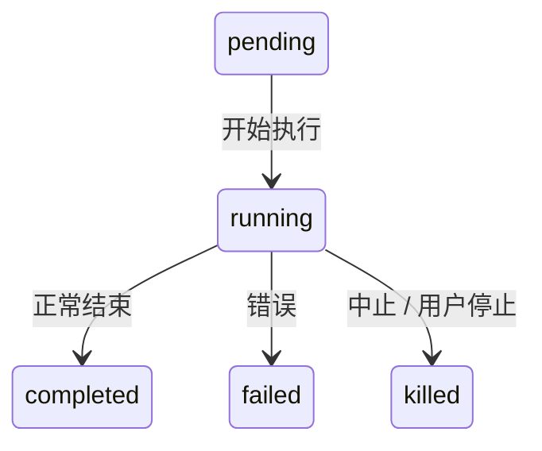
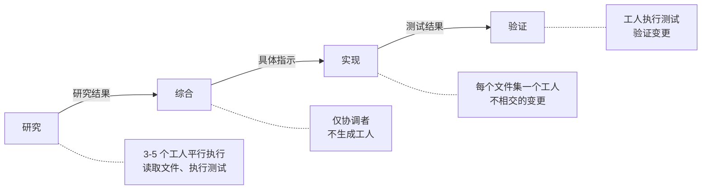
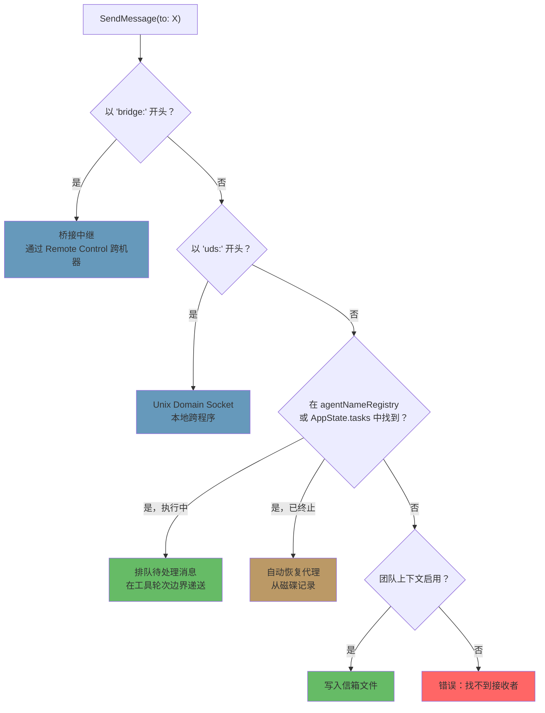

# 第十章：任务、协调与群集

## 单一线程的极限

第八章展示了如何建立子代理——从代理定义构建隔离执行上下文的十五步骤生命周期。第九章展示了如何通过利用提示缓存，让并行生成变得经济实惠。但建立代理和管理代理是不同的问题。本章要处理的是后者。

单一代理循环——一个模型、一段对话、一次一个工具——能完成的工作量令人惊叹。它可以读取文件、编辑代码、执行测试、搜索网络，以及推理复杂问题。但它会碰到天花板。

天花板不是智力，而是并行性和作用范围。一个开发者在进行大规模重构时，需要更新 40 个文件、在每批修改后执行测试，并验证没有东西坏掉。一次代码迁移会同时涉及前端、后端和数据库层。一次彻底的代码审查要在背景执行测试包的同时阅读数十个文件。这些不是更难的问题——而是更宽的问题。它们需要同时做多件事的能力、将工作委派给专家的能力，以及协调结果的能力。

Claude Code 对此问题的答案不是单一机制，而是一个分层的编排模式栈，每一层适合不同形态的工作。背景任务用于发射后不管的指令。协调者模式用于管理者-工人的阶层架构。群集团队用于点对点协作。而一套统一的通信协议将它们全部串在一起。

编排层大约横跨 40 个文件，分布在 `tools/AgentTool/`、`tasks/`、`coordinator/`、`tools/SendMessageTool/` 和 `utils/swarm/` 之中。尽管覆盖范围如此广泛，设计仍锚定于一个所有模式共用的单一状态机。理解那个状态机——`Task.ts` 中的 `Task` 抽象——是理解其他一切的先决条件。

本章从基础的任务状态机开始追踪整个栈，一路到最精密的多代理拓扑。

---

## 任务状态机

Claude Code 中的每个背景操作——一个 shell 指令、一个子代理、一个远端会话、一个工作流脚本——都被追踪为一个*任务*。任务抽象存在于 `Task.ts` 中，提供了其余编排层所依赖的统一状态模型。

### 七种类型

系统定义了七种任务类型，每种代表不同的执行模型：

这七种任务类型是：`local_bash`（背景 shell 指令）、`local_agent`（背景子代理）、`remote_agent`（远端会话）、`in_process_teammate`（群集队友）、`local_workflow`（工作流脚本执行）、`monitor_mcp`（MCP 服务器监控）和 `dream`（推测性背景思考）。

`local_bash` 和 `local_agent` 是工作主力——分别是背景 shell 指令和背景子代理。`in_process_teammate` 是群集原语。`remote_agent` 桥接到远端 Claude Code Runtime 环境。`local_workflow` 执行多步骤脚本。`monitor_mcp` 监控 MCP 服务器健康状态。`dream` 是最不寻常的——一个让代理在等待用户输入时进行推测性思考的背景任务。

每种类型都有一个单字符 ID 前缀，用于即时的视觉辨识：

| 类型 | 前缀 | 示例 ID |
|------|--------|------------|
| `local_bash` | `b` | `b4k2m8x1` |
| `local_agent` | `a` | `a7j3n9p2` |
| `remote_agent` | `r` | `r1h5q6w4` |
| `in_process_teammate` | `t` | `t3f8s2v5` |
| `local_workflow` | `w` | `w6c9d4y7` |
| `monitor_mcp` | `m` | `m2g7k1z8` |
| `dream` | `d` | `d5b4n3r6` |

任务 ID 使用单字符前缀（a 表示代理、b 表示 bash、t 表示队友等等）加上 8 个随机英数字符，取自大小写不敏感安全字母表（数字加小写字母）。这产生了约 2.8 兆种组合——足以抵抗针对磁盘上任务输出文件的暴力符号链接攻击。

当你在日志行中看到 `a7j3n9p2`，你立刻知道这是一个背景代理。当你看到 `b4k2m8x1`，是一个 shell 指令。前缀对人类读者是一个微型优化，但在一个可能有数十个并行任务的系统中，这很重要。

### 五种状态

生命周期是一个简单的有向图，没有循环：



`pending` 是注册和首次执行之间的短暂状态。`running` 表示任务正在积极工作。三个终止状态是 `completed`（成功）、`failed`（错误）和 `killed`（由用户、协调者或中止讯号明确停止）。一个辅助函数防止与已终止的任务互动：

```typescript
export function isTerminalTaskStatus(status: TaskStatus): boolean {
  return status === 'completed' || status === 'failed' || status === 'killed'
}
```

这个函数无处不在——出现在消息注入守卫、驱逐逻辑、孤儿清理，以及 SendMessage 路由决定要排队消息还是恢复已终止代理的逻辑中。

### 基础状态

每个任务状态都扩展自 `TaskStateBase`，它承载所有七种类型共享的字段：

```typescript
export type TaskStateBase = {
  id: string              // 带前缀的随机 ID
  type: TaskType          // 区分器
  status: TaskStatus      // 目前生命周期位置
  description: string     // 人类可读的摘要
  toolUseId?: string      // 生成此任务的 tool_use 区块
  startTime: number       // 建立时间戳
  endTime?: number        // 终止状态时间戳
  totalPausedMs?: number  // 累计暂停时间
  outputFile: string      // 流输出的磁碟路径
  outputOffset: number    // 增量输出的读取游标
  notified: boolean       // 是否已回报完成给父代理
}
```

有两个字段值得注意。`outputFile` 是异步执行和父代理对话之间的桥梁——每个任务将其输出写入磁盘上的文件，父代理可以通过 `outputOffset` 增量读取它。`notified` 防止重复的完成消息；一旦父代理被告知任务已完成，标志就翻转为 `true`，通知永远不会再次发送。如果没有这个守卫，一个在两次连续轮询通知队列之间完成的任务会产生重复通知，让模型误以为两个任务完成了，而实际上只有一个。

### 代理任务状态

`LocalAgentTaskState` 是最复杂的变体，承载管理背景子代理完整生命周期所需的一切：

```typescript
export type LocalAgentTaskState = TaskStateBase & {
  type: 'local_agent'
  agentId: string
  prompt: string
  selectedAgent?: AgentDefinition
  agentType: string
  model?: string
  abortController?: AbortController
  pendingMessages: string[]       // 通过 SendMessage 排队
  isBackgrounded: boolean         // 这原本是前景代理吗？
  retain: boolean                 // UI 正在持有此任务
  diskLoaded: boolean             // 侧链记录已加载
  evictAfter?: number             // GC 截止期限
  progress?: AgentProgress
  lastReportedToolCount: number
  lastReportedTokenCount: number
  // ... 其他生命周期栏位
}
```

三个字段揭示了重要的设计决策。`pendingMessages` 是收件匣——当 `SendMessage` 针对一个正在执行的代理时，消息会被排入此处而非立即注入。消息在工具轮次边界被排空，这保留了代理的回合结构。`isBackgrounded` 区分了天生就是异步的代理和那些最初作为前景同步代理启动、后来由用户按键转入背景的代理。`evictAfter` 是垃圾回收机制：未被保留的已完成任务在宽限期后其状态会从内存中清除。

所有任务状态都存储在 `AppState.tasks` 中，作为 `Record<string, TaskState>`，以带前缀的 ID 为键。这是一个扁平的映射，不是树——系统不在状态存储中建模父子关系。父子关系隐含在对话流中：父代理持有派生子代理的 `toolUseId`。

### 任务注册表

每种任务类型背后都有一个具有最小接口的 `Task` 对象：

```typescript
export type Task = {
  name: string
  type: TaskType
  kill(taskId: string, setAppState: SetAppState): Promise<void>
}
```

注册表收集所有任务实现：

```typescript
export function getAllTasks(): Task[] {
  return [
    LocalShellTask,
    LocalAgentTask,
    RemoteAgentTask,
    DreamTask,
    ...(LocalWorkflowTask ? [LocalWorkflowTask] : []),
    ...(MonitorMcpTask ? [MonitorMcpTask] : []),
  ]
}
```

注意条件式包含——`LocalWorkflowTask` 和 `MonitorMcpTask` 受功能闸控，在运行时可能不存在。`Task` 接口刻意保持最小。早期的迭代包含 `spawn()` 和 `render()` 方法，但当团队意识到生成和渲染从未被多型地调用时，这些方法就被移除了。每种任务类型都有自己的生成逻辑、自己的状态管理和自己的渲染。唯一真正需要按类型分派的操作是 `kill()`，所以接口只要求这一个方法。

这是一个通过减法进行接口演化的示例。最初的设计想像所有任务类型会共享一个通用的生命周期接口。在实践中，各类型的差异足够大，以至于共享接口变成了虚构——shell 指令的 `spawn()` 和程序内队友的 `spawn()` 几乎没有共同点。与其维护一个有泄漏的抽象，团队移除了除真正从多型中受益的那一个方法以外的所有东西。

---

## 通信模式

一个在背景执行的任务，只有在父代理能观察其进度并接收其结果时才有用。Claude Code 支持三种通信通道，每种针对不同的访问模式进行优化。

### 前景：生成器链

当代理同步执行时，父代理直接迭代其 `runAgent()` 异步生成器，将每个消息沿调用栈向上产出。这里有趣的机制是背景逃逸出口——同步循环在「来自代理的下一个消息」和「背景讯号」之间竞跑：

```typescript
const agentIterator = runAgent({ ...params })[Symbol.asyncIterator]()

while (true) {
  const nextMessagePromise = agentIterator.next()
  const raceResult = backgroundPromise
    ? await Promise.race([nextMessagePromise.then(...), backgroundPromise])
    : { type: 'message', result: await nextMessagePromise }

  if (raceResult.type === 'background') {
    // 用户触发了背景化——转换为非同步
    await agentIterator.return(undefined)
    void runAgent({ ...params, isAsync: true })
    return { data: { status: 'async_launched' } }
  }

  agentMessages.push(message)
}
```

如果用户在执行过程中决定同步代理应该变成背景任务，前景迭代器会被干净地返回（触发其 `finally` 区块进行资源清理），然后代理以相同 ID 被重新生成为异步任务。转换是无缝的——不会丢失任何工作，代理从中断处继续，使用一个与父代理 ESC 键脱钩的异步中止控制器。

这是一个真正难以做对的状态转换。前景代理共用父代理的中止控制器（ESC 同时终止两者）。背景代理需要自己的控制器（ESC 不应该终止它）。代理的消息需要从前景生成器流转移到背景通知系统。任务状态需要翻转 `isBackgrounded`，这样 UI 才知道要在背景面板中显示它。所有这些都必须原子性地发生——转换中不能丢失消息，不能留下僵尸迭代器继续执行。`Promise.race` 在下一个消息和背景讯号之间的竞跑，就是使这一切成为可能的机制。

### 背景：三个通道

背景代理通过磁盘、通知和排队消息进行通信。

**磁盘输出文件。** 每个任务都写入一个 `outputFile` 路径——一个指向代理记录的 JSONL 格式符号链接。父代理（或任何观察者）可以使用 `outputOffset` 增量读取此文件，该偏移量追踪文件已被消费到哪里。`TaskOutputTool` 将此暴露给模型：

```typescript
inputSchema = z.strictObject({
  task_id: z.string(),
  block: z.boolean().default(true),
  timeout: z.number().default(30000),
})
```

当 `block: true` 时，工具会轮询直到任务达到终止状态或超时到期。这是协调者生成工人并等待其结果的主要机制。

**任务通知。** 当背景代理完成时，系统会生成一个 XML 通知并将其排入队列，准备送入父代理的对话：

```xml
<task-notification>
  <task-id>a7j3n9p2</task-id>
  <tool-use-id>toolu_abc123</tool-use-id>
  <output-file>/path/to/output</output-file>
  <status>completed</status>
  <summary>代理「调查认证 bug」已完成</summary>
  <result>在 src/auth/validate.ts:42 发现空指标...</result>
  <usage>
    <total_tokens>15000</total_tokens>
    <tool_uses>8</tool_uses>
    <duration_ms>12000</duration_ms>
  </usage>
</task-notification>
```

通知作为 user-role 消息注入父代理的对话中，这意味着模型在其正常的消息流中就能看到它。它不需要特殊的工具来检查完成状态——它们以上下文的形式到达。任务状态上的 `notified` 标志防止重复递送。

**命令队列。** `LocalAgentTaskState` 上的 `pendingMessages` 数组是第三个通道。当 `SendMessage` 针对一个正在执行的代理时，消息会被排队：

```typescript
if (isLocalAgentTask(task) && task.status === 'running') {
  queuePendingMessage(agentId, input.message, setAppState)
  return { data: { success: true, message: 'Message queued...' } }
}
```

这些消息由 `drainPendingMessages()` 在工具轮次边界排空，并作为用户消息注入代理的对话。这是一个至关重要的设计选择——消息在工具轮次之间到达，而非在执行中途。代理完成其当前的思考后，才接收新的信息。没有竞态条件，没有损坏的状态。

### 进度追踪

`ProgressTracker` 提供对代理活动的即时可见性：

```typescript
export type ProgressTracker = {
  toolUseCount: number
  latestInputTokens: number        // 累计的（最新值，非加总）
  cumulativeOutputTokens: number   // 跨回合加总
  recentActivities: ToolActivity[] // 最近 5 次工具使用
}
```

输入和输出 token 追踪之间的区别是刻意的，反映了 API 计费模型的一个细微之处。输入 token 是每次 API 调用的累计值，因为完整对话每次都会重新发送——第 15 个回合包含前 14 个回合的所有内容，所以 API 回报的输入 token 计数已经反映了总数。保留最新值才是正确的聚合方式。输出 token 是每回合的——模型每次都生成新的 token——所以加总才是正确的聚合方式。搞错这一点会导致要嘛大幅高估（加总累计的输入 token），要嘛大幅低估（仅保留最新的输出 token）。

`recentActivities` 数组（上限为 5 笔）提供了代理正在做什么的人类可读流：「读取 src/auth/validate.ts」、「Bash: npm test」、「编辑 src/auth/validate.ts」。这会出现在 VS Code 子代理面板和终端的背景任务指示器中，让用户无需阅读完整记录就能看到代理的工作。

对于背景代理，进度通过 `updateAsyncAgentProgress()` 写入 `AppState`，并通过 `emitTaskProgress()` 作为 SDK 事件发送。VS Code 子代理面板消费这些事件来渲染即时的进度条、工具计数和活动流。进度追踪不只是装饰性的——它是告诉用户背景代理是在取得进展还是陷入循环的主要反馈机制。

---

## 协调者模式

协调者模式将 Claude Code 从一个带有背景助手的单一代理，转变为真正的管理者-工人架构。它是系统中最具主见的编排模式，其设计揭示了关于 LLM 应该如何以及不应该如何委派工作的深思熟虑。

### 协调者模式解决的问题

标准代理循环有一段对话和一个上下文窗口。当它生成一个背景代理时，背景代理独立执行并通过任务通知回报结果。这对简单的委派很有效——「在我继续编辑时执行测试」——但对复杂的多步骤工作流就会失效。

考虑一次代码迁移。代理需要：(1) 理解 200 个文件中的当前模式，(2) 设计迁移策略，(3) 对每个文件套用变更，(4) 验证没有东西坏掉。步骤 1 和 3 受益于并行化。步骤 2 需要综合步骤 1 的结果。步骤 4 依赖步骤 3。单一代理依次执行这些，会将大部分 token 预算花在重新读取文件上。多个背景代理在没有协调的情况下做这些，会产生不一致的变更。

协调者模式通过将「思考」代理和「执行」代理分离来解决这个问题。协调者处理步骤 1 和 2（派遣研究工人，然后综合）。工人处理步骤 3 和 4（套用变更、执行测试）。协调者看到全貌；工人只看到自己的特定任务。

### 启动

一个环境变量就能切换开关：

```typescript
export function isCoordinatorMode(): boolean {
  if (feature('COORDINATOR_MODE')) {
    return isEnvTruthy(process.env.CLAUDE_CODE_COORDINATOR_MODE)
  }
  return false
}
```

在会话恢复时，`matchSessionMode()` 会检查已恢复会话的存储模式是否与当前环境匹配。如果它们不一致，环境变量会被翻转以匹配。这防止了令人困惑的场景——协调者会话以普通代理恢复（丢失对其工人的感知），或者普通会话以协调者恢复（丢失对其工具的访问）。会话的模式是事实的来源；环境变量是运行时讯号。

### 工具限制

协调者的力量不是来自拥有更多工具，而是来自拥有更少的工具。在协调者模式中，协调者代理恰好获得三个工具：

- **Agent** —— 生成工人
- **SendMessage** —— 与现有工人通信
- **TaskStop** —— 终止执行中的工人

就这样。没有文件读取。没有代码编辑。没有 shell 指令。协调者不能直接碰代码库。这个限制不是一种缺陷——而是核心设计原则。协调者的工作是思考、计划、分解和综合。工人做实际的工作。

相反地，工人获得完整的工具集，扣除内部协调工具：

```typescript
const INTERNAL_WORKER_TOOLS = new Set([
  TEAM_CREATE_TOOL_NAME,
  TEAM_DELETE_TOOL_NAME,
  SEND_MESSAGE_TOOL_NAME,
  SYNTHETIC_OUTPUT_TOOL_NAME,
])
```

工人不能生成自己的子团队或向同侪发送消息。他们通过正常的任务完成机制回报结果，由协调者跨工人进行综合。

### 370 行系统提示词

协调者系统提示词，就行数而言，是代码库中关于如何使用 LLM 进行编排最具教育意义的文件。它大约有 370 行，编码了关于委派模式的宝贵经验教训。关键教学：

**「绝不委派理解。」** 这是核心论点。协调者必须将研究发现综合为具体的提示，包含文件路径、行号和确切的变更。提示明确指出反模式，例如「根据你的研究发现，修复这个 bug」——一个将*理解*委派给工人的提示，迫使它重新推导协调者已经拥有的上下文。正确的模式是：「在 `src/auth/validate.ts` 第 42 行，`userId` 参数在从 OAuth 流程调用时可以是 null。加入一个 null 检查，返回 401 响应。」

**「并行性是你的超能力。」** 提示建立了一个清晰的并行模型。只读任务可以自由并行执行——研究、探索、文件读取。写入密集的任务按文件集序列化。协调者被期望推理哪些任务可以重叠、哪些必须按顺序。一个好的协调者同时生成五个研究工人，等待它们全部完成，综合，然后生成三个处理不相交文件集的实现工人。一个差的协调者生成一个工人，等待，再生成下一个，再等待——将本可并行的工作序列化。

**任务工作流阶段。** 提示定义了四个阶段：



1. **研究** —— 工人并行探索代码库，读取文件、执行测试、收集信息
2. **综合** —— 协调者（不是工人）读取所有研究结果并建立统一的理解
3. **实现** —— 工人接收从综合中得出的精确指示
4. **验证** —— 工人执行测试并验证变更

协调者不应跳过阶段。最常见的失败模式是从研究直接跳到实现而没有综合。当这种情况发生时，协调者将理解委派给了实现工人——每个工人都必须从头重新推导上下文，导致不一致的变更和浪费的 token。

**继续 vs 生成的决策。** 当一个工人完成而协调者有后续工作时，它应该向现有工人发送消息（通过 SendMessage）还是生成一个新的（通过 Agent）？决策是上下文重叠程度的函数：

- **高重叠，相同文件**：继续。工人的上下文中已经有文件内容，理解模式，可以在之前的工作基础上构建。重新生成会强制重新读取相同的文件和重新推导相同的理解。
- **低重叠，不同领域**：生成新的。一个刚调查完认证系统的工人装载了 20,000 token 的认证专用上下文，这些对 CSS 重构任务来说是无用的负担。干净地重新开始更便宜。
- **高重叠但工人失败了**：生成新的，附带关于出了什么问题的明确指引。继续使用一个失败的工人通常意味着与混乱的上下文对抗。带着「前一次尝试因为 X 失败了，避免 Y」的全新开始更可靠。
- **后续工作需要工人的输出**：继续，在 SendMessage 中包含输出。工人不需要重新推导自己的结果。

**工人提示的编写和反模式。** 提示教协调者如何编写有效的工人提示，并明确标记不良模式：

反模式：*「根据你的研究发现，实现修复。」* 这委派了理解。工人不是做研究的那个——是协调者读了研究结果。

反模式：*「修复认证模块中的 bug。」* 没有文件路径，没有行号，没有 bug 的描述。工人必须从头搜索整个代码库。

反模式：*「对所有其他文件做同样的变更。」* 哪些文件？什么变更？协调者知道；它应该列举出来。

好的模式：*「在 `src/auth/validate.ts` 第 42 行，`userId` 参数在从 `src/oauth/callback.ts:89` 调用时可以是 null。加入一个 null 检查：如果 `userId` 为 null，返回 `{ error: 'unauthorized', status: 401 }`。然后更新 `src/auth/__tests__/validate.test.ts` 中的测试以覆盖 null 的情况。」*

编写具体提示的成本由协调者承担一次。其益处——工人第一次就正确执行——是巨大的。模糊的提示创造了一种虚假的经济效益：协调者省了 30 秒的提示编写时间，工人浪费了 5 分钟的探索时间。

### 工人上下文

协调者将可用工具的信息注入自己的上下文中，这样模型就知道工人能做什么：

```typescript
export function getCoordinatorUserContext(mcpClients, scratchpadDir?) {
  return {
    workerToolsContext: `Workers spawned via Agent have access to: ${workerTools}`
      + (mcpClients.length > 0
        ? `\nWorkers also have MCP tools from: ${serverNames}` : '')
      + (scratchpadDir ? `\nScratchpad: ${scratchpadDir}` : '')
  }
}
```

暂存目录（由 `tengu_scratch` 功能标志闸控）是一个共享的文件系统位置，工人可以在不需要权限提示的情况下进行读写。它实现了持久的跨工人知识共享——一个工人的研究笔记成为另一个工人的输入，通过文件系统而非通过协调者的 token 窗口来中介。

这很重要，因为它解决了协调者模式的一个根本限制。没有暂存目录时，所有信息都流经协调者：工人 A 产生发现，协调者通过 TaskOutput 读取它们，将它们综合成工人 B 的提示。协调者的上下文窗口成为瓶颈——它必须持有所有中间结果足够长的时间来综合它们。有了暂存目录，工人 A 将发现写入 `/tmp/scratchpad/auth-analysis.md`，协调者告诉工人 B：「读取 `/tmp/scratchpad/auth-analysis.md` 中的认证分析，并将该模式套用到 OAuth 模块。」协调者通过引用而非通过值来移动信息。

### 与 Fork 的互斥

协调者模式和基于 fork 的子代理是互斥的：

```typescript
export function isForkSubagentEnabled(): boolean {
  if (feature('FORK_SUBAGENT')) {
    if (isCoordinatorMode()) return false
    // ...
  }
}
```

冲突是根本性的。分叉代理继承父代理的整个对话上下文——它们是共享提示缓存的廉价复制品。协调者工人是具有全新上下文和特定指示的独立代理。这是对立的委派哲学，系统在功能标志层级强制执行这个选择。

---

## 群集系统

协调者模式是阶层式的：一个管理者、多个工人、自上而下的控制。群集系统是点对点的替代方案——多个 Claude Code 实例作为一个团队工作，由一个领导者通过消息传递来协调多个队友。

### 团队上下文

团队由 `teamName` 识别，追踪在 `AppState.teamContext` 中：

```typescript
teamContext?: {
  teamName: string
  teammates: {
    [id: string]: { name: string; color?: string; ... }
  }
}
```

每个队友都有一个名字（用于定址）和一个颜色（用于 UI 中的视觉区分）。团队文件持久化在磁盘上，这样团队成员资格在程序重启后仍然存在。

### 代理名称注册表

背景代理可以在生成时被指定名字，这使得它们可以通过人类可读的识别符而非随机任务 ID 来定址：

```typescript
if (name) {
  rootSetAppState(prev => {
    const next = new Map(prev.agentNameRegistry)
    next.set(name, asAgentId(asyncAgentId))
    return { ...prev, agentNameRegistry: next }
  })
}
```

`agentNameRegistry` 是一个 `Map<string, AgentId>`。当 `SendMessage` 解析 `to` 字段时，会先检查注册表：

```typescript
const registered = appState.agentNameRegistry.get(input.to)
const agentId = registered ?? toAgentId(input.to)
```

这意味着你可以向 `"researcher"` 发送消息，而不是 `a7j3n9p2`。这个间接层很简单，但它让协调者能以角色而非 ID 来思考——这对模型推理多代理工作流的能力是一个重大改进。

### 程序内队友

程序内队友在与领导者相同的 Node.js 程序中执行，通过 `AsyncLocalStorage` 隔离。它们的状态以团队特定字段扩展基础：

```typescript
export type InProcessTeammateTaskState = TaskStateBase & {
  type: 'in_process_teammate'
  identity: TeammateIdentity
  prompt: string
  messages?: Message[]                  // 上限为 50
  pendingUserMessages: string[]
  isIdle: boolean
  shutdownRequested: boolean
  awaitingPlanApproval: boolean
  permissionMode: PermissionMode
  onIdleCallbacks?: Array<() => void>
  currentWorkAbortController?: AbortController
}
```

`messages` 上限为 50 笔值得解释。在开发过程中，分析显示每个程序内代理在 500+ 回合时累积约 20MB 的 RSS。鲸鱼级会话——长时间执行工作流的重度用户——被观察到在 2 分钟内启动 292 个代理，将 RSS 推到 36.8GB。UI 表示的 50 条消息上限是一个内存安全阀。代理实际的对话以完整历史继续；只有面向 UI 的快照被截断。

`isIdle` 标志启用了工作窃取模式。一个闲置的队友不消耗 token 或 API 调用——它只是在等待下一则消息。`onIdleCallbacks` 数组让系统能在从活跃到闲置的转换中挂钩，实现「等待所有队友完成，然后继续」之类的编排模式。

`currentWorkAbortController` 与队友的主要中止控制器不同。中止当前工作控制器会取消队友正在进行的回合，但不会终止队友。这启用了一种「重导向」模式：领导者发送一则更高优先级的消息，队友当前的工作被中止，队友接收新的消息。主要中止控制器被中止时，会完全终止队友。两个层级的中断对应两个层级的意图。

`shutdownRequested` 标志实现了协作式终止。当领导者发送关闭请求时，这个标志被设置。队友可以在自然的停止点检查它并优雅地收尾——完成当前的文件写入、提交变更，或发送最终的状态更新。这比硬终止更温和，硬终止可能会让文件处于不一致的状态。

### 信箱

队友通过基于文件的信箱系统进行通信。当 `SendMessage` 针对一个队友时，消息会被写入接收者的磁盘信箱文件：

```typescript
await writeToMailbox(recipientName, {
  from: senderName,
  text: content,
  summary,
  timestamp: new Date().toISOString(),
  color: senderColor,
}, teamName)
```

消息可以是纯文字、结构化协议消息（关闭请求、计划核准），或广播（`to: "*"` 发送给所有团队成员，排除发送者）。一个轮询钩子处理收到的消息，并将它们路由到队友的对话中。

基于文件的方法是刻意简单的。没有消息代理，没有事件汇流排，没有共享内存通道。文件是持久的（在程序崩溃后存活）、可检视的（你可以 `cat` 一个信箱）、而且成本低廉（没有基础设施依赖）。对于一个消息量以每个会话数十则而非每秒数千则来衡量的系统，这是正确的取舍。一个 Redis 支持的消息队列会增加营运复杂度、一个依赖项和失败模式——全都是为了一个文件系统调用就能轻松处理的吞吐量需求。

广播机制值得一提。当消息发送到 `"*"` 时，发送者会从团队文件迭代所有团队成员，跳过自己（不区分大小写的比较），然后分别写入每个成员的信箱：

```typescript
for (const member of teamFile.members) {
  if (member.name.toLowerCase() === senderName.toLowerCase()) continue
  recipients.push(member.name)
}
for (const recipientName of recipients) {
  await writeToMailbox(recipientName, { from: senderName, text: content, ... }, teamName)
}
```

没有扇出优化——每个接收者都是一次单独的文件写入。同样，在代理团队的规模下（通常 3-8 个成员），这完全足够。如果一个团队有 100 个成员，这就需要重新思考。但防止 36GB RSS 场景的 50 条消息内存上限，也隐含地限制了有效的团队大小。

### 权限转发

群集工人以受限的权限运作，但可以在需要批准敏感操作时向领导者升级：

```typescript
const request = createPermissionRequest({
  toolName, toolUseId, input, description, permissionSuggestions
})
registerPermissionCallback({ requestId, toolUseId, onAllow, onReject })
void sendPermissionRequestViaMailbox(request)
```

流程是：工人遇到一个需要权限的工具，bash 分类器尝试自动批准，如果失败，请求通过信箱系统转发给领导者。领导者在其 UI 中看到请求，可以核准或拒绝。回调触发，工人继续。这让工人能对安全操作自主运作，同时对危险操作维持人类监督。

---

## 代理间通信：SendMessage

`SendMessageTool` 是通用的通信原语。它通过单一工具接口处理四种不同的路由模式，由 `to` 字段的形式来选择。

### 输入结构

```typescript
inputSchema = z.object({
  to: z.string(),
  // "teammate-name", "*", "uds:<socket>", "bridge:<session-id>"
  summary: z.string().optional(),
  message: z.union([
    z.string(),
    z.discriminatedUnion('type', [
      z.object({ type: z.literal('shutdown_request'), reason: z.string().optional() }),
      z.object({ type: z.literal('shutdown_response'), request_id, approve, reason }),
      z.object({ type: z.literal('plan_approval_response'), request_id, approve, feedback }),
    ]),
  ]),
})
```

`message` 字段是纯文字和结构化协议消息的联合类型。这意味着 SendMessage 身兼双职——它既是非正式的聊天通道（「这是我的发现」），也是正式的协议层（「我核准你的计划」/「请关闭」）。

### 路由分派

`call()` 方法遵循一个按优先顺序的分派链：



**1. 桥接消息**（`bridge:<session-id>`）。通过 Anthropic 的 Remote Control 服务器进行跨机器通信。这是最广的触及范围——两个 Claude Code 实例在不同的机器上，可能在不同的大陆，通过中继进行通信。系统在发送桥接消息前需要明确的用户同意——这是一个安全检查，防止一个代理单方面与远端实例建立通信。没有这个闸门，一个被入侵或困惑的代理可能会将信息泄漏到远端会话。同意检查使用 `postInterClaudeMessage()`，它处理通过 Remote Control 中继的序列化和传输。

**2. UDS 消息**（`uds:<socket-path>`）。通过 Unix Domain Socket 的本地跨程序通信。这是用于在同一台机器上但在不同程序中执行的 Claude Code 实例——例如，一个 VS Code 扩展功能托管一个实例，一个终端托管另一个。UDS 通信速度快（没有网络往返）、安全（文件系统权限控制访问）且可靠（核心处理递送）。`sendToUdsSocket()` 函数序列化消息并写入 `to` 字段中指定的 socket 路径。对等端通过 `ListPeers` 工具扫描活跃的 UDS 端点来发现彼此。

**3. 程序内子代理路由**（纯名称或代理 ID）。这是最常见的路径。路由逻辑：

- 在 `agentNameRegistry` 中查找 `input.to`
- 如果找到且正在执行：`queuePendingMessage()` —— 消息等待下一个工具轮次边界
- 如果找到但处于终止状态：`resumeAgentBackground()` —— 代理被透明地重新启动
- 如果不在 `AppState` 中：尝试从磁盘记录恢复

**4. 团队信箱**（当团队上下文启用时的备用路径）。具名接收者的消息被写入其信箱文件。`"*"` 万用字符触发向所有团队成员的广播。

### 结构化协议

除了纯文字，SendMessage 还承载两个正式的协议。

**关闭协议。** 领导者向队友发送 `{ type: 'shutdown_request', reason: '...' }`。队友响应 `{ type: 'shutdown_response', request_id, approve: true/false, reason }`。如果核准，程序内队友中止其控制器；基于 tmux 的队友收到 `gracefulShutdown()` 调用。协议是协作式的——如果队友正在处理关键工作，它可以拒绝关闭请求，领导者必须处理这种情况。

**计划核准协议。** 以计划模式运作的队友在执行前必须获得核准。它们提交一个计划，领导者响应 `{ type: 'plan_approval_response', request_id, approve, feedback }`。只有团队领导者可以发出核准。这创造了一个审查闸门——领导者可以在任何文件被修改之前检查工人的预期方法，及早捕捉误解。

### 自动恢复模式

路由系统最优雅的特性是透明的代理恢复。当 `SendMessage` 针对一个已完成或已终止的代理时，它不会返回错误，而是复活该代理：

```typescript
if (task.status !== 'running') {
  const result = await resumeAgentBackground({
    agentId,
    prompt: input.message,
    toolUseContext: context,
    canUseTool,
  })
  return {
    data: {
      success: true,
      message: `Agent "${input.to}" was stopped; resumed with your message`
    }
  }
}
```

`resumeAgentBackground()` 函数从其磁盘记录重建代理：

1. 读取侧链 JSONL 记录
2. 重建消息历史，过滤孤立的思考区块和未解决的工具使用
3. 重建内容替换状态以维持提示缓存稳定性
4. 从存储的中继数据解析原始代理定义
5. 以全新的中止控制器重新注册为背景任务
6. 以恢复的历史加上新消息作为提示调用 `runAgent()`

从协调者的角度来看，向一个已终止的代理发送消息和向一个存活的代理发送消息是相同的操作。路由层处理复杂性。这意味着协调者不需要追踪哪些代理是存活的——它们只管发送消息，系统自行解决。

其含义是重大的。没有自动恢复，协调者需要维护一个关于代理存活状态的心理模型：「`researcher` 还在执行吗？让我检查一下。它完成了。我需要生成一个新的代理。但等等，我应该用同一个名字吗？它会有相同的上下文吗？」有了自动恢复，所有这些都化简为：「向 `researcher` 发送一则消息。」如果它活着，消息被排队。如果它已终止，它会带着完整历史被复活。协调者的提示复杂度大幅降低。

当然有其代价。从磁盘记录恢复意味着重新读取可能数千则消息、重建内部状态，以及用完整的上下文窗口进行新的 API 调用。对于长期存活的代理，这在延迟和 token 上都可能很昂贵。但替代方案——要求协调者手动管理代理生命周期——更糟。协调者是一个 LLM。它擅长推理问题和编写指示。它不擅长簿记。自动恢复通过完全消除一整类簿记工作，发挥了 LLM 的强项。

---

## TaskStop：终止开关

`TaskStopTool` 是 Agent 和 SendMessage 的互补——它终止执行中的任务：

```typescript
inputSchema = z.strictObject({
  task_id: z.string().optional(),
  shell_id: z.string().optional(),  // 已弃用的向后相容
})
```

实现委派给 `stopTask()`，它根据任务类型分派：

1. 在 `AppState.tasks` 中查找任务
2. 调用 `getTaskByType(task.type).kill(taskId, setAppState)`
3. 对于代理：中止控制器，设置状态为 `'killed'`，启动驱逐计时器
4. 对于 shell：终止程序群组

该工具有一个遗留别名 `"KillShell"` ——这提醒我们任务系统是从更简单的起源演化而来的，当时唯一的背景操作就是 shell 指令。

终止机制因任务类型而异，但模式是一致的。对于代理，终止意味着中止中止控制器（这导致 `query()` 循环在下一个 yield 点退出）、设置状态为 `'killed'`，以及启动驱逐计时器以便在宽限期后清理任务状态。对于 shell，终止意味着向程序群组发送讯号——先是 `SIGTERM`，然后如果程序在超时内没有退出则发送 `SIGKILL`。对于程序内队友，终止还会触发向团队的关闭通知，让其他成员知道该队友已离开。

驱逐计时器值得注意。当代理被终止时，其状态不会被立即清除。它在 `AppState.tasks` 中停留一个宽限期（由 `evictAfter` 控制），这样 UI 可以显示已终止的状态、任何最终输出可以被读取，以及通过 SendMessage 的自动恢复仍然可行。宽限期结束后，状态被垃圾回收。这与已完成任务使用的模式相同——系统区分「已完成」（结果可用）和「已遗忘」（状态已清除）。

---

## 在模式之间选择

（关于命名的说明：代码库中还包含 `TaskCreate`/`TaskGet`/`TaskList`/`TaskUpdate` 工具，用于管理结构化的待办事项清单——这是一个与此处描述的背景任务状态机完全不同的系统。`TaskStop` 操作 `AppState.tasks`；`TaskUpdate` 操作项目追踪数据存储。命名上的重叠是历史遗留问题，也是模型困惑的反复来源。）

有三种编排模式可用——背景委派、协调者模式和群集团队——自然的问题是何时使用哪一种。

**简单委派**（Agent 工具搭配 `run_in_background: true`）适用于父代理有一两个独立任务要卸载的情况。在继续编辑的同时在背景执行测试。在等待构建的同时搜索代码库。父代理保持控制，在准备好时检查结果，不需要复杂的通信协议。开销最小——一个任务状态条目，一个磁盘输出文件，完成时一个通知。

**协调者模式**适用于问题分解为研究阶段、综合阶段和实现阶段——并且协调者需要在多个工人的结果之间推理后才能指导下一步。协调者不能碰文件，这强制了关注点的清晰分离：思考在一个上下文中发生，执行在另一个上下文中发生。370 行的系统提示词不是仪式——它编码了防止 LLM 委派最常见失败模式的模式，即委派理解而非委派行动。

**群集团队**适用于代理需要点对点通信的长期协作会话、工作是持续性而非批次导向的、以及代理可能需要根据收到的消息闲置和恢复的情况。信箱系统支持协调者模式（同步的生成-等待-综合）不支持的异步模式。计划核准闸门增加了审查层。权限转发在不需要每个代理都有完整权限的情况下维持安全性。

一个实用的决策表：

| 场景 | 模式 | 原因 |
|----------|---------|-----|
| 在编辑时执行测试 | 简单委派 | 一个背景任务，不需要协调 |
| 搜索代码库中的所有用法 | 简单委派 | 发射后不管，完成时读取输出 |
| 跨 3 个模块重构 40 个文件 | 协调者 | 研究阶段找出模式，综合阶段规划变更，工人按模块并行执行 |
| 带有审查闸门的多日功能开发 | 群集 | 长期存活的代理、计划核准协议、同侪通信 |
| 修复已知位置的 bug | 都不用——单一代理 | 编排开销超过了聚焦、循序工作的收益 |
| 迁移数据库结构 + 更新 API + 更新前端 | 协调者 | 在共享的研究/规划阶段之后的三个独立工作流 |
| 带有用户监督的配对编程 | 群集搭配计划模式 | 工人提议，领导者核准，工人执行 |

这些模式在原则上不互斥，但在实践中是互斥的。协调者模式禁用分叉子代理。群集团队有自己的通信协议，不会与协调者任务通知混合。选择在会话启动时通过环境变量和功能标志做出，它塑造了整个互动模型。

最后一个观察：最简单的模式几乎总是正确的起点。大多数任务不需要协调者模式或群集团队。一个带有偶尔背景委派的单一代理就能处理绝大多数的开发工作。复杂的模式存在于那 5% 的情况——问题真正是宽广的、真正是并行的、或真正是长期执行的。对一个单一文件的 bug 修复使用协调者模式，就像为一个静态网站部署 Kubernetes——技术上可行，架构上不恰当。

---

## 编排的代价

在审视编排层在哲学上揭示了什么之前，值得承认它在实务上的代价。

每个背景代理都是一次独立的 API 对话。它有自己的上下文窗口、自己的 token 预算，以及自己的提示缓存槽位。一个生成 5 个研究工人的协调者正在进行 6 个并行的 API 调用，每个都有自己的系统提示词、工具定义和 CLAUDE.md 注入。token 开销不是微不足道的——光是系统提示词就可能有数千个 token，而且每个工人重新读取其他工人可能已经读过的文件。

通信通道增加延迟。磁盘输出文件需要文件系统 I/O。任务通知在工具轮次边界递送，而非即时。命令队列引入完整的往返延迟——协调者发送消息，消息等待工人完成其当前的工具使用，工人处理消息，结果被写入磁盘供协调者读取。

状态管理增加复杂性。七种任务类型、五种状态，以及每个任务状态数十个字段。驱逐逻辑、垃圾回收计时器、内存上限——所有这些都存在，因为无界的状态增长导致了真实的生产事故（36.8GB RSS）。

这些都不意味着编排是错的。它意味着编排是一个有代价的工具，代价应该与收益相权衡。执行 5 个并行工人来搜索代码库，当搜索循序执行需要 5 分钟时是值得的。执行一个协调者来修复一个文件中的错字就是纯粹的开销。

---

## 编排层揭示了什么

这个系统最有趣的方面不是任何单一机制——任务状态、信箱和通知 XML 都是直接的工程。有趣的是从它们如何组合在一起所浮现的*设计哲学*。

协调者提示词中的「绝不委派理解」不只是 LLM 编排的好建议。它是对基于上下文窗口进行推理之根本限制的陈述。一个拥有全新上下文窗口的工人，无法理解协调者在读取 50 个文件并综合三份研究报告后所理解的东西。弥合这个差距的唯一方法是让协调者将其理解提炼为一个具体、可行动的提示。模糊的委派不只是低效的——它在信息理论上是有损的。

SendMessage 中的自动恢复模式揭示了一种偏好：*表面的简单性优于实际的简单性*。实现很复杂——读取磁盘记录、重建内容替换状态、重新解析代理定义。但接口是微不足道的：发送一则消息，无论接收者是活的还是死的，它都能工作。复杂性被基础设施吸收，这样模型（和用户）就能用更简单的术语来推理。

而程序内队友的 50 条消息内存上限，则提醒我们编排系统在真实的物理限制下运作。292 个代理在 2 分钟内达到 36.8GB RSS 不是一个理论上的顾虑——它在生产中发生过。抽象是优雅的，但它们在内存有限的硬件上执行，系统必须在用户推到极限时优雅地降级。

分层架构本身也包含一个教训。任务状态机是不可知的——它不知道协调者或群集的存在。通信通道是不可知的——SendMessage 不知道它是被协调者、群集领导者还是独立代理调用。协调者提示词叠加在上面，增加方法论而不改变底层机制。每一层都可以独立理解、独立测试和独立演化。当团队增加群集系统时，他们不需要修改任务状态机。当他们增加协调者提示词时，他们不需要修改 SendMessage。

这是良好分解的编排的标志：原语是通用的，模式从它们组合而成。协调者只是一个具有限制工具和详细系统提示词的代理。群集领导者只是一个具有团队上下文和信箱访问的代理。背景工人只是一个具有独立中止控制器和磁盘输出文件的代理。七种任务类型、五种状态和四种路由模式组合产生的编排模式，大于其各部分之和。

编排层是 Claude Code 从单一线程的工具执行者转变为更接近开发团队的地方。任务状态机提供簿记。通信通道提供信息流。协调者提示词提供方法论。群集系统为不适合严格阶层的问题提供点对点拓扑。它们共同使得语言模型能做到单次模型调用无法做到的事：在并行环境中、带有协调地处理宽广的问题。

下一章探讨权限系统——决定这些代理中的哪些可以做什么、以及危险操作如何从工人升级到人类的安全层。没有权限控制的编排将是错误的力量倍增器。权限系统确保更多代理意味着更多功能，而非更多风险。
