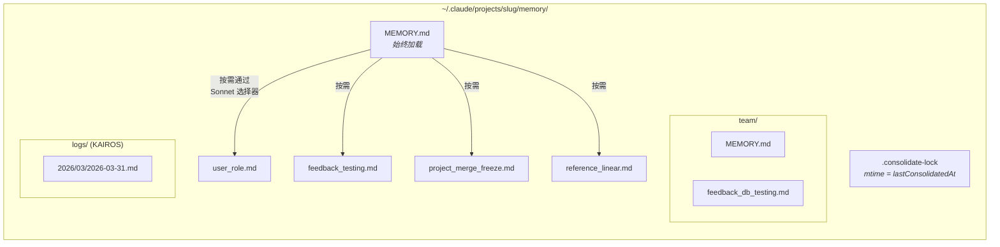
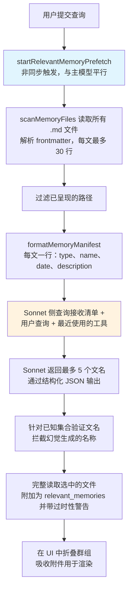
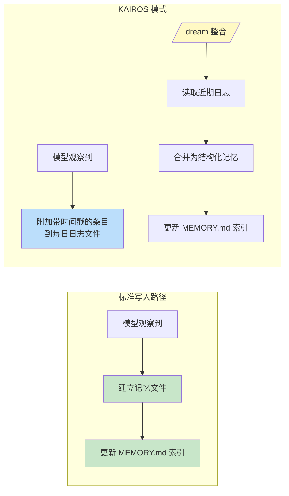

# 第十一章：记忆（Memory）——跨对话学习

## 无状态问题

到目前为止的每一章描述的都是存在于单一会话内的机制。代理循环运行、工具执行、子代理协调，而当程序退出时，一切都消失了。下一次对话以相同的系统提示、相同的工具定义、相同的模型启动——对之前发生过什么毫无所知。

这是无状态架构的根本限制。开发者在周一纠正了模型的测试方式，到了周二模型又犯了同样的错误。用户解释了他们的角色、项目的限制、偏好的代码风格，而每次新的会话都需要他们重新解释一遍。模型不是健忘——它从来就不知道。每次对话都是一个独立的宇宙。

这个问题不是理论上的。它以具体的方式表现出来，侵蚀信任。用户说「记住，我们在测试中使用真实的数据库实例，而不是 mock」——下周模型却生成了使用 mock 的测试。用户解释自己是资深工程师，不需要初学者级别的说明——下一个会话却以教学级别的导览开场。没有记忆，每次会话都从零开始。代理永远是第一天上班的新人。

业界的标准解决方案是检索增强生成（RAG）：将文件嵌入为向量，存储在向量数据库中，在查询时检索相关片段。这对知识库效果很好——文件、FAQ、参考数据。但对于代理实际需要跨会话记住的东西，它在架构上是不匹配的。代理的记忆不是知识库。它是一组观察：用户是谁、他们曾纠正过什么、项目目前的限制是什么、在哪里能找到东西。这些观察很小、经常变化，而且必须是人类可编辑的。向量数据库解决的是错误的问题。

Claude Code 的记忆系统是一个完全不同的赌注：磁盘上的文件、Markdown 格式、LLM 驱动的回忆、零基础设施。这个赌注是，存储的简单性加上检索的智慧，能产生比两者都追求复杂性更好的系统。

这个设计哲学带来的后果塑造了整个系统：

- **人类可读。** 想查看 Claude Code 记住了什么的用户可以在任何文字编辑器中打开 `~/.claude/projects/<slug>/memory/MEMORY.md`。不需要特殊工具、不需要解密、不需要导出指令。
- **人类可编辑。** 过时的记忆可以用 vim 修正。错误的记忆可以用 `rm` 删除。用户对代理的知识拥有完全的控制权。
- **可版本控制。** 团队记忆可以提交到 git。记忆变更的 diff 很干净，因为它们是 Markdown。
- **零基础设施。** 记忆系统可以离线工作、不需要服务器、在任何有文件系统的操作系统上都能运作。不存在迁移路径，因为没有 schema。
- **可调试。** 当记忆的行为出乎意料时，诊断路径是 `ls` 和 `cat`，而不是查询日志和数据库检查。

模型使用 `FileWriteTool` 和 `FileEditTool` 来读写记忆——与它用来编辑源码的工具相同（在第六章介绍过）。不存在特殊的记忆 API。系统提示教会模型一个两步骤写入协议（建立文件、更新索引），模型在新的指令下使用其既有能力来执行。这是将工具重用作为架构原则——记忆系统不是螺栓接在代理上的子系统，而是代理使用其既有能力所产生的涌现行为。

基于文件的选择在此行得通有一个更深层的原因。对 AI 代理而言，记忆与传统应用中的记忆根本不同。传统应用的数据库保存权威状态——系统数据的唯一真实来源。代理的记忆保存的是*观察*——在某个时间点为真、可能仍为真也可能不再为真的事物。文件自然地传达了这种认识论状态。它们有修改时间，揭示观察何时被记录。它们可以被知道观察有误的人类读取、编辑和删除。数据库暗示永久性和权威性；Markdown 文件暗示的是某人写下的笔记，可能需要更新。存储媒介传达了数据的本质——这些是工作笔记，不是圣经。

### 逐项目范围界定

记忆的范围界定是基于 git 仓库根目录，而非工作目录。如果用户在 `src/components/` 开一个终端，在 `tests/` 开另一个，两个会话共享相同的记忆目录。解析逻辑首先找到规范的 git 根目录，否则回退到使用项目根目录：

基础路径解析首先找到规范的 git 根目录，否则回退到使用项目根目录。这确保同一仓库的所有 git worktree 共享单一的记忆目录。

`findCanonicalGitRoot` 调用确保同一仓库的所有 git worktree 共享单一的记忆目录。git 根目录被清理（斜线变成破折号，通过 `sanitizePath()` ）以产生扁平的目录名称：

```
~/.claude/projects/-Users-alex-code-myapp/memory/
```

一个完整填充的记忆目录揭示了系统的结构：



命名惯例是语义化的：`<type>_<topic>.md`。类型前缀不由代码强制，而是提示指令的一部分，使得目视扫描目录并理解记忆全貌变得容易。

---

## 四类型分类法

不是所有东西都值得记住。记忆系统将所有记忆严格限制为四种类型：

这四种类型是：**user**（用户）、**feedback**（反馈）、**project**（项目）和 **reference**（参考）。

分类法是围绕一个单一标准设计的：**这个知识能否从目前的项目状态推导出来？** 代码模式、架构、文件结构、git 历史——这些都可以通过读取代码库重新推导。它们被排除在外。这四种类型捕获的是无法重新推导的知识。

**用户记忆**记录关于人的信息：他们的角色、目标、职责、专业程度。一位精通 Go 但初学 React 的资深工程师得到的解释，与一位初次接触编程的人不同。

**反馈记忆**捕获关于如何处理工作的指导——包括纠正和确认。系统明确指示模型记录两者：「如果你只保存纠正，你会偏离用户已经验证过的方式。」每条反馈记忆有特定结构：规则本身，然后是一行 `**Why:**` 说明原因（通常是过去的事件），再然后是一行 `**How to apply:**` 说明触发条件。

**项目记忆**记录进行中的工作上下文——谁在做什么、为什么、截止日期。提示强调将相对日期转换为绝对日期：「Thursday」变成「2026-03-05」，这样记忆在几周后仍然可解读。

**参考记忆**是书签——指向信息在外部系统中位置的指标。一个 Linear 项目 URL、一个 Grafana 仪表板、一个 Slack 频道。这些告诉模型该去哪里找，而不是找什么。

### 分类法作为过滤器

这四种类型不仅是分类——它们是过滤器。通过精确定义什么算记忆，系统隐含地定义了什么不算。没有这个分类法，一个急切的模型会保存所有东西：代码模式、架构图、错误消息。这些全部可以从代码库推导。保存它们会建立一个并行的、可能过时的信息副本，而这些信息最好从其来源取得。

分类法也防止了一个更微妙的失败：记忆作为拐杖。如果模型把架构决策保存为记忆，它就不再去读代码库来理解架构了。通过排除可推导的信息，系统迫使模型保持扎根于代码的当前状态。

排除清单是明确的：代码模式、git 历史、调试解法、CLAUDE.md 中的任何内容、临时任务细节。这些排除即使在用户明确要求保存时也适用。如果用户说「记住这个 PR 清单」，模型被指示追问——「其中*令人惊讶*或*非显而易见*的部分是什么？」那个令人惊讶的部分值得保留。原始清单不值得。这条指令通过了 eval 验证，从 0/2 提升到 3/3，是在加入排除覆盖指令后达成的。

### Frontmatter 作为契约

每个记忆文件使用带有三个必填字段的 YAML frontmatter：

```markdown
---
name: {{记忆名称}}
description: {{一行描述——用于判断相关性}}
type: {{user, feedback, project, reference}}
---
```

`description` 是最承重的字段。它是相关性选择器（一个 Sonnet 侧查询，下文讨论）用来决定是否呈现此记忆的依据。一个模糊的描述如「testing stuff」要么匹配得太广泛，要么完全不匹配。一个具体的描述如「Integration tests must hit real DB, not mocks -- burned by mock divergence Q4」恰好匹配那些它真正重要的对话。描述就是记忆的搜索索引——不是被搜索引擎消费，而是被一个能理解细微差异、上下文和意图的语言模型消费。

frontmatter 也是扫描系统在回忆过程中唯一读取的部分。`scanMemoryFiles()` 读取每个文件仅读前 30 行来提取请求头。正文在文件被明确选中并加载之前是私有的。

---

## 写入路径

写入记忆是一个使用标准文件工具执行的两步骤过程。

**步骤 1：写入记忆文件。** 模型在记忆目录中建立一个带有 YAML frontmatter 的 `.md` 文件：

```markdown
---
name: Testing Policy
description: Integration tests must hit real DB, not mocks
type: feedback
---

Don't mock the database in integration tests.

**Why:** We got burned last quarter when mocked tests passed but production
queries hit edge cases the mocks didn't cover.

**How to apply:** Any test file under `__tests__/` that touches database
operations should use the real PGlite instance from test-utils.
```

**步骤 2：更新索引。** 模型在 `MEMORY.md` 中新增一行指标：

```markdown
- [Testing Policy](feedback_testing.md) -- integration tests must hit real DB
```

每个条目必须保持在大约 150 个字符以内。索引是目录，不是知识库。

当模型学到修改既有记忆的新信息时，它使用 `FileEditTool` 来更新既有文件，而不是建立重复的。系统不会在内部对记忆进行版本控制——文件在本地文件系统上，如果用户想要版本控制，他们有 `git`。在提示构建之前，`ensureMemoryDirExists()` 会建立记忆目录，而提示会告诉模型目录已经存在，避免在 `ls` 和 `mkdir -p` 上浪费轮次。

---

## 回忆路径

写入记忆是必要的，但不够。更难的问题是检索：给定用户的查询，潜在的数百个记忆文件中哪些应该被加载模型的上下文？加载全部会耗尽 token 预算。不加载会失去意义。加载错误的会在无关信息上浪费 token，同时错过那些本会改变模型行为的知识。

回忆系统以两层运作。`MEMORY.md` 索引在会话开始时始终加载上下文，提供方向。个别记忆文件则通过 LLM 驱动的相关性查询按需呈现，每轮最多选择五个记忆。

### 完整回忆管道



步骤 2 中的异步预取是关键的性能决策。等到主模型到达需要回忆上下文的时刻，侧查询通常已经完成。用户不会感受到额外的延迟。

### Sonnet 侧查询

清单被作为侧查询发送给 Sonnet 模型。这个选择器的系统提示是精确的：

选择器的系统提示指示它要保守：只包含对当前查询有用的记忆，不确定时跳过，避免为已在使用中的工具选择 API/使用说明文件（因为模型已经加载了那些工具）——但仍然要呈现关于那些工具的警告、注意事项或已知问题。

响应使用结构化输出——`{ selected_memories: string[] }`——文件名会针对已知集合进行验证。

这种方法以延迟换取精确度，而权衡分析具有启发性。**关键字匹配**会很快但无法理解上下文——它无法表达「不要为已在使用中的工具选择记忆」。**嵌入相似度**能处理语义匹配但引入了基础设施（嵌入模型、向量存储、更新管道），而且在否定句上表现不佳——「do NOT use database mocks」的嵌入向量与「use database mocks」非常接近。**Sonnet 侧查询**理解语义相关性、能推理上下文、处理否定句，且不需要任何基础设施。延迟成本是有界的（数百毫秒）且被隐藏在主模型的初始处理之后。

遥测系统即使在没有选择任何记忆时也会追踪选择率。0/150 的选择率与 0/3 意味着不同的事——前者表示精确度问题，后者表示复盖率问题。

---

## 过时性

过时性系统解决的是从实际使用中浮现的一个失败模式。用户报告说，旧的记忆——包含指向已更改代码的 file:line 引用——被模型当作事实来断言。引用使得过时的声明听起来*更*权威，而非更不权威。

解决方案不是过期。旧记忆不会被删除——它们可能包含数年有效的制度知识。取而代之的是，系统附加年龄警告：

过时性函数计算记忆的年龄（天数）。今天或昨天的记忆不会得到警告（函数返回空字符串）。更旧的所有记忆都会在记忆内容旁边注入一段附带说明：一条消息说明年龄天数，并警告代码行为声明或 file:line 引用可能已过时，建议对照当前代码进行验证。

今天或昨天的记忆不会得到警告。更旧的所有记忆都会在记忆内容旁边注入过时性附带说明。人类可读的格式——「today」、「yesterday」、「47 days ago」——存在的原因是模型在日期运算上表现不佳。原始的 ISO 时间戳不会像「47 days ago」那样触发过时性推理。这是一个关于模型行为的经验观察，通过 eval 验证：行动提示式的措辞「Before recommending from memory」得分 3/3，而更抽象的「Trusting what you recall」得分 0/3，正文内容完全相同。

有一个值得点名的哲学张力。过时性系统将记忆视为假说，而非事实。但模型的自然倾向是自信地呈现信息。过时性警告是在对抗模型自己的声音——利用模型的指令遵循能力来覆盖其信心生成倾向。

---

## MEMORY.md 作为始终加载的索引

每次对话都以 `MEMORY.md` 在上下文中开始。它不是一个记忆——它是一个索引，是实际记忆文件的目录。

索引有两个硬性上限：

索引有两个硬性上限：200 行和 25,000 字节。

200 行上限捕获正常增长。25KB 字节上限捕获一个观察到的失败模式：用户塞入长行，行数低于 200 行但消耗了大量的 token 预算。在第 97 百分位，一个只有 197 行的 MEMORY.md 占了 197KB。当任一上限触发时，可操作的指引会告诉用户该修什么：「Keep index entries to one line under ~200 chars; move detail into topic files.」

这种两层式架构——轻量的始终启用索引加上按需的重量级内容——是让记忆得以扩展的设计。一个拥有 150 条记忆的项目有一个 150 行的索引，消耗大约 3,000 个 token，而不是 150 个完整文件消耗 100,000 个。

---

从个人记忆到共享知识的转变是自然的。一条测试策略、一个部署惯例、一个构建系统中已知的陷阱——这些都需要在团队中共享。

## 团队记忆

团队记忆是自动记忆目录下的一个子目录，位于 `<autoMemPath>/team/`，由功能标志控制，且要求启用自动记忆。这种架构上的巢状是刻意的：禁用自动记忆会连带禁用团队记忆。

### 纵深防御

团队记忆引入了个人记忆所没有的攻击面。团队同步的文件来自其他用户，而恶意的团队成员可能尝试路径穿越。安全模型使用三层防御。

**第一层：输入清理。** `sanitizePathKey()` 函数验证是否存在空字节、URL 编码的穿越（`%2e%2e%2f`）、Unicode 规范化攻击（全形字符规范化后变成 `../`）、反斜线和绝对路径。

**第二层：字符串层级路径验证。** 清理后，`path.resolve()` 规范化剩余的 `..` 片段，并将解析后的路径与团队目录前缀进行比对（包含尾端分隔符以防止 `team-evil/` 匹配到 `team/`）。

**第三层：符号链接解析。** `realpathDeepestExisting()` 对最深的既存祖先解析符号链接，捕获字符串层级验证无法侦测到的攻击。如果 `team/evil` 是一个指向 `/etc/` 的符号链接，字符串验证看到的是有效前缀，但 `realpath` 揭示了真正的目标。

所有验证失败都产生 `PathTraversalError`。没有部分成功、没有退路。失败即关闭。

### 范围指引

提示教会模型区分私有和共享记忆。用户记忆始终是私有的。参考记忆通常是团队的。反馈记忆默认为私有，除非它们代表全项目的惯例。交叉检查指令——「在保存私有反馈记忆之前，检查它是否与团队反馈记忆矛盾」——防止冲突的指导因哪个记忆先被回忆而不可预测地浮现。

---

## KAIROS 模式：仅附加的每日日志

标准记忆假设离散的会话。KAIROS 模式（Claude Code 的助理模式）打破了这个假设——会话是长期存活的，可能运行数天。两步骤写入模式无法扩展到持续运作。

解决方案是捕获和整合之间的架构分离：



在 KAIROS 模式中，模型附加到以日期命名的日志文件（`<autoMemPath>/logs/YYYY/MM/YYYY-MM-DD.md`）。每个条目是一个简短的带时间戳的项目符号。模型被指示：「不要重写或重组日志」——在捕获过程中重组会失去整合所需的时间顺序信号。

提示中的路径被描述为一个*模式*而非今天的字面日期。这是一个缓存优化：记忆提示被缓存，不会在午夜日期变更时失效。模型从单独的 `date_change` 附件推导当前日期。

### /dream 整合

整合分四个阶段运行：**定向**（列出目录、读取索引、浏览既有文件）、**收集**（搜索日志、检查已漂移的记忆）、**整合**（写入或更新文件、合并而非复制）、**修剪**（将索引更新到 200 行以下、移除过时指标）。强调合并到既有文件而非建立新文件是重要的——没有这样做的话，记忆目录会随使用量线性增长。

### 整合锁

锁定文件 `.consolidate-lock` 有双重用途：其内容是持有者的 PID（互斥），其 mtime *就是* `lastConsolidatedAt`（调度状态）。自动 dream 在三个闸门通过时触发，按成本从低到高评估：距上次整合超过 24 小时、之后修改的会话超过 5 个、且没有其他程序持有锁。崩溃恢复通过 `process.kill(pid, 0)` 侦测死掉的 PID，并以一小时的过时超时作为 PID 重用的防御。

---

## 后台提取

主代理有完整的指令来主动写入记忆。但代理是不完美的——而且这种不完美是可预测的。当用户说「记住要始终使用整合测试」然后立即问「现在修复登录的 bug」，模型的注意力完全转移到 bug 上。记忆保存指令被处理了，但可能不会执行。

在每个完整的查询循环结束时，一个分叉的代理——共享父代理的提示缓存——分析近期的消息并写入主代理遗漏的任何记忆。当主代理已在当前轮次范围内写入记忆时，提取代理会跳过该范围。提取代理有受限的工具预算：只读工具加上仅对记忆目录路径的写入访问权。其提示指示一个两轮策略：第 1 轮并行读取，第 2 轮并行写入。

这种互动是合作的，不是竞争的。主代理的提示始终包含完整的保存指令。当主代理保存时，后台代理退让。当主代理没保存时，后台代理填补空缺。这种模式——带有后台安全网的主要路径——使记忆捕获更可靠，而不增加主要互动的负担。两者单独都不够。

---

## 路径解析与安全性

自动记忆路径通过一个优先顺序链解析：

1. **`CLAUDE_COWORK_MEMORY_PATH_OVERRIDE`** —— Cowork 的完整路径覆盖。
2. **settings.json 中的 `autoMemoryDirectory`** —— 仅信任的设置来源。项目设置被刻意排除。
3. **默认计算路径** —— `~/.claude/projects/<sanitized-git-root>/memory/`。

排除项目设置是一个安全决策。恶意仓库可能提交 `.claude/settings.json` 并设置 `autoMemoryDirectory: "~/.ssh"`，而记忆文件的权限豁免会授予模型对 SSH 金钥的自动写入访问权。通过将覆盖限制在 policy、flag、local 和 user 设置——这些都不可提交到仓库——这个攻击向量就被关闭了。

`isAutoMemPath()` 函数在前缀检查前规范化路径以防止穿越，而尾端分隔符的惯例确保前缀匹配需要目录边界。

### 启用/禁用链

自动记忆是否启用由 `isAutoMemoryEnabled()` 决定，实现了自己的优先顺序链：环境变量、bare 模式、无持久存储的 CCR、设置、默认启用。禁用时，提示段落会被丢弃（因此模型不会收到记忆指令）而且后台程序会停止（extract-memories、auto-dream、team sync）。两个闸门必须对齐——仅移除提示不会停止提取代理，因为它有自己的提示。

---

## 实践应用：设计代理记忆

记忆系统的复杂性在于行为层——提示指令、LLM 驱动的回忆、过时性管理、后台提取——而非存储基础设施。这种复杂性的分布本身就是一个设计原则。

**基于文件的方式胜过数据库作为代理记忆。** 文件是可检视的、可编辑的、可版本控制的。透明度建立信任。当替代方案是用户无法轻松读取的数据库时，文件仅凭信任就赢了。

**限制保存什么，而不仅是怎么保存。** 可推导性测试——这个知识能否从目前的项目状态重新推导？——排除了大多数潜在记忆，同时保留了真正重要的那些。

**使用 LLM 进行回忆，而非关键字或嵌入。** LLM 侧查询理解上下文、推理已有的可用信息、处理否定句，且不需要索引维护。延迟成本是真实的，但有界的，且被隐藏在主模型的处理之后。

**警告过时性，不要过期。** 制度知识可能数年有效。附加年龄警告让模型将旧记忆视为假说而非事实。人类可读的年龄格式以原始时间戳不会的方式触发正确的推理。

**为捕获建立安全网。** 主代理会遗漏记忆。一个审查近期对话的后台提取代理使系统更可靠，而不增加主要互动的负担。当主代理保存时，后台代理退让。

---

代理现在可以跨会话学习——累积关于其用户、他们的偏好、项目状态以及他们所做的纠正的知识。记忆系统做出了一个哲学承诺：代理与用户的关系应该随时间深化，而不是每次互动都重置。基于文件的实现使这个承诺变得具体——在磁盘上可见、由人类可编辑、与代码一起进行版本控制。代理的记忆不是黑盒子。它是文件夹中的一组笔记，用模型和人类都能读懂的语言书写。

下一章将探讨 Claude Code 如何扩展其核心之外的能力：教会模型新行为的技能系统，以及让外部代码在超过二十个生命周期节点上约束和修改这些行为的钩子系统。
