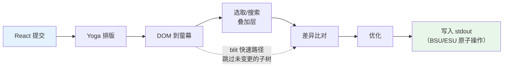
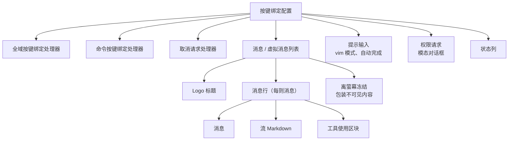

# 第十三章：终端 UI

## 为什么要自建渲染器？

终端不是浏览器。没有 DOM、没有 CSS 引擎、没有合成器、没有保留模式图形管道。只有一条流向 stdout 的字节流，和一条来自 stdin 的字节流。这两条流之间的一切——排版、样式、差异比对、命中测试、滚动、选取——都得从零开始发明。

Claude Code 需要一个反应式 UI。它有提示输入、流 Markdown 输出、权限对话框、进度旋转指示器、可滚动的消息列表、搜索高亮，以及一个 vim 模式编辑器。React 是声明这类组件树的明显选择。但 React 需要一个宿主环境来渲染，而终端不提供。

Ink 是标准答案：一个用于终端的 React 渲染器，基于 Yoga 实现 flexbox 排版。Claude Code 最初使用 Ink，然后将其 fork 到面目全非。原版每个画格对每个存储格分配一个 JavaScript 对象——在 200x120 的终端上，那是每 16ms 建立并回收 24,000 个对象。它在字符串层级做差异比对，比较整行 ANSI 编码文字。没有 blit 优化的概念、没有双缓冲、没有存储格级别的脏标记追踪。对于一个每秒刷新一次的简单 CLI 仪表板，这没问题。但对于一个以 60fps 流 token 的 LLM 代理，同时用户在一个有数百条消息的对话中滚动，这完全不可行。

Claude Code 中保留下来的是一个自定义渲染引擎，它与 Ink 共享概念上的 DNA——React 调和器、Yoga 排版、ANSI 输出——但重新实现了关键路径：用压缩类型数组取代每存储格一个对象、用基于池的字符串驻留取代每画格一个字符串、用双缓冲渲染搭配存储格级别差异比对，以及一个将相邻终端写入合并为最少转义序列的优化器。

结果是在 200 栏的终端上流 Claude 的 token 时达到 60fps。要理解如何做到，我们需要审视四个层：React 调和的自定义 DOM、将该 DOM 转换为终端输出的渲染管道、让系统在数小时的长时间会话中不被垃圾回收淹没的基于池的内存管理，以及将一切串联起来的组件架构。

---

## 自定义 DOM

React 的调和器需要某些东西来进行调和。在浏览器中，那是 DOM。在 Claude Code 的终端中，那是一棵自定义的内存内树，有七种元素类型和一种文字节点类型。

这些元素类型直接对应到终端渲染概念：

- **`ink-root`** ——文件根节点，每个 Ink 实例一个
- **`ink-box`** ——一个 flexbox 容器，终端中等同于 `<div>`
- **`ink-text`** ——一个带有 Yoga 量测函数的文字节点，用于自动换行
- **`ink-virtual-text`** ——巢状在另一个文字节点内的带样式文字（在文字上下文中时自动从 `ink-text` 提升）
- **`ink-link`** ——超链接，通过 OSC 8 转义序列渲染
- **`ink-progress`** ——进度指示器
- **`ink-raw-ansi`** ——具有已知尺寸的预渲染 ANSI 内容，用于语法高亮的代码块

每个 `DOMElement` 携带渲染管道所需的状态：

```typescript
// 示意用——实际接口远比这复杂
interface DOMElement {
  yogaNode: YogaNode;           // Flexbox 排版节点
  style: Styles;                // 类似 CSS 的属性映射到 Yoga
  attributes: Map<string, DOMNodeAttribute>;
  childNodes: (DOMElement | TextNode)[];
  dirty: boolean;               // 是否需要重新渲染
  _eventHandlers: EventHandlerMap; // 与 attributes 分离
  scrollTop: number;            // 命令式卷动状态
  pendingScrollDelta: number;
  stickyScroll: boolean;
  debugOwnerChain?: string;     // 用于调试的 React 组件栈
}
```

将 `_eventHandlers` 与 `attributes` 分离是刻意的。在 React 中，handler 的身份在每次渲染时都会改变（除非手动 memoize）。如果 handler 存储为 attributes，每次渲染都会将节点标记为脏并触发完整重绘。通过分开存储，调和器的 `commitUpdate` 可以更新 handler 而不弄脏节点。

`markDirty()` 函数是 DOM 变更与渲染管道之间的桥梁。当任何节点的内容改变时，`markDirty()` 向上遍历每个祖先，在每个元素上设置 `dirty = true`，并在叶文字节点上调用 `yogaNode.markDirty()`。这就是一个深层巢状文字节点中的单一字符变更如何调度整条路径到根节点的重新渲染的方式——但仅限于那条路径。兄弟子树保持干净，可以从前一个画格 blit 过来。

`ink-raw-ansi` 元素类型值得特别说明。当一个代码块已经经过语法高亮处理（产生 ANSI 转义序列），重新解析那些序列以提取字符和样式会很浪费。取而代之的是，预高亮的内容被包装在一个 `ink-raw-ansi` 节点中，其 `rawWidth` 和 `rawHeight` 属性告诉 Yoga 精确的尺寸。渲染管道直接将原始 ANSI 内容写入输出缓冲区，而不将其分解为个别带样式的字符。这使得语法高亮的代码块在初始高亮处理之后基本上是零成本的——UI 中最昂贵的视觉元素也是渲染最便宜的。

`ink-text` 节点的量测函数值得理解，因为它在 Yoga 的排版过程中执行，而该过程是同步且阻塞的。函数接收可用宽度并必须返回文字的尺寸。它执行自动换行（尊重 `wrap` 样式属性：`wrap`、`truncate`、`truncate-start`、`truncate-middle`），顾及字素集群边界（因此不会将多码位的 emoji 跨行分割），正确量测 CJK 全形字符（每个计为 2 栏），并从宽度计算中剥离 ANSI 转义码（转义序列的视觉宽度为零）。所有这些都必须在每个节点以微秒级完成，因为一个有 50 个可见文字节点的对话意味着每次排版过程有 50 次量测函数调用。

---

## React Fiber 容器

调和器桥接使用 `react-reconciler` 建立自定义宿主配置。这与 React DOM 和 React Native 使用的是同一个 API。关键差异：Claude Code 在 `ConcurrentRoot` 模式下执行。

```typescript
createContainer(rootNode, ConcurrentRoot, ...)
```

ConcurrentRoot 启用了 React 的并行功能——用 Suspense 延迟加载语法高亮，用 transition 在流期间进行非阻塞状态更新。替代方案 `LegacyRoot` 会强制同步渲染，在大量 Markdown 重新解析时阻塞事件循环。

宿主配置方法将 React 操作映射到自定义 DOM：

- **`createInstance(type, props)`** 通过 `createNode()` 建立一个 `DOMElement`，套用初始样式和属性，附加事件 handler，并捕捉 React 组件的拥有者链以用于除错归因。拥有者链存储为 `debugOwnerChain`，在 `CLAUDE_CODE_DEBUG_REPAINTS` 模式中用于将全屏幕重设归因到特定组件
- **`createTextInstance(text)`** 建立一个 `TextNode`——但仅在文字上下文中。调和器强制要求原始字符串必须包装在 `<Text>` 中。尝试在文字上下文之外建立文字节点会抛出例外，在调和时而非渲染时捕捉这类错误
- **`commitUpdate(node, type, oldProps, newProps)`** 通过浅比较对旧新 props 进行差异比对，然后仅套用变更的部分。样式、属性和事件 handler 各有其独自的更新路径。如果没有任何变更，差异比对函数返回 `undefined`，完全避免不必要的 DOM 变更
- **`removeChild(parent, child)`** 从树中移除节点，递归释放 Yoga 节点（在 `free()` 之前调用 `unsetMeasureFunc()` 以避免访问已释放的 WASM 内存），并通知焦点管理器
- **`hideInstance(node)` / `unhideInstance(node)`** 切换 `isHidden`，并在 Yoga 节点的 `Display.None` 和 `Display.Flex` 之间切换。这是 React 用于 Suspense 后备过渡的机制
- **`resetAfterCommit(container)`** 是关键钩子：它调用 `rootNode.onComputeLayout()` 来执行 Yoga，然后调用 `rootNode.onRender()` 来调度终端绘制

调和器在每个提交周期追踪两个性能计数器：Yoga 排版时间（`lastYogaMs`）和总提交时间（`lastCommitMs`）。这些流入 Ink 类别报告的 `FrameEvent`，使生产环境中的性能监控成为可能。

事件系统映射了浏览器的捕获/冒泡模型。`Dispatcher` 类别实现了完整的事件传播，包含三个阶段：捕获（从根到目标）、目标处，以及冒泡（从目标到根）。事件类型映射到 React 的调度优先级——离散事件用于键盘和点击（最高优先级，立即处理），连续事件用于滚动和调整大小（可延迟）。分发器将所有事件处理包装在 `reconciler.discreteUpdates()` 中以实现正确的 React 批次处理。

当你在终端中按下一个键时，产生的 `KeyboardEvent` 会通过自定义 DOM 树进行分发，从聚焦元素向上冒泡到根节点，与键盘事件通过浏览器 DOM 元素冒泡的方式完全相同。路径上的任何 handler 都可以调用 `stopPropagation()` 或 `preventDefault()`，语义与浏览器规范完全一致。

---

## 渲染管道

每个画格经历七个阶段，每个单独计时：



每个阶段都单独计时并报告在 `FrameEvent.phases` 中。这种逐阶段的检测对于诊断性能问题至关重要：当一个画格花费 30ms 时，你需要知道瓶颈是 Yoga 重新量测文字（阶段 2）、渲染器遍历大型脏子树（阶段 3），还是慢速终端造成的 stdout 背压（阶段 7）。答案决定了修复方式。

**阶段 1：React 提交和 Yoga 排版。** 调和器处理状态更新并调用 `resetAfterCommit`。这将根节点的宽度设为 `terminalColumns` 并执行 `yogaNode.calculateLayout()`。Yoga 在一次遍历中计算整个 flexbox 树，遵循 CSS flexbox 规范：它解析所有节点的 flex-grow、flex-shrink、padding、margin、gap、alignment 和 wrapping。结果——`getComputedWidth()`、`getComputedHeight()`、`getComputedLeft()`、`getComputedTop()`——按节点缓存。对于 `ink-text` 节点，Yoga 在排版期间调用自定义量测函数（`measureTextNode`），该函数通过自动换行和字素量测计算文字尺寸。这是每个节点最昂贵的操作：它必须处理 Unicode 字素集群、CJK 全形字符、emoji 序列，以及嵌入在文字内容中的 ANSI 转义码。

**阶段 2：DOM 到屏幕。** 渲染器以深度优先方式遍历 DOM 树，将字符和样式写入 `Screen` 缓冲区。每个字符成为一个压缩的存储格。输出是一个完整的画格：终端上的每个存储格都有一个定义好的字符、样式和宽度。

**阶段 3：叠加层。** 文字选取和搜索高亮在屏幕缓冲区中就地修改，翻转匹配存储格上的样式 ID。选取套用反转显示以建立熟悉的「高亮文字」外观。搜索高亮套用更强烈的视觉处理：当前匹配使用反转 + 黄色前景 + 粗体 + 底线，其他匹配仅使用反转。这会污染缓冲区——以 `prevFrameContaminated` 标志追踪，让下一个画格知道要跳过 blit 快速路径。这种污染是刻意的取舍：就地修改缓冲区避免了分配一个独立的叠加层缓冲区（在 200x120 的终端上节省 48KB），代价是在叠加层清除后多一个全损坏画格。

**阶段 4：差异比对。** 新屏幕与前端画格的屏幕逐存储格比较。只有变更的存储格产生输出。比较是每个存储格两次整数比较（两个压缩的 `Int32` 字组），差异比对遍历损坏矩形而非整个屏幕。在稳态画格中（只有旋转指示器在跳动），这可能在 24,000 个存储格中只产生 3 个修补。每个修补是一个 `{ type: 'stdout', content: string }` 对象，包含游标移动序列和 ANSI 编码的存储格内容。

**阶段 5：优化。** 同一行上相邻的修补被合并为单次写入。冗余的游标移动被消除——如果修补 N 结束在第 10 栏而修补 N+1 从第 11 栏开始，游标已经在正确位置，不需要移动序列。样式转换通过 `StylePool.transition()` 缓存预先序列化，所以从「粗体红色」变为「暗淡绿色」是单次缓存字符串查找，而非差异比对再序列化操作。优化器与朴素的逐存储格输出相比，通常将字节数减少 30-50%。

**阶段 6：写入。** 优化后的修补被序列化为 ANSI 转义序列，并在单次 `write()` 调用中写入 stdout，在支持的终端上包装在同步更新标记（BSU/ESU）中。BSU（Begin Synchronized Update，`ESC [ ? 2026 h`）告诉终端缓冲所有后续输出，而 ESU（`ESC [ ? 2026 l`）告诉它刷新。这在支持该协议的终端上消除了可见的撕裂——整个画格以原子方式呈现。

每个画格通过 `FrameEvent` 对象报告其时间分解：

```typescript
interface FrameEvent {
  durationMs: number;
  phases: {
    renderer: number;    // DOM 到萤幕
    diff: number;        // 萤幕比较
    optimize: number;    // 修补合并
    write: number;       // stdout 写入
    yoga: number;        // 排版计算
  };
  yogaVisited: number;   // 遍历的节点数
  yogaMeasured: number;  // 执行了 measure() 的节点数
  yogaCacheHits: number; // 使用缓存排版的节点数
  flickers: FlickerEvent[];  // 全萤幕重设归因
}
```

当 `CLAUDE_CODE_DEBUG_REPAINTS` 启用时，全屏幕重设会通过 `findOwnerChainAtRow()` 归因到其来源 React 组件。这是终端版的 React DevTools「Highlight Updates」——它显示哪个组件导致了整个屏幕重绘，而这是渲染管道中可能发生的最昂贵的事情。

blit 优化值得特别关注。当一个节点不是脏的，且其位置自前一个画格以来没有改变（通过节点缓存检查），渲染器会直接从 `prevScreen` 复制存储格到当前屏幕，而不是重新渲染子树。这使得稳态画格极其便宜——在一个典型的画格中，只有旋转指示器在跳动，blit 覆盖了 99% 的屏幕，只有旋转指示器的 3-4 个存储格从头重新渲染。

blit 在三种条件下会被禁用：

1. **`prevFrameContaminated` 为 true** ——选取叠加层或搜索高亮就地修改了前端画格的屏幕缓冲区，因此那些存储格不能被信任为「正确的」前一状态
2. **一个绝对定位节点被移除** ——绝对定位意味着该节点可能已经绘制覆盖了非兄弟存储格，那些存储格需要从实际拥有它们的元素重新渲染
3. **排版位移** ——任何节点的缓存位置与其当前计算位置不同，意味着 blit 会将存储格复制到错误的座标

损坏矩形（`screen.damage`）追踪渲染期间所有已写入存储格的边界框。差异比对只检查此矩形内的行，跳过完全未改变的区域。在一个 120 行的终端上，流消息占据第 80-100 行时，差异比对检查 20 行而非 120 行——比较工作减少了 6 倍。

---

## 双缓冲渲染和画格调度

Ink 类别维护两个画格缓冲区：

```typescript
private frontFrame: Frame;  // 当前显示在终端上的
private backFrame: Frame;   // 正在渲染的
```

每个 `Frame` 包含：

- `screen: Screen` ——存储格缓冲区（压缩的 `Int32Array`）
- `viewport: Size` ——渲染时的终端尺寸
- `cursor: { x, y, visible }` ——终端游标停放位置
- `scrollHint` ——alt-screen 模式下的 DECSTBM（滚动区域）优化提示
- `scrollDrainPending` ——ScrollBox 是否还有剩余的滚动增量待处理

每次渲染后，画格交换：`backFrame = frontFrame; frontFrame = newFrame`。旧的前端画格成为下一个后端画格，为 blit 优化提供 `prevScreen`，为存储格级别的差异比对提供基线。

这种双缓冲设计消除了分配。渲染器不是每个画格建立一个新的 `Screen`，而是重用后端画格的缓冲区。交换只是一个指标赋值。这个模式借鉴自图形编程，其中双缓冲通过确保显示端从一个完整的画格读取，而渲染器写入另一个，来防止撕裂。在终端上下文中，撕裂不是问题（BSU/ESU 协议处理了这个）；问题是每 16ms 分配和丢弃包含 48KB+ 类型数组的 `Screen` 对象所造成的 GC 压力。

渲染调度使用 lodash `throttle`，间隔 16ms（大约 60fps），启用前缘和后缘：

```typescript
const deferredRender = () => queueMicrotask(this.onRender);
this.scheduleRender = throttle(deferredRender, FRAME_INTERVAL_MS, {
  leading: true,
  trailing: true,
});
```

微任务延迟不是偶然的。`resetAfterCommit` 在 React 的 layout effects 阶段之前执行。如果渲染器在此同步执行，它会错过在 `useLayoutEffect` 中设置的游标声明。微任务在 layout effects 之后但在同一事件循环 tick 内执行——终端看到的是单一、一致的画格。

对于滚动操作，一个独立的 `setTimeout` 以 4ms（FRAME_INTERVAL_MS >> 2）提供更快的滚动画格，而不干扰 throttle。滚动变更完全绕过 React：`ScrollBox.scrollBy()` 直接修改 DOM 节点属性，调用 `markDirty()`，并通过微任务调度渲染。没有 React 状态更新、没有调和开销、不会因为单一滚轮事件而重新渲染整个消息列表。

**调整大小的处理**是同步的，不做防抖。当终端调整大小时，`handleResize` 立即更新尺寸以保持排版一致。对于 alt-screen 模式，它重设画格缓冲区并将 `ERASE_SCREEN` 延迟到下一个原子 BSU/ESU 绘制区块中，而非立即写入。同步写入擦除会让屏幕在渲染耗费的约 80ms 期间保持空白；延迟到原子区块意味着旧内容保持可见，直到新画格完全准备好。

**alt-screen 管理**新增了另一层。`AlternateScreen` 组件在挂载时进入 DEC 1049 替代屏幕缓冲区，将高度限制为终端行数。它使用 `useInsertionEffect`——而非 `useLayoutEffect`——来确保 `ENTER_ALT_SCREEN` 转义序列在第一个渲染画格之前到达终端。使用 `useLayoutEffect` 会太晚：第一个画格会渲染到主屏幕缓冲区，在切换之前产生可见的闪烁。`useInsertionEffect` 在 layout effects 之前和浏览器（或终端）绘制之前执行，使过渡无缝。

---

## 基于池的内存：为什么驻留很重要

一个 200 栏乘 120 行的终端有 24,000 个存储格。如果每个存储格都是一个带有 `char` 字符串、`style` 字符串和 `hyperlink` 字符串的 JavaScript 对象，那就是每个画格 72,000 次字符串分配——加上存储格本身的 24,000 次对象分配。以 60fps 计算，那是每秒 576 万次分配。V8 的垃圾回收器可以处理这个，但不是没有停顿的，而这些停顿表现为掉画格。GC 停顿通常为 1-5ms，但它们不可预测：它们可能在流 token 更新期间发生，在用户正在观看输出时造成可见的卡顿。

Claude Code 通过压缩类型数组和三个驻留池完全消除了这个问题。结果：存储格缓冲区的每画格对象分配为零。唯一的分配在池本身中（摊销的，因为大多数字符和样式在第一个画格时就被驻留并在之后重用）以及差异比对产生的修补字符串中（这不可避免，因为 stdout.write 需要字符串或 Buffer 引数）。

**存储格布局**使用每个存储格两个 `Int32` 字组，存储在连续的 `Int32Array` 中：

```
word0: charId        （32 位元，CharPool 的索引）
word1: styleId[31:17] | hyperlinkId[16:2] | width[1:0]
```

一个覆盖同一缓冲区的并行 `BigInt64Array` 视图使批次操作成为可能——清除一行只需对 64 位字组进行单次 `fill()` 调用，而不是逐个字段归零。

**CharPool** 将字符字符串驻留为整数 ID。它对 ASCII 有一条快速路径：一个 128 个项目的 `Int32Array` 将字符码直接映射到池索引，完全避免 `Map` 查找。多字节字符（emoji、CJK 表意文字）回退到 `Map<string, number>`。索引 0 始终是空格，索引 1 始终是空字符串。

```typescript
export class CharPool {
  private strings: string[] = [' ', '']
  private ascii: Int32Array = initCharAscii()

  intern(char: string): number {
    if (char.length === 1) {
      const code = char.charCodeAt(0)
      if (code < 128) {
        const cached = this.ascii[code]!
        if (cached !== -1) return cached
        const index = this.strings.length
        this.strings.push(char)
        this.ascii[code] = index
        return index
      }
    }
    // 多字节字符的 Map 回退
    ...
  }
}
```

**StylePool** 将 ANSI 样式码数组驻留为整数 ID。巧妙之处在于：每个 ID 的第 0 位编码该样式是否对空格字符有可见效果（背景色、反转、底线）。仅前景的样式得到偶数 ID；对空格可见的样式得到奇数 ID。这让渲染器可以通过单次位遮罩检查跳过不可见的空格——`if (!(styleId & 1) && charId === 0) continue`——而无需查找样式定义。池还在任意两个样式 ID 之间缓存预序列化的 ANSI 转换字符串，所以从「粗体红色」转换为「暗淡绿色」是一次缓存字符串串联，而非差异比对再序列化操作。

**HyperlinkPool** 驻留 OSC 8 超链接 URI。索引 0 表示没有超链接。

所有三个池在前端和后端画格之间共享。这是一个关键的设计决策。因为池是共享的，驻留的 ID 在画格之间是有效的：blit 优化可以直接从 `prevScreen` 复制压缩的存储格字组到当前屏幕而不需要重新驻留。差异比对可以将 ID 作为整数比较而不需要字符串查找。如果每个画格有自己的池，blit 就需要重新驻留每个复制的存储格（通过旧 ID 查找字符串，然后在新池中驻留），这会抵消 blit 的大部分性能优势。

池会周期性重设（每 5 分钟），以防止在长时间会话中无限制增长。一个迁移过程会将前端画格的活跃存储格重新驻留到新池中。

**CellWidth** 用 2 位分类处理全形字符：

| 值 | 含义 |
|-------|---------|
| 0（Narrow） | 标准单栏字符 |
| 1（Wide） | CJK/emoji 头存储格，占两栏 |
| 2（SpacerTail） | 全形字符的第二栏 |
| 3（SpacerHead） | 软换行续行标记 |

这存储在 `word1` 的低 2 位中，使压缩存储格的宽度检查免费——常见情况下不需要字段提取。

额外的逐存储格元数据存在并行数组中，而非压缩的存储格中：

- **`noSelect: Uint8Array`** ——逐存储格标志，将内容排除在文字选取之外。用于不应出现在复制文字中的 UI 装饰（边框、指示器）
- **`softWrap: Int32Array`** ——逐行标记，指示自动换行续行。当用户选取跨越软换行行的文字时，选取逻辑知道不在换行点插入换行符
- **`damage: Rectangle`** ——当前画格中所有已写入存储格的边界框。差异比对只检查此矩形内的行，跳过完全未改变的区域

这些并行数组避免了扩大压缩存储格格式（这会增加差异比对内循环中的缓存压力），同时提供选取、复制和优化所需的元数据。

`Screen` 还公开了一个 `createScreen()` 工厂方法，接受尺寸和池参照。建立屏幕时通过 `BigInt64Array` 视图的 `fill(0n)` 将 `Int32Array` 归零——一次原生调用就能在微秒内清除整个缓冲区。这在调整大小（需要新的画格缓冲区时）和池迁移（旧屏幕的存储格被重新驻留到新池时）中使用。

---

## REPL 组件

REPL（`REPL.tsx`）大约有 5,000 行。它是代码库中最大的单一组件，原因充分：它是整个互动体验的编排者。所有东西都流经它。

该组件大致组织为九个区段：

1. **导入**（约 100 行）——引入启动引导状态、命令、历史记录、hooks、组件、键绑定、成本追踪、通知、群集/团队支持、语音整合
2. **Feature flag 导入** ——通过 `feature()` 保护搭配 `require()` 的条件式加载，用于语音整合、主动模式、简要工具和协调者代理
3. **状态管理** ——大量的 `useState` 调用，涵盖消息、输入模式、待处理权限、对话框、成本阈值、会话状态、工具状态和代理状态
4. **QueryGuard** ——管理活跃 API 调用的生命周期，防止并行请求互相干扰
5. **消息处理** ——处理来自查询循环的传入消息，规范化排序，管理流状态
6. **工具权限流程** ——协调工具使用区块和 PermissionRequest 对话框之间的权限请求
7. **会话管理** ——恢复、切换、导出对话
8. **键绑定设置** ——连接键绑定提供者：`KeybindingSetup`、`GlobalKeybindingHandlers`、`CommandKeybindingHandlers`
9. **渲染树** ——从上述所有内容组合最终的 UI

其渲染树在全屏幕模式下组合了完整的接口：



`OffscreenFreeze` 是特定于终端渲染的性能优化。当一则消息滚动到窗口之上时，其 React 元素被缓存且子树被冻结。这防止了离屏幕消息中基于计时器的更新（旋转指示器、经过时间计数器）触发终端重设。没有这个，第 3 则消息中的旋转指示器会导致完整重绘，即使用户正在看第 47 则消息。

组件全程由 React Compiler 编译。不再需要手动的 `useMemo` 和 `useCallback`，编译器使用槽数组插入逐表达式的 memoization：

```typescript
const $ = _c(14);  // 14 个 memoization 槽
let t0;
if ($[0] !== dep1 || $[1] !== dep2) {
  t0 = expensiveComputation(dep1, dep2);
  $[0] = dep1; $[1] = dep2; $[2] = t0;
} else {
  t0 = $[2];
}
```

这个模式出现在代码库中的每个组件中。它提供了比 `useMemo`（在 hook 层级 memoize）更细的粒度——渲染函数中的个别表达式各有自己的依赖追踪和缓存。对于像 REPL 这样 5,000 行的组件，这消除了每次渲染中数百次潜在的不必要重新计算。

---

## 选取和搜索高亮

文字选取和搜索高亮作为屏幕缓冲区叠加层运作，在主渲染之后但差异比对之前套用。

**文字选取**仅在 alt-screen 中运作。Ink 实例持有一个 `SelectionState`，追踪锚点和焦点位置、拖曳模式（字符/单词/行），以及已滚动出屏幕的提取行。当用户点击并拖曳时，选取处理器更新这些座标。在 `onRender` 期间，`applySelectionOverlay` 遍历受影响的行，使用 `StylePool.withSelectionBg()` 就地修改存储格样式 ID，该方法返回一个加了反转显示的新样式 ID。这种对屏幕缓冲区的直接修改正是 `prevFrameContaminated` 标志存在的原因——前端画格的缓冲区已被叠加层修改，所以下一个画格不能信任它用于 blit 优化，必须做全损坏差异比对。

滑鼠追踪使用 SGR 1003 模式，报告点击、拖曳和移动的栏/行座标。`App` 组件实现了多次点击侦测：双击选取一个单词，三击选取一行。侦测使用 500ms 超时和 1 个存储格的位置容忍度（在点击之间滑鼠可以移动一个存储格而不重设多次点击计数器）。超链接点击被这个超时刻意延迟——双击链接会选取单词而不是开启浏览器，这符合用户从文字编辑器中所预期的行为。

一个遗失释放恢复机制处理了用户在终端内开始拖曳、将滑鼠移到窗口外、然后释放的情况。终端报告了按下和拖曳，但不报告释放（因为它发生在窗口外）。没有恢复机制，选取会永久卡在拖曳模式。恢复的运作方式是侦测没有按钮按下的滑鼠移动事件——如果我们处于拖曳状态且收到了一个无按钮的移动事件，我们推断按钮在窗口外被释放，然后完成选取。

**搜索高亮**有两个并行执行的机制。基于扫描的路径（`applySearchHighlight`）遍历可见存储格寻找查询字符串，并套用 SGR 反转样式。基于位置的路径使用来自 `scanElementSubtree()` 的预计算 `MatchPosition[]`，按消息相对位置存储，并在已知偏移处套用「当前匹配」黄色高亮，使用栈的 ANSI 码（反转 + 黄色前景 + 粗体 + 底线）。黄色前景与反转结合后成为黄色背景——终端在反转启用时交换前景/背景。底线是在黄色与现有背景色冲突的主题中的备用可见性标记。

**游标声明**解决了一个微妙的问题。终端模拟器在实体游标位置渲染 IME（输入法编辑器）预编辑文字。正在组字的 CJK 用户需要游标在文字输入的插入点，而不是在终端自然停放的屏幕底部。`useDeclaredCursor` hook 让组件声明每个画格后游标应该在哪里。Ink 类别从 `nodeCache` 读取已声明节点的位置，将其转换为屏幕座标，并在差异比对后发出游标移动序列。屏幕阅读器和放大镜也追踪实体游标，所以这个机制同时有利于无障碍和 CJK 输入。

在主屏幕模式下，已声明的游标位置与 `frame.cursor` 分开追踪（后者必须保持在内容底部，以维持 log-update 的相对移动不变量）。在 alt-screen 模式下，问题更简单：每个画格以 `CSI H`（游标归位）开始，所以已声明的游标只是在画格末尾发出的绝对位置。

---

## 流 Markdown

渲染 LLM 输出是终端 UI 面临的最繁重任务。Token 一次一个到达，每秒 10-50 个，每一个都改变一则消息的内容，而该消息可能包含代码块、列表、粗体文字和行内代码。朴素方法——每个 token 都重新解析整则消息——在规模上会是灾难性的。

Claude Code 使用三种优化：

**Token 缓存。** 一个模块级的 LRU 缓存（500 个项目）存储以内容哈希为键的 `marked.lexer()` 结果。缓存在虚拟滚动期间的 React 卸载/重新挂载周期中存活。当用户卷回到先前可见的消息时，Markdown token 从缓存中提供，而非重新解析。

**快速路径侦测。** `hasMarkdownSyntax()` 通过单一正规表达式检查前 500 个字符是否有 Markdown 标记。如果没有找到语法，它直接构建一个单段落 token，绕过完整的 GFM 解析器。这在纯文字消息上每次渲染节省大约 3ms——当你以每秒 60 个画格渲染时，这很重要。

**延迟语法高亮。** 代码块高亮通过 React `Suspense` 加载。`MarkdownBody` 组件以 `highlight={null}` 作为后备立即渲染，然后使用 cli-highlight 实例异步解析。用户立即看到代码（无样式），然后一两个画格后颜色出现。

流情况增加了一个皱折。当 token 从模型到达时，Markdown 内容递增增长。在每个 token 上重新解析整个内容，在消息的过程中会是 O(n²)。快速路径侦测有帮助——大多数流内容是纯文字段落，会完全绕过解析器——但对于包含代码块和列表的消息，LRU 缓存提供了真正的优化。缓存键是内容哈希，所以当 10 个 token 到达而只有最后一段改变时，未变更前缀的缓存解析结果会被重用。Markdown 渲染器只重新解析改变的尾部。

`StreamingMarkdown` 组件与静态的 `Markdown` 组件不同。它处理内容仍在生成中的情况：不完整的代码围栏（有 ` ``` ` 但没有关闭围栏）、部分的粗体标记，以及被截断的列表项目。流变体在解析上更宽容——它不会因未关闭的语法而报错，因为关闭语法尚未到达。当消息完成流时，组件过渡到静态的 `Markdown` 渲染器，后者套用严格语法检查的完整 GFM 解析。

代码块的语法高亮是渲染管道中最昂贵的逐元素操作。一个 100 行的代码块在使用 cli-highlight 时可能需要 50-100ms 来高亮。加载高亮程序库本身需要 200-300ms（它捆绑了数十种语言的语法定义）。两种成本都被 React `Suspense` 隐藏了：代码块立即渲染为纯文字，高亮程序库异步加载，当它解析完成时，代码块带着颜色重新渲染。用户立即看到代码，片刻之后看到颜色——比加载程序库时 300ms 的空白画格好得多。

---

## 实践应用：高效渲染流输出

终端渲染管道是一个消除工作的案例研究。三个原则驱动了设计：

**驻留一切。** 如果你有一个出现在数千个存储格中的值——一个样式、一个字符、一个 URL——存储一次并以整数 ID 引用。整数比较是一条 CPU 指令。字符串比较是一个循环。当你的内循环每个画格在 60fps 下执行 24,000 次时，整数上的 `===` 和字符串上的 `===` 之间的差别就是顺畅滚动与可见延迟的差别。

**在正确的层级做差异比对。** 存储格级别的差异比对听起来很昂贵——每个画格 24,000 次比较。但它是每个存储格两次整数比较（压缩的字组），而且在稳态画格中，差异比对在检查第一个存储格后就会跳出大部分行。替代方案——重新渲染整个屏幕并写入 stdout——每个画格会产生 100KB+ 的 ANSI 转义序列。差异比对通常产生不到 1KB。

**将热路径与 React 分离。** 滚动事件以滑鼠输入频率到达（潜在的每秒数百次）。将每一个都路由通过 React 的调和器——状态更新、调和、提交、排版、渲染——每个事件增加 5-10ms 的延迟。通过直接修改 DOM 节点并经由微任务调度渲染，滚动路径保持在 1ms 以下。React 只在最终的绘制中参与，而那是它无论如何都会执行的。

这些原则适用于任何流输出系统，不仅限于终端。如果你正在构建一个渲染即时数据的 Web 应用——日志检视器、聊天客户端、监控仪表板——同样的取舍适用。驻留重复的值。与前一个画格做差异比对。将热路径保持在你的反应式框架之外。

第四个原则，特定于长时间执行的会话：**定期清理。** Claude Code 的池随着新字符和样式的驻留而单调增长。在多小时的会话中，池可能累积数千个不再被任何活跃存储格引用的项目。5 分钟的重设周期限制了这种增长：每 5 分钟，建立新池，前端画格的存储格被迁移（重新驻留到新池），旧池变成垃圾。这是一种世代回收策略，在应用级别套用，因为 JavaScript 的 GC 对池项目的语义活性没有可见性。

使用 `Int32Array` 而非普通对象的决定有一个更微妙的好处，超越 GC 压力：内存局部性。当差异比对比较 24,000 个存储格时，它遍历一个连续的类型数组。现代 CPU 预取顺序内存访问，所以整个屏幕比较在 L1/L2 缓存内执行。每存储格一个对象的布局会将存储格分散在堆中，使每次比较都变成缓存未命中。性能差异是可量测的：在 200x120 的屏幕上，类型数组的差异比对在 0.5ms 以内完成，而等效的基于对象的差异比对需要 3-5ms——当与管道的其他阶段结合时，足以超出 16ms 的画格预算。

第五个原则适用于任何渲染到固定大小网格的系统：**追踪损坏边界。** 每个屏幕上的 `damage` 矩形记录渲染期间写入的存储格的边界框。差异比对参考此矩形，完全跳过其外的行。当流消息占据 120 行终端的底部 20 行时，差异比对检查 20 行，而非 120 行。结合 blit 优化（它只为重新渲染的区域填充损坏矩形，而非 blit 的区域），这意味着常见情况——一则消息在流而对话的其余部分是静态的——只触及屏幕缓冲区的一小部分。

更广义的教训：渲染系统中的性能不是关于让任何单一操作更快。而是关于完全消除操作。blit 消除了重新渲染。损坏矩形消除了差异比对。池共享消除了重新驻留。压缩存储格消除了分配。每项优化移除了一整个类别的工作，而且它们以乘法方式栈。

用数字来说明：在 200x120 的终端上，最坏情况的画格（所有东西都脏、没有 blit、全屏幕损坏）大约需要 12ms。最佳情况的画格（一个脏节点、blit 其他所有东西、3 行损坏矩形）在 1ms 以内。系统大部分时间处于最佳情况。流 token 到达触发一个脏文字节点，该节点使其祖先一路到消息容器变脏，通常是屏幕的 10-30 行。blit 处理其他 90-110 行。损坏矩形将差异比对限制在脏区域。池查找是整数操作。流一个 token 的稳态成本由 Yoga 排版（重新量测脏文字节点及其祖先）和 Markdown 重新解析主导——而非渲染管道本身。


---
