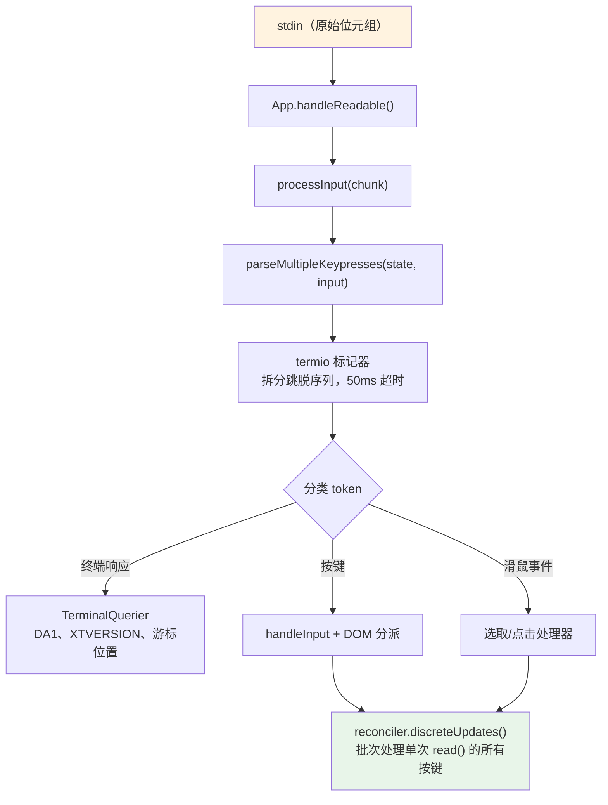
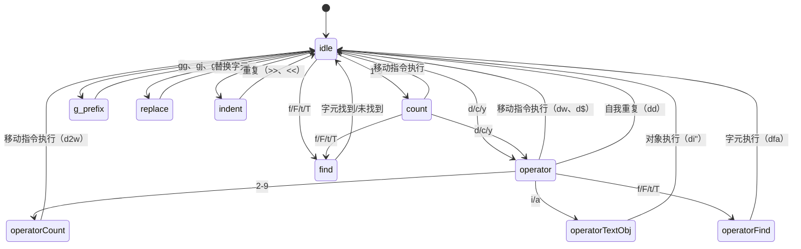

# 第十四章：输入与互动

## 原始字节，有意义的动作

当你在 Claude Code 中按下 Ctrl+X 再按 Ctrl+K 时，终端会发送两段字节序列，中间大约间隔 200 毫秒。第一段是 `0x18`（ASCII CAN）。第二段是 `0x0B`（ASCII VT）。这两个字节本身不带有除了「控制字符」以外的任何固有意义。输入系统必须辨识出这两个在超时窗口内依次到达的字节，构成了组合键 `ctrl+x ctrl+k`，对应到动作 `chat:killAgents`，终止所有正在执行的子代理。

从原始字节到被终止的代理之间，六个系统依次启动：一个标记器拆分转义序列，一个解析器跨五种终端协议进行分类，一个键绑定解析器根据上下文特定的绑定进行匹配，一个组合键状态机管理多键序列，一个处理器执行动作，最后 React 将产生的状态更新批次合并为一次渲染。

困难之处不在于任何单一系统，而在于终端多样性所带来的组合爆炸。iTerm2 发送 Kitty 键盘协议序列。macOS Terminal 发送传统 VT220 序列。通过 SSH 连接的 Ghostty 发送 xterm modifyOtherKeys。tmux 可能会吃掉、转换或透传任何这些序列，取决于它的设置。Windows Terminal 在 VT 模式方面有自己的怪癖。输入系统必须从所有这些来源产生正确的 `ParsedKey` 对象，因为用户不应该需要知道他们的终端使用的是哪种键盘协议。

本章追踪从原始字节到有意义动作的完整路径，横跨这整个生态系统。

设计哲学是渐进增强搭配优雅降级。在支持 Kitty 键盘协议的现代终端上，Claude Code 能获得完整的修饰键侦测（Ctrl+Shift+A 与 Ctrl+A 是不同的）、super 键回报（Cmd 快捷键），以及无歧义的按键识别。在通过 SSH 连接的传统终端上，它会回退到最佳可用协议，损失一些修饰键区分能力但保持核心功能完整。用户永远不会看到关于其终端不支持的错误消息。他们可能无法使用 `ctrl+shift+f` 进行全域搜索，但 `ctrl+r` 的历史搜索在任何地方都能运作。

---

## 按键解析管道

输入以字节区块的形式从 stdin 到达。管道分阶段处理它们：



标记器是整个基础。终端输入是一个混合了可打印字符、控制码和多字节转义序列的字节流，没有明确的框架界定。从 stdin 的一次 `read()` 可能返回 `\x1b[1;5A`（Ctrl+上箭头），也可能在一次读取中返回 `\x1b`，然后在下一次读取中返回 `[1;5A`，取决于字节从 PTY 到达的速度。标记器维护一个状态机，缓冲不完整的转义序列并产出完整的 token。

不完整序列问题是根本性的。当标记器看到一个孤立的 `\x1b` 时，它无法知道这是 Escape 键还是 CSI 序列的开头。它会缓冲这个字节并启动一个 50ms 计时器。如果没有后续到达，缓冲区会被清空，`\x1b` 成为一个 Escape 按键事件。但在清空之前，标记器会检查 `stdin.readableLength` —— 如果核心缓冲区中有字节在等待，计时器会重新启动而非清空。这处理了事件循环被阻塞超过 50ms 且后续字节已经被缓冲但尚未被读取的情况。

对于粘贴操作，超时延长到 500ms。粘贴的文字可能很大且分多个区块到达。

来自单次 `read()` 的所有已解析按键会在一次 `reconciler.discreteUpdates()` 调用中被处理。这会批次处理 React 状态更新，使得粘贴 100 个字符只产生一次重新渲染，而非 100 次。这个批次处理是必要的：没有它，粘贴中的每个字符都会触发一次完整的协调循环 —— 状态更新、协调、提交、Yoga 排版、渲染、比对、写入。以每次循环 5ms 计算，100 个字符的粘贴需要 500ms 才能处理完。有了批次处理，同样的粘贴只需要一次 5ms 循环。

### stdin 管理

`App` 组件通过引用计数管理原始模式。当任何组件需要原始输入（提示框、对话框、vim 模式）时，它调用 `setRawMode(true)`，将计数器加一。当它不再需要原始输入时，调用 `setRawMode(false)`，将计数器减一。只有当计数器归零时，原始模式才会被禁用。这防止了终端应用中一个常见的 bug：组件 A 启用原始模式，组件 B 启用原始模式，组件 A 禁用原始模式，然后组件 B 的输入突然坏掉，因为原始模式被全域禁用了。

当原始模式首次启用时，App 会：

1. 停止早期输入捕获（启动引导阶段在 React 挂载前收集按键的机制）
2. 将 stdin 设为原始模式（无行缓冲、无回显、无讯号处理）
3. 附加一个 `readable` 监听器用于异步输入处理
4. 启用括弧粘贴（使粘贴的文字可被识别）
5. 启用焦点回报（使应用知道终端窗口何时获得/失去焦点）
6. 启用延伸按键回报（Kitty 键盘协议 + xterm modifyOtherKeys）

在禁用时，以上所有步骤会以相反顺序还原。谨慎的顺序安排防止了转义序列泄漏 —— 在禁用原始模式之前先禁用延伸按键回报，确保终端不会在应用停止解析它们之后继续发送 Kitty 编码序列。

`onExit` 讯号处理器（通过 `signal-exit` 包）确保即使在非预期终止时也会执行清理。如果程序收到 SIGTERM 或 SIGINT，处理器会禁用原始模式、还原终端状态、退出替代屏幕（如果启用的话），并在程序退出前重新显示游标。没有这个清理，一个崩溃的 Claude Code 会话会让终端留在原始模式中，没有游标也没有回显 —— 用户需要盲打 `reset` 来恢复他们的终端。

---

## 多协议支持

终端在如何编码键盘输入方面并没有共识。像 Kitty 这样的现代终端模拟器会发送带有完整修饰键信息的结构化序列。通过 SSH 连接的传统终端发送需要上下文才能解释的模糊字节序列。Claude Code 的解析器同时处理五种不同的协议，因为用户的终端可能是其中任何一种。

**CSI u（Kitty 键盘协议）** 是现代标准。格式：`ESC [ codepoint [; modifier] u`。示例：`ESC[13;2u` 是 Shift+Enter，`ESC[27u` 是无修饰键的 Escape。码位无歧义地识别按键 —— Escape 按键和 Escape 作为序列前缀之间没有歧义。修饰键字组将 shift、alt、ctrl 和 super（Cmd）编码为各自的位。Claude Code 在启动时通过 `ENABLE_KITTY_KEYBOARD` 转义序列在支持的终端上启用此协议，并在退出时通过 `DISABLE_KITTY_KEYBOARD` 禁用它。协议通过查询/响应握手进行侦测：应用发送 `CSI ? u`，终端以 `CSI ? flags u` 响应，其中 `flags` 指示支持的协议等级。

**xterm modifyOtherKeys** 是用于像通过 SSH 连接的 Ghostty 这类终端的备用方案，在这些环境中 Kitty 协议无法协商。格式：`ESC [ 27 ; modifier ; keycode ~`。注意参数顺序与 CSI u 相反 —— 修饰键在键码之前，然后是键码。这是解析器 bug 的常见来源。此协议通过 `CSI > 4 ; 2 m` 启用，当终端的 TERM 识别未被侦测到时（在 SSH 上 `TERM_PROGRAM` 未被转发时很常见），由 Ghostty、tmux 和 xterm 发出。

**传统终端序列** 涵盖其他所有情况：通过 `ESC O` 和 `ESC [` 序列的功能键、方向键、数字键盘、Home/End/Insert/Delete，以及 40 年终端演进中累积的 VT100/VT220/xterm 变体的完整动物园。解析器使用两个正规表达式来匹配这些：`FN_KEY_RE` 用于 `ESC O/N/[/[[` 前缀模式（匹配功能键、方向键及其带修饰键的变体），`META_KEY_CODE_RE` 用于 meta 键码（`ESC` 后跟一个英数字符，传统的 Alt+键编码）。

传统序列的挑战在于歧义性。`ESC [ 1 ; 2 R` 可能是 Shift+F3 或游标位置回报，取决于上下文。解析器通过私有标记检查来解决这个问题：游标位置回报使用 `CSI ? row ; col R`（带有 `?` 私有标记），而带修饰键的功能键使用 `CSI params R`（不带标记）。这个消歧义是 Claude Code 请求 DECXCPR（延伸游标位置回报）而非标准 CPR 的原因 —— 延伸形式是无歧义的。

终端识别增加了另一层复杂性。在启动时，Claude Code 发送一个 `XTVERSION` 查询（`CSI > 0 q`）来发现终端的名称和版本。响应（`DCS > | name ST`）能在 SSH 连接中存活 —— 不像 `TERM_PROGRAM` 那样，它是一个不会通过 SSH 传播的环境变量。知道终端身分让解析器能处理终端特定的怪癖。例如，xterm.js（VS Code 的整合终端使用的）与原生 xterm 有不同的转义序列行为，而识别字符串（`xterm.js(X.Y.Z)`）让解析器能考虑这些差异。

**SGR 滑鼠事件** 使用格式 `ESC [ < button ; col ; row M/m`，其中 `M` 是按下，`m` 是释放。按钮码编码动作：0/1/2 对应左/中/右键点击，64/65 对应滚轮上/下（0x40 OR 上一个滚轮位），32+ 对应拖曳（0x20 OR 上一个移动位）。滚轮事件被转换为 `ParsedKey` 对象，使它们流经键绑定系统；点击和拖曳事件成为 `ParsedMouse` 对象，路由到选取处理器。

**括弧粘贴** 将粘贴的内容包裹在 `ESC [200~` 和 `ESC [201~` 标记之间。标记之间的所有内容成为一个带有 `isPasted: true` 的单一 `ParsedKey`，无论粘贴的文字可能包含什么转义序列。这防止粘贴的代码被解释为命令 —— 当用户粘贴包含 `\x03`（作为原始字节的 Ctrl+C）的代码片段时，这是一个关键的安全特性。

解析器的输出类型形成一个清晰的判别式联合：

```typescript
type ParsedKey = {
  kind: 'key';
  name: string;        // 'return'、'escape'、'a'、'f1' 等
  ctrl: boolean; meta: boolean; shift: boolean;
  option: boolean; super: boolean;
  sequence: string;    // 原始跳脱序列，用于调试
  isPasted: boolean;   // 在括弧贴上内
}

type ParsedMouse = {
  kind: 'mouse';
  button: number;      // SGR 按钮码
  action: 'press' | 'release';
  col: number; row: number;  // 1-indexed 终端坐标
}

type ParsedResponse = {
  kind: 'response';
  response: TerminalResponse;  // 路由到 TerminalQuerier
}
```

`kind` 判别式确保下游代码明确处理每种输入类型。一个按键不可能被意外地当作滑鼠事件处理；一个终端响应不可能被意外地解释为按键。`ParsedKey` 类型还携带原始 `sequence` 字符串用于调试 —— 当用户回报「按 Ctrl+Shift+A 没有反应」时，调试日志能显示终端究竟发送了什么字节序列，使得诊断问题究竟出在终端的编码、解析器的识别还是键绑定的设置成为可能。

`ParsedKey` 上的 `isPasted` 标志对安全性至关重要。当括弧粘贴启用时，终端将粘贴的内容包裹在标记序列中。解析器在产生的按键事件上设置 `isPasted: true`，键绑定解析器会跳过对已粘贴按键的绑定匹配。没有这个机制，粘贴包含 `\x03`（原始字节的 Ctrl+C）或转义序列的文字会触发应用命令。有了它，粘贴的内容无论其字节内容为何都被视为字面文字输入。

解析器也识别终端响应 —— 终端自身对查询的回答所发送的序列。这些包括设备属性（DA1、DA2）、游标位置回报、Kitty 键盘标志响应、XTVERSION（终端识别）和 DECRPM（模式状态）。这些被路由到 `TerminalQuerier` 而非输入处理器：

```typescript
type TerminalResponse =
  | { type: 'decrpm'; mode: number; status: number }
  | { type: 'da1'; params: number[] }
  | { type: 'da2'; params: number[] }
  | { type: 'kittyKeyboard'; flags: number }
  | { type: 'cursorPosition'; row: number; col: number }
  | { type: 'osc'; code: number; data: string }
  | { type: 'xtversion'; version: string }
```

**修饰键解码** 遵循 XTerm 惯例：修饰键字组为 `1 + (shift ? 1 : 0) + (alt ? 2 : 0) + (ctrl ? 4 : 0) + (super ? 8 : 0)`。`ParsedKey` 中的 `meta` 字段对应到 Alt/Option（位 2）。`super` 字段是独立的（位 8，macOS 上的 Cmd）。这个区别很重要，因为 Cmd 快捷键由操作系统保留，终端应用无法捕获 —— 除非终端使用 Kitty 协议，它会回报其他协议默默吞掉的 super 修饰键。

一个 stdin 间隙侦测器会在距上次输入 5 秒无输入后触发终端模式重新声明。这处理了 tmux 重新连接和笔记本唤醒情境，在这些情境中终端的键盘模式可能已被多路复用器或操作系统重置。当重新声明触发时，它会重新发送 `ENABLE_KITTY_KEYBOARD`、`ENABLE_MODIFY_OTHER_KEYS`、括弧粘贴和焦点回报序列。没有这个机制，从 tmux 会话分离后重新连接会默默地将键盘协议降级为传统模式，在剩余的会话中破坏修饰键侦测。

### 终端 I/O 层

解析器之下是 `ink/termio/` 中的结构化终端 I/O 子系统：

- **csi.ts** —— CSI（控制序列引导器）序列：游标移动、清除、滚动区域、括弧粘贴启用/禁用、焦点事件启用/禁用、Kitty 键盘协议启用/禁用
- **dec.ts** —— DEC 私有模式序列：替代屏幕缓冲区（1049）、滑鼠追踪模式（1000/1002/1003）、游标可见性、括弧粘贴（2004）、焦点事件（1004）
- **osc.ts** —— 操作系统命令：剪贴簿访问（OSC 52）、分页状态、iTerm2 进度指示器、tmux/screen 多路复用器包装（DCS 透传，用于需要穿越多路复用器边界的序列）
- **sgr.ts** —— 选择图形再现：ANSI 样式码系统（颜色、粗体、斜体、底线、反转）
- **tokenize.ts** —— 有状态的标记器，用于转义序列边界侦测

多路复用器包装值得一提。当 Claude Code 在 tmux 内执行时，某些转义序列（如 Kitty 键盘协议协商）必须透传到外部终端。tmux 使用 DCS 透传（`ESC P ... ST`）来转发它不理解的序列。`osc.ts` 中的 `wrapForMultiplexer` 函数侦测多路复用器环境并适当地包装序列。没有这个机制，Kitty 键盘模式会在 tmux 内默默失败，用户永远不会知道为什么他们的 Ctrl+Shift 绑定停止运作了。

### 事件系统

`ink/events/` 目录实现了一个兼容于浏览器的事件系统，具有七种事件类型：`KeyboardEvent`、`ClickEvent`、`FocusEvent`、`InputEvent`、`TerminalFocusEvent` 和基础 `TerminalEvent`。每个都携带 `target`、`currentTarget`、`eventPhase`，并支持 `stopPropagation()`、`stopImmediatePropagation()` 和 `preventDefault()`。

包装 `ParsedKey` 的 `InputEvent` 是为了与传统 `EventEmitter` 路径的向后兼容性，较旧的组件可能仍在使用。新组件使用 DOM 风格的键盘事件分派，带有捕获/冒泡阶段。两条路径都从同一个已解析的按键触发，所以它们始终一致 —— 到达 stdin 的一个按键产生恰好一个 `ParsedKey`，它同时产生一个 `InputEvent`（给传统监听器）和一个 `KeyboardEvent`（给 DOM 风格分派）。这个双路径设计允许从 EventEmitter 模式到 DOM 事件模式的渐进式迁移，而不会破坏现有组件。

---

## 键绑定系统

键绑定系统分离了三个经常被纠缠在一起的关注点：什么按键触发什么动作（绑定）、动作触发时发生什么（处理器），以及哪些绑定现在是活跃的（上下文）。

### 绑定：声明式设置

默认绑定定义在 `defaultBindings.ts` 中，作为 `KeybindingBlock` 对象数组，每个都限定在一个上下文中：

```typescript
export const DEFAULT_BINDINGS: KeybindingBlock[] = [
  {
    context: 'Global',
    bindings: {
      'ctrl+c': 'app:interrupt',
      'ctrl+d': 'app:exit',
      'ctrl+l': 'app:redraw',
      'ctrl+r': 'history:search',
    },
  },
  {
    context: 'Chat',
    bindings: {
      'escape': 'chat:cancel',
      'ctrl+x ctrl+k': 'chat:killAgents',
      'enter': 'chat:submit',
      'up': 'history:previous',
      'ctrl+x ctrl+e': 'chat:externalEditor',
    },
  },
  // ... 另外 14 个上下文
]
```

平台特定的绑定在定义时处理。图片粘贴在 macOS/Linux 上是 `ctrl+v`，但在 Windows 上是 `alt+v`（因为 `ctrl+v` 是系统粘贴）。模式循环切换在支持 VT 模式的终端上是 `shift+tab`，但在没有 VT 模式的 Windows Terminal 上是 `meta+m`。功能标志绑定（快速搜索、语音模式、终端面板）是条件式包含的。

用户可以通过 `~/.claude/keybindings.json` 覆盖任何绑定。解析器接受修饰键别名（`ctrl`/`control`、`alt`/`opt`/`option`、`cmd`/`command`/`super`/`win`）、按键别名（`esc` -> `escape`、`return` -> `enter`）、组合键表示法（以空格分隔的步骤，如 `ctrl+k ctrl+s`），以及 null 动作来解除默认按键的绑定。null 动作与不定义绑定不同 —— 它明确阻止默认绑定的触发，这对于想要回收某个按键给终端使用的用户很重要。

### 上下文：16 个活动范围

每个上下文代表一种互动模式，其中一组特定的绑定适用：

| 上下文 | 何时活跃 |
|---------|------------|
| Global | 始终 |
| Chat | 提示输入获得焦点时 |
| Autocomplete | 自动完成选单可见时 |
| Confirmation | 权限对话框显示时 |
| Scroll | 替代屏幕中有可滚动内容时 |
| Transcript | 只读对话记录检视器 |
| HistorySearch | 反向历史搜索（ctrl+r） |
| Task | 背景任务正在执行时 |
| Help | 说明复盖层显示时 |
| MessageSelector | 回溯对话框 |
| MessageActions | 消息游标导航 |
| DiffDialog | 差异检视器 |
| Select | 通用选择列表 |
| Settings | 设置面板 |
| Tabs | 分页导航 |
| Footer | 页尾指示器 |

当按键到达时，解析器从目前活跃的上下文（由 React 组件状态决定）建立一个上下文列表，去重复同时保持优先顺序，然后搜索匹配的绑定。最后一个匹配的绑定胜出 —— 这就是用户覆盖如何优先于默认值的方式。上下文列表在每次按键时重建（这很廉价：最多 16 个字符串的数组串联和去重复），所以上下文变更会立即生效，不需要任何订阅或监听器机制。

上下文设计处理了一个棘手的互动模式：巢状模态。当权限对话框在执行中的任务期间出现时，`Confirmation` 和 `Task` 上下文可能都是活跃的。`Confirmation` 上下文取得优先权（它在组件树中较晚注册），所以 `y` 触发「批准」而非任何任务层级的绑定。当对话框关闭时，`Confirmation` 上下文禁用，`Task` 绑定恢复。这个栈行为自然而然地从上下文列表的优先顺序中浮现 —— 不需要特殊的模态处理代码。

### 保留快捷键

并非一切都可以重新绑定。系统强制执行三层保留：

**不可重新绑定**（硬编码行为）：`ctrl+c`（中断/退出）、`ctrl+d`（退出）、`ctrl+m`（在所有终端中与 Enter 相同 —— 重新绑定它会破坏 Enter）。

**终端保留**（警告）：`ctrl+z`（SIGTSTP）、`ctrl+\`（SIGQUIT）。这些技术上可以被绑定，但在大多数设置中终端会在应用看到它们之前就拦截掉。

**macOS 保留**（错误）：`cmd+c`、`cmd+v`、`cmd+x`、`cmd+q`、`cmd+w`、`cmd+tab`、`cmd+space`。操作系统在它们到达终端之前就拦截了。绑定它们会建立一个永远不会触发的快捷键。

### 解析流程

当按键到达时，解析路径是：

1. 建立上下文列表：组件注册的活跃上下文加上 Global，去重复同时保持优先顺序
2. 针对合并的绑定表调用 `resolveKeyWithChordState(input, key, contexts)`
3. `match`：清除任何待处理的组合键，调用处理器，对事件执行 `stopImmediatePropagation()`
4. `chord_started`：存储待处理的按键，停止传播，启动组合键超时
5. `chord_cancelled`：清除待处理的组合键，让事件继续冒泡
6. `unbound`：清除组合键 —— 这是明确的解除绑定（用户将动作设为 `null`），所以传播被停止但不执行处理器
7. `none`：继续冒泡到其他处理器

「最后者胜出」的解析策略意味着，如果默认绑定和用户绑定都在 `Chat` 上下文中定义了 `ctrl+k`，用户的绑定取得优先权。这在匹配时通过按定义顺序迭代绑定并保留最后一个匹配来评估，而非在加载时建立覆盖映射。优点是：上下文特定的覆盖自然地组合。用户可以覆盖 `Chat` 中的 `enter` 而不影响 `Confirmation` 中的 `enter`。

---

## 组合键支持

`ctrl+x ctrl+k` 绑定是一个组合键：两个按键共同构成一个单一动作。解析器通过一个状态机来管理它。

当按键到达时：

1. 解析器将它附加到任何待处理的组合键前缀
2. 它检查是否有任何绑定的组合键以此前缀开头。如果有，它返回 `chord_started` 并存储待处理的按键
3. 如果完整的组合键精确匹配一个绑定，它返回 `match` 并清除待处理状态
4. 如果组合键前缀不匹配任何东西，它返回 `chord_cancelled`

一个 `ChordInterceptor` 组件在组合键等待状态期间拦截所有输入。它有一个 1000ms 的超时 —— 如果第二个按键没有在一秒内到达，组合键会被取消且第一个按键会被丢弃。`KeybindingContext` 提供一个 `pendingChordRef` 用于同步访问待处理状态，避免 React 状态更新延迟，那可能导致第二个按键在第一个按键的状态更新完成之前就被处理。

组合键设计避免了遮蔽 readline 编辑键。没有组合键的话，「终止代理」的键绑定可能是 `ctrl+k` —— 但那是 readline 的「删除到行尾」，用户在终端文字输入中预期会有这个功能。通过使用 `ctrl+x` 作为前缀（匹配 readline 自身的组合键前缀惯例），系统获得了一个不与单键编辑快捷键冲突的绑定命名空间。

实现处理了一个大多数组合键系统都遗漏的边缘情况：当用户按了 `ctrl+x` 但接着输入一个不属于任何组合键的字符时会发生什么？如果处理不当，那个字符会被吞掉 —— 组合键拦截器消耗了输入，组合键被取消，字符就消失了。Claude Code 的 `ChordInterceptor` 在这种情况下返回 `chord_cancelled`，这导致待处理输入被丢弃，但允许不匹配的字符继续冒泡到正常的输入处理。字符不会遗失；只有组合键前缀被丢弃。这与用户从 Emacs 风格组合键前缀中预期的行为一致。

---

## Vim 模式

### 状态机

Vim 实现是一个带有穷举类型检查的纯状态机。类型即文件：

```typescript
export type VimState =
  | { mode: 'INSERT'; insertedText: string }
  | { mode: 'NORMAL'; command: CommandState }

export type CommandState =
  | { type: 'idle' }
  | { type: 'count'; digits: string }
  | { type: 'operator'; op: Operator; count: number }
  | { type: 'operatorCount'; op: Operator; count: number; digits: string }
  | { type: 'operatorFind'; op: Operator; count: number; find: FindType }
  | { type: 'operatorTextObj'; op: Operator; count: number; scope: TextObjScope }
  | { type: 'find'; find: FindType; count: number }
  | { type: 'g'; count: number }
  | { type: 'operatorG'; op: Operator; count: number }
  | { type: 'replace'; count: number }
  | { type: 'indent'; dir: '>' | '<'; count: number }
```

这是一个具有 12 个变体的判别式联合。TypeScript 的穷举检查确保每个对 `CommandState.type` 的 `switch` 语句都处理所有 12 种情况。向联合中添加新状态会导致每个不完整的 switch 产生编译错误。状态机不可能有死状态或遗漏的转换 —— 类型系统禁止了这些。

注意每个状态如何恰好携带下一次转换所需的数据。`operator` 状态知道哪个操作符（`op`）以及前面的计数。`operatorCount` 状态增加了数字累加器（`digits`）。`operatorTextObj` 状态增加了范围（`inner` 或 `around`）。没有任何状态携带它不需要的数据。这不仅是好品味 —— 它防止了一整类 bug，其中处理器读取前一个命令的过期数据。如果你处于 `find` 状态，你有一个 `FindType` 和一个 `count`。你没有操作符，因为没有操作符在等待中。类型使不可能的状态无法被表达。

状态图注明了一切：



从 `idle`，按下 `d` 进入 `operator` 状态。从 `operator`，按下 `w` 以 `w` 移动指令执行 `delete`。再按 `d`（`dd`）触发行删除。按 `2` 进入 `operatorCount`，所以 `d2w` 变成「删除接下来 2 个字」。按 `i` 进入 `operatorTextObj`，所以 `di"` 变成「删除引号内的内容」。每个中间状态恰好携带下一次转换所需的上下文 —— 不多不少。

### 转换即纯函数

`transition()` 函数根据当前状态类型分派到 10 个处理器函数之一。每个返回一个 `TransitionResult`：

```typescript
type TransitionResult = {
  next?: CommandState;    // 新状态（省略 = 留在当前状态）
  execute?: () => void;   // 副作用（省略 = 尚无动作）
}
```

副作用被返回，而非执行。转换函数是纯的 —— 给定一个状态和一个按键，它返回下一个状态以及可选的执行动作的闭包。调用者决定何时执行副作用。这使得状态机的测试变得微不足道：喂入状态和按键，对返回的状态进行断言，忽略闭包。这也意味着转换函数不依赖编辑器状态、游标位置或缓冲区内容。那些细节在建立时被闭包捕获，而非在转换时被状态机消耗。

`fromIdle` 处理器是入口点，涵盖完整的 vim 词汇表：

- **计数前缀**：`1-9` 进入 `count` 状态，累积数字。`0` 是特殊的 —— 它是「行首」移动指令，不是计数数字，除非已经有数字被累积
- **操作符**：`d`、`c`、`y` 进入 `operator` 状态，等待移动指令或文字对象来定义范围
- **寻找**：`f`、`F`、`t`、`T` 进入 `find` 状态，等待要搜索的字符
- **G 前缀**：`g` 进入 `g` 状态，用于复合命令（`gg`、`gj`、`gk`）
- **替换**：`r` 进入 `replace` 状态，等待替换字符
- **缩排**：`>`、`<` 进入 `indent` 状态（用于 `>>` 和 `<<`）
- **简单移动指令**：`h/j/k/l/w/b/e/W/B/E/0/^/$` 立即执行，移动游标
- **即时命令**：`x`（删除字符）、`~`（切换大小写）、`J`（合并行）、`p/P`（粘贴）、`D/C/Y`（操作符快捷键）、`G`（跳到末尾）、`.`（点重复）、`;/,`（寻找重复）、`u`（复原）、`i/I/a/A/o/O`（进入插入模式）

### 移动指令、操作符与文字对象

**移动指令** 是将按键映射到游标位置的纯函数。`resolveMotion(key, cursor, count)` 将移动指令套用 `count` 次，如果游标停止移动则短路（你无法向左移动超过第 0 栏）。这个短路对于在行尾的 `3w` 很重要 —— 它停在最后一个字而非换行或报错。

移动指令按其与操作符的互动方式分类：

- **排他的**（默认） —— 目的地的字符**不**包含在范围中。`dw` 删除到下一个字的第一个字符之前（但不包含它）
- **包含的**（`e`、`E`、`$`） —— 目的地的字符**包含**在范围中。`de` 删除到当前字的最后一个字符（含）
- **行范围的**（`j`、`k`、`G`、`gg`、`gj`、`gk`） —— 与操作符一起使用时，范围扩展到涵盖整行。`dj` 删除当前行和下面一行，而非仅仅两个游标位置之间的字符

**操作符** 作用于一个范围。`delete` 移除文字并存储到暂存器。`change` 移除文字并进入插入模式。`yank` 复制到暂存器但不做修改。`cw`/`cW` 特殊情况遵循 vim 惯例：change-word 移动到当前字的末尾，而非下一个字的开头（与 `dw` 不同）。

一个有趣的边缘情况：`[Image #N]` 晶片吸附。当一个字移动指令落在图片参考晶片（在终端中渲染为单一视觉单元）内部时，范围扩展到涵盖整个晶片。这防止了用户感知为原子元素的部分删除 —— 你无法删除 `[Image #3]` 的一半，因为移动指令系统将整个晶片视为单一个字。

额外的命令涵盖了完整的预期 vim 词汇表：`x`（删除字符）、`r`（替换字符）、`~`（切换大小写）、`J`（合并行）、`p`/`P`（带有行范围/字符范围感知的粘贴）、`>>` / `<<`（以 2 个空格为单位的缩排/取消缩排）、`o`/`O`（在下方/上方开启新行并进入插入模式）。

**文字对象** 在游标周围寻找边界。它们回答的问题是：「游标所在的『东西』是什么？」

字对象（`iw`、`aw`、`iW`、`aW`）将文字分段为字素，将每个分类为字词字符、空白或标点符号，并将选取范围扩展到字边界。`i`（inner）变体仅选取字本身。`a`（around）变体包含周围的空白 —— 优先选取尾随空白，如果在行尾则回退到前导空白。大写变体（`W`、`aW`）将任何非空白序列视为一个字，忽略标点边界。

引号对象（`i"`、`a"`、`i'`、`a'`、`` i` ``、`` a` ``）在当前行寻找成对的引号。配对按顺序匹配（第一和第二个引号形成一对，第三和第四个形成下一对，依此类推）。如果游标在第一和第二个引号之间，那就是匹配。`a` 变体包含引号字符；`i` 变体排除它们。

括号对象（`ib`/`i(`、`ab`/`a(`、`i[`/`a[`、`iB`/`i{`/`aB`/`a{`、`i<`/`a<`）对匹配的定界符进行深度追踪搜索。它们从游标向外搜索，维护一个嵌套计数，直到在深度零找到匹配的配对。这正确处理了嵌套括号 —— 在 `foo((bar))` 内的 `d i (` 删除 `bar`，而非 `(bar)`。

### 持久状态与点重复

Vim 模式维护一个 `PersistentState`，它在命令之间存续 —— 这是让 vim 感觉像 vim 的「记忆」：

CODEBLOCK7

每个会修改的命令都将自身记录为一个 `RecordedChange` —— 一个涵盖插入、操作符+移动指令、操作符+文本对象、操作符+寻找、替换、删除字符、切换大小写、缩排、开启新行和合并行的判别式联合。`.` 命令从持久状态重播 `lastChange`，使用记录的计数、操作符和移动指令在当前游标位置重现完全相同的编辑。

寻找重复（`;` 和 `,`）使用 `lastFind`。`;` 命令在相同方向重复最后一次寻找。`,` 命令翻转方向：`f` 变成 `F`，`t` 变成 `T`，反之亦然。这意味著在 `fa`（向前寻找 'a'）之后，`;` 向前寻找下一个 'a'，而 `,` 向后寻找下一个 'a' —— 用户不需要记住他们搜索的方向。

暂存器追踪复制和删除的文字。当暂存器内容以 `\n` 结尾时，它被标记为行范围的，这会改变粘贴行为：`p` 在当前行下方插入（而非游标之后），`P` 在上方插入。这个区别对用户是不可见的，但对于 vim 用户经常依赖的「删除一行，在别处粘贴」工作流程至关重要。

---

## 虚拟滚动

长时间的工作会话会产生冗长的对话。一个繁重的除错会话可能产生 200 多条消息，每条包含 markdown、代码区块、工具使用结果和权限记录。没有虚拟化，React 会在内存中维护 200 多个组件子树，每个都有自己的状态、副作用和记忆化缓存。DOM 树会包含数千个节点。Yoga 排版会在每一帧都遍历所有节点。终端会变得无法使用。

`VirtualMessageList` 组件通过只渲染可视区域中可见的消息加上上方和下方的小缓冲区来解决这个问题。在一个有数百条消息的对话中，这是挂载 500 个 React 子树（每个都带有 markdown 解析、语法高亮和工具使用区块）与挂载 15 个之间的差异。

组件维护：

- 每条消息的**高度缓存**，在终端列数改变时失效
- 用于对话记录搜索导航的**跳转控制柄**（跳到索引、下一个/上一个匹配）
- 带有热缓存支持的**搜索文字萃取**（当用户输入 `/` 时预先将所有消息转小写）
- **黏性提示追踪** —— 当用户从输入处卷离时，他们最后的提示文字作为上下文出现在顶部
- **消息动作导航** —— 基于游标的消息选取，用于回溯功能

`useVirtualScroll` hook 基于 `scrollTop`、`viewportHeight` 和累积消息高度计算要挂载哪些消息。它在 `ScrollBox` 上维护滚动箝制边界，以防止在突发的 `scrollTo` 调用超过 React 的非同步重新渲染时出现空白萤幕 —— 这是虚拟化列表中的经典问题，滚动位置可能跑在 DOM 更新前面。

虚拟滚动与 markdown token 缓存之间的互动值得注意。当一条消息卷出可视区域时，它的 React 子树会卸载。当用户卷回时，子树重新挂载。没有缓存的话，这意味著每条用户卷过的消息都要重新解析 markdown。模块级的 LRU 缓存（500 个项目，以内容哈希为键）确保昂贵的 `marked.lexer()` 调用对每个唯一的消息内容最多发生一次，无论组件挂载和卸载多少次。

`ScrollBox` 组件本身通过 `useImperativeHandle` 提供命令式 API：

- `scrollTo(y)` —— 绝对滚动，中断黏性滚动模式
- `scrollBy(dy)` —— 累积到 `pendingScrollDelta`，由渲染器以封顶速率消耗
- `scrollToElement(el, offset)` —— 通过 `scrollAnchor` 将位置读取延迟到渲染时
- `scrollToBottom()` —— 重新启用黏性滚动模式
- `setClampBounds(min, max)` —— 约束虚拟滚动窗口

所有滚动变更直接操作 DOM 节点属性并通过微任务调度渲染，绕过 React 的协调器。`markScrollActivity()` 调用通知背景定时器（旋转动画、计时器）跳过它们的下一个 tick，减少活跃滚动期间的事件循环争用。这是一种协作式调度模式：滚动路径告诉后台任务「我正在执行延迟敏感的操作，请让步。」背景定时器在调度下一个 tick 之前检查此标志，如果滚动正在进行则延迟一帧。结果是即使多个旋转动画和计时器在背景执行，滚动也始终保持平滑。

---

## 实践应用：建构上下文感知的按键绑定系统

Claude Code 的按键绑定架构为任何具有模态输入的应用程序提供了范本 —— 编辑器、IDE、绘图工具、终端多路复用器。关键洞察：

**将绑定与处理器分离。** 绑定是资料（哪个按键对应哪个动作名称）。处理器是代码（动作触发时发生什么）。将它们分开意味著绑定可以序列化为 JSON 供用户自定义，而处理器则留在拥有相关状态的组件中。用户可以将 `ctrl+k` 重新绑定到 `chat:submit` 而不需要碰任何组件代码。

**上下文作为一等概念。** 不是使用一个扁平的键映射，而是定义根据应用程序状态启用和禁用的上下文。当对话框开启时，`Confirmation` 上下文启用，其绑定优先于 `Chat` 绑定。当对话框关闭时，`Chat` 绑定恢复。这消除了散布在事件处理器中的 `if (dialogOpen && key === 'y')` 条件汤。

**组合键状态作为明确的机器。** 多键序列（组合键）不是单键绑定的特殊情况 —— 它们是一种不同类型的绑定，需要带有超时和取消语意的状态机。使这一点明确化（通过专用的 `ChordInterceptor` 组件和 `pendingChordRef`）可以防止微妙的 bug，例如组合键的第二个按键被不同的处理器消耗，因为 React 的状态更新尚未传播完毕。

**及早保留，清楚警告。** 在定义时而非解析时识别无法重新绑定的按键（系统快捷键、终端控制字符）。当用户尝试绑定 `ctrl+c` 时，在设定加载期间显示错误，而非默默接受一个永远不会触发的绑定。这是一个能运作的按键绑定系统与一个产生神秘 bug 回报的系统之间的差异。

**为终端多样性设计。** Claude Code 的按键绑定系统在绑定层级而非处理器层级定义平台特定的替代方案。图片粘贴根据操作系统是 `ctrl+v` 或 `alt+v`。模式循环切换根据 VT 模式支持是 `shift+tab` 或 `meta+m`。每个动作的处理器是相同的，无论哪个按键触发它。这意味著测试涵盖每个动作一条代码路径，而非每个平台-按键组合一条。当新的终端怪癖出现时（例如 Windows Terminal 在 Node 24.2.0 之前缺少 VT 模式），修复是绑定定义中的一个条件式，而非散布在处理器代码中的一组 `if (platform === 'windows')` 检查。

**提供逃生口。** null 动作解除绑定机制虽小但很重要。在终端多路复用器内执行 Claude Code 的用户可能会发现 `ctrl+t`（切换待办事项）与他们的多路复用器的分页切换快捷键冲突。通过在他们的 keybindings.json 中添加 `{ "ctrl+t": null }`，他们完全禁用该绑定。按键穿过到多路复用器。没有 null 解除绑定，用户唯一的选择是将 `ctrl+t` 重新绑定到他们不想要的其他动作，或重新设定他们的多路复用器 —— 两者都不是好的体验。

Vim 模式实现增加了另一个教训：**让类型系统强制执行你的状态机**。12 个变体的 `CommandState` 联合使得在 switch 语句中遗忘一个状态成为不可能。`TransitionResult` 类型将状态变更与副作用分离，使机器可以作为纯函数进行测试。如果你的应用程序有模态输入，将模式表达为判别式联合，让编译器验证穷举性。花在定义类型上的时间会以消除的执行时 bug 来回报自身。

考虑替代方案：一个使用可变状态和命令式条件的 vim 实现。`fromOperator` 处理器会是一堆 `if (mode === 'operator' && pendingCount !== null && isDigit(key))` 检查的巢状结构，每个分支都修改共享变量。添加新状态（比如巨集录制模式）需要审查每个分支以确保新状态被处理。有了判别式联合，编译器会执行审查 —— 添加新变体的 PR 在每个 switch 语句处理它之前不会建置通过。

这是 Claude Code 输入系统更深层的教训：在每一层 —— 标记器、解析器、按键绑定解析器、vim 状态机 —— 架构尽可能早地将非结构化输入转换为类型化、穷举处理的结构。原始位元组在解析器边界成为 `ParsedKey`。`ParsedKey` 在按键绑定边界成为动作名称。动作名称在组件边界成为类型化的处理器。每次转换都缩窄了可能状态的空间，每次缩窄都由 TypeScript 的类型系统强制执行。当按键到达应用程序逻辑时，歧义已经消失。不存在「如果按键是 undefined 怎么办？」不存在「如果修饰键组合是不可能的怎么办？」类型已经禁止了那些状态的存在。

这两章合起来讲述一个故事。第十三章展示了渲染系统如何消除不必要的工作 —— 位元传输未改变的区域、内化重复值、在单元格层级比对、追踪损坏边界。第十四章展示了输入系统如何消除歧义 —— 将五种协定解析为一种类型、根据上下文绑定解析按键、将模态状态表达为穷举联合。渲染系统回答「你如何每秒 60 次绘制 24,000 个单元格？」输入系统回答「你如何在碎片化的生态系统中将位元组流转为有意义的动作？」两个答案遵循相同的原则：将复杂性推到边界，在那里它可以被处理一次且正确，使得下游的一切都在干净的、类型化的、边界明确的资料上运作。终端是混沌。应用程序是有序。边界代码做的是将一个转换为另一个的艰难工作。

---

## 总结：两个系统，一个设计哲学

第十三章和第十四章涵盖了终端界面的两半：输出与输入。尽管它们的关注点不同，两个系统遵循相同的架构原则。

**内化与间接引用。** 渲染系统将字符、样式和超连结内化到池中，在热路径中用整数比较替代字符串比较。输入系统在解析器边界将转义序列内化为结构化的 `ParsedKey` 对象，在处理器路径中用类型化的字段访问替代字节层级的模式匹配。

**分层消除工作。** 渲染系统栈了五种优化（脏标志、位传输、损坏矩形、存储格层级差异、修补优化），每种都消除一类不必要的计算。输入系统栈了三种（标记器、协议解析器、键绑定解析器），每种都消除一类歧义。

**纯函数与类型化状态机。** Vim 模式是带有类型化转换的纯状态机。键绑定解析器是从（按键、上下文、组合键状态）到解析结果的纯函数。渲染管道是从（DOM 树、前一个屏幕）到（新屏幕、修补）的纯函数。副作用发生在边界 —— 写入 stdout、分派到 React —— 而非核心逻辑中。

**跨环境的优雅降级。** 渲染系统适应终端大小、替代屏幕支持和同步更新协议可用性。输入系统适应 Kitty 键盘协议、xterm modifyOtherKeys、传统 VT 序列和多路复用器透传需求。两个系统都不需要特定终端才能运作；两者都在更有能力的终端上变得更好。

这些原则不限于终端应用。它们适用于任何必须处理高频输入并在多样化的执行环境中产生低延迟输出的系统。终端恰好是一个约束足够尖锐的环境，违反这些原则会产生立即可见的退化 —— 丢帧、吞掉的按键、闪烁。这种尖锐性使它成为一个绝佳的教师。

下一章从 UI 层移到协议层：Claude Code 如何实现 MCP —— 让任何外部服务成为一等工具的通用工具协议。终端 UI 处理用户体验的最后一哩 —— 将数据结构转换为屏幕上的像素，将按键转换为应用动作。MCP 处理可扩展性的第一哩 —— 发现、连接和执行存在于代理自身代码库之外的工具。在它们之间，记忆系统（第十一章）和技能/钩子系统（第十二章）定义了智慧和控制层。整个系统的质量上限取决于这四者：再多的模型智慧也无法补偿延迟的 UI，再多的渲染性能也无法补偿一个无法触及它所需工具的模型。
