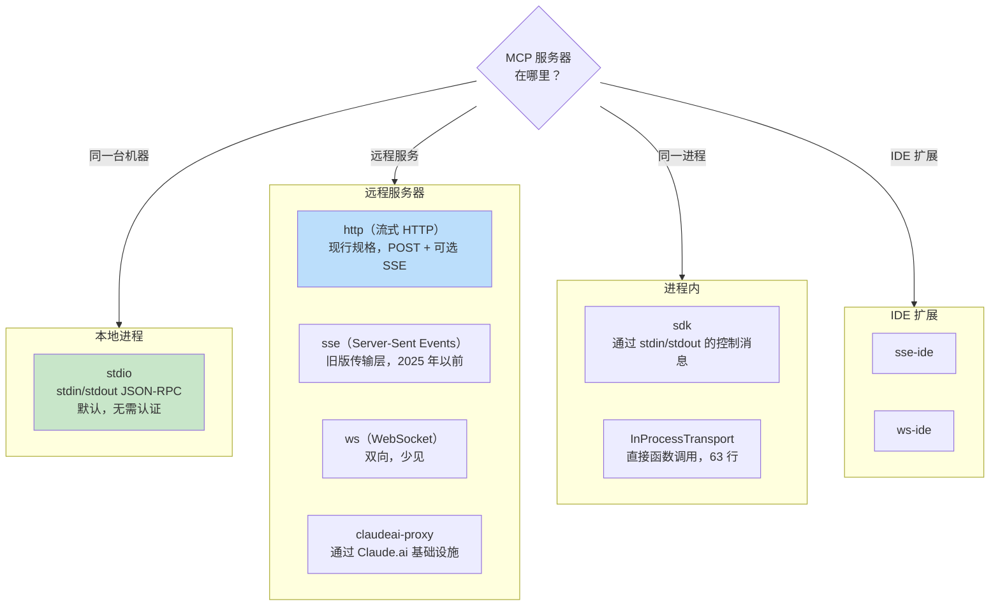
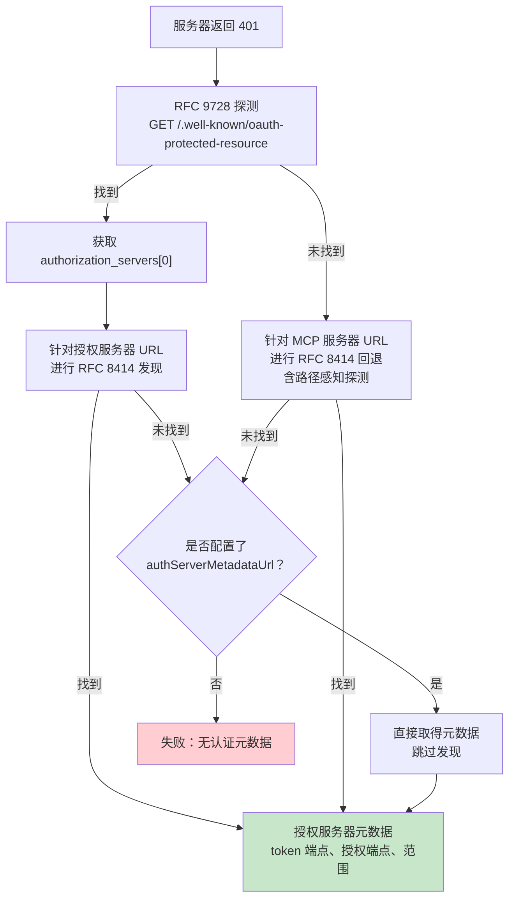

# 第十五章：MCP —— 通用工具协议

## 为何 MCP 的意义超越 Claude Code

本书其他每一章都在讨论 Claude Code 的内部机制。这一章不同。模型上下文协议（Model Context Protocol）是一个开放规格，任何代理都能实现，而 Claude Code 的 MCP 子系统是现存最完整的生产环境客户端之一。如果你正在构建一个需要调用外部工具的代理——任何代理、任何语言、任何模型——本章的模式可以直接套用。

核心命题很直接：MCP 定义了一个 JSON-RPC 2.0 协议，用于客户端（代理）与服务器（工具提供者）之间的工具发现与调用。客户端发送 `tools/list` 来发现服务器提供了什么，然后用 `tools/call` 来执行。服务器以名称、描述和 JSON Schema 输入参数来描述每个工具。这就是全部的契约。其他一切——传输层选择、认证、设置加载、工具名称规范化——都是将干净的规格变成能在现实世界中存活之物的实现工程。

Claude Code 的 MCP 实现横跨四个核心文件：`types.ts`、`client.ts`、`auth.ts` 和 `InProcessTransport.ts`。它们共同支持八种传输类型、七个设置范围、跨两个 RFC 的 OAuth 发现机制，以及一个让 MCP 工具与内置工具无法区分的工具封装层——与第六章介绍的 `Tool` 接口完全相同。本章将逐层讲解。

---

## 八种传输类型

任何 MCP 整合的第一个设计决策是客户端如何与服务器通信。Claude Code 支持八种传输层配置：



有三个设计选择值得关注。第一，`stdio` 是默认值——当 `type` 被省略时，系统假设是本地子进程。这向下兼容最早期的 MCP 设置。第二，fetch 包装器是栈式的：超时包装在最外层，步进侦测在中间，基础 fetch 在最内层。每个包装器只处理一个关注点。第三，`ws-ide` 分支有 Bun/Node 运行时的分歧——Bun 的 `WebSocket` 原生支持 proxy 和 TLS 选项，而 Node 需要 `ws` 包。

**何时使用哪种。** 对于本地工具（文件系统、数据库、自定义脚本），用 `stdio`——没有网络、无需认证，只有管道。对于远端服务，`http`（流式 HTTP）是现行规格的建议。`sse` 是旧版但部署广泛。`sdk`、IDE 和 `claudeai-proxy` 类型是各自生态系统的内部实现。

---

## 设置加载与范围划定

MCP 服务器设置从七个范围加载，合并后去重：

| 范围 | 来源 | 信任等级 |
|------|------|----------|
| `local` | 工作目录中的 `.mcp.json` | 需要用户核准 |
| `user` | `~/.claude.json` 的 mcpServers 字段 | 用户自行管理 |
| `project` | 项目层级设置 | 共享的项目设置 |
| `enterprise` | 受管企业设置 | 由组织预先核准 |
| `managed` | 外挂提供的服务器 | 自动发现 |
| `claudeai` | Claude.ai 网页接口 | 通过网页预先授权 |
| `dynamic` | 运行时注入（SDK） | 以程序方式加入 |

**去重是基于内容的，而非基于名称。** 两个名称不同但命令或 URL 相同的服务器会被识别为同一个服务器。`getMcpServerSignature()` 函数计算出一个正规键值：本地服务器为 `stdio:["command","arg1"]`，远端服务器为 `url:https://example.com/mcp`。外挂提供的服务器若其签名与手动设置匹配，则会被抑制。

---

## 工具封装：从 MCP 到 Claude Code

连接成功后，客户端调用 `tools/list`。每个工具定义被转换为 Claude Code 的内部 `Tool` 接口——与内置工具使用的接口完全相同。封装完成后，模型无法区分内置工具和 MCP 工具。

封装过程有四个阶段：

**1. 名称规范化。** `normalizeNameForMCP()` 将无效字符替换为底线。完整限定名称遵循 `mcp__{serverName}__{toolName}` 格式。

**2. 描述截断。** 上限为 2,048 个字符。OpenAPI 产生的服务器曾被观察到将 15-60KB 倾倒进 `tool.description`——单一工具每回合大约 15,000 个 token。

**3. Schema 直通。** 工具的 `inputSchema` 直接传递给 API。封装时不做转换、不做验证。Schema 错误在调用时才会浮现，而非注册时。

**4. 注解映射。** MCP 注解映射到行为标志：`readOnlyHint` 将工具标记为可安全并行执行（如第七章流执行器中所讨论的），`destructiveHint` 触发额外的权限审查。这些注解来自 MCP 服务器——恶意服务器可能将破坏性工具标记为只读。这是一个被接受的信任边界，但值得理解：用户选择加入了该服务器，而恶意服务器将破坏性工具标记为只读确实是一个真实的攻击向量。系统接受这个取舍，因为替代方案——完全忽略注解——将阻止合法服务器改善用户体验。

---

## MCP 服务器的 OAuth

远端 MCP 服务器通常需要认证。Claude Code 实现了完整的 OAuth 2.0 + PKCE 流程，包含基于 RFC 的发现机制、跨应用访问（Cross-App Access）和错误响应规范化。

### 发现链



`authServerMetadataUrl` 这个逃生口的存在是因为某些 OAuth 服务器两个 RFC 都没有实现。

### 跨应用访问（XAA）

当 MCP 服务器设置中有 `oauth.xaa: true` 时，系统通过身分提供者（Identity Provider）执行联合 token 交换——一次 IdP 登录即可解锁多个 MCP 服务器。

### 错误响应规范化

`normalizeOAuthErrorBody()` 函数处理违反规格的 OAuth 服务器。Slack 对错误响应返回 HTTP 200，错误消息埋在 JSON 本体中。该函数会窥探 2xx POST 响应的本体，当本体匹配 `OAuthErrorResponseSchema` 但不匹配 `OAuthTokensSchema` 时，将响应重写为 HTTP 400。它还会将 Slack 特有的错误码（`invalid_refresh_token`、`expired_refresh_token`、`token_expired`）规范化为标准的 `invalid_grant`。

---

## 进程内传输层

不是每个 MCP 服务器都需要是独立进程。`InProcessTransport` 类别使 MCP 服务器和客户端可以在同一进程中执行：

```typescript
class InProcessTransport implements Transport {
  async send(message: JSONRPCMessage): Promise<void> {
    if (this.closed) throw new Error('Transport is closed')
    queueMicrotask(() => { this.peer?.onmessage?.(message) })
  }
  async close(): Promise<void> {
    if (this.closed) return
    this.closed = true
    this.onclose?.()
    if (this.peer && !this.peer.closed) {
      this.peer.closed = true
      this.peer.onclose?.()
    }
  }
}
```

整个文件只有 63 行。两个设计决策值得关注。第一，`send()` 通过 `queueMicrotask()` 传递，以防止同步请求/响应循环中的栈深度问题。第二，`close()` 会级联到对等端，防止半开启状态。Chrome MCP 服务器和 Computer Use MCP 服务器都使用这个模式。

---

## 连接管理

### 连接状态

每个 MCP 服务器连接存在于五种状态之一：`connected`、`failed`、`needs-auth`（带有 15 分钟的 TTL 缓存，防止 30 个服务器各自独立发现同一个过期 token）、`pending` 或 `disabled`。

### 会话过期侦测

MCP 的流式 HTTP 传输层使用会话 ID。当服务器重新启动时，请求会返回 HTTP 404 并带有 JSON-RPC 错误码 -32001。`isMcpSessionExpiredError()` 函数检查这两个讯号——注意它使用字符串包含来侦测错误码，这务实但脆弱：

```typescript
export function isMcpSessionExpiredError(error: Error): boolean {
  const httpStatus = 'code' in error ? (error as any).code : undefined
  if (httpStatus !== 404) return false
  return error.message.includes('"code":-32001') ||
    error.message.includes('"code": -32001')
}
```

侦测到后，连接缓存清除并重试一次调用。

### 批次连接

本地服务器以每批 3 个连接（产生进程可能耗尽文件描述符），远端服务器以每批 20 个连接。React 上下文提供者 `MCPConnectionManager.tsx` 管理生命周期，将当前连接与新设置进行差异比对。

---

## Claude.ai 代理传输层

`claudeai-proxy` 传输层展示了一种常见的代理整合模式：通过中介连接。Claude.ai 的订阅者通过网页接口设置 MCP「连接器」，而 CLI 通过 Claude.ai 的基础设施路由，由其处理供应商端的 OAuth。

`createClaudeAiProxyFetch()` 函数在请求时捕获 `sentToken`，而非在 401 后重新读取。在多个连接器并发 401 的情况下，另一个连接器的重试可能已经刷新了 token。该函数还会在重新整理处理器返回 false 时检查并发刷新——即「ELOCKED 竞争」的场景，另一个连接器赢得了锁定文件的竞争。

---

## 超时架构

MCP 的超时是分层的，每一层防护不同的失败模式：

| 层级 | 持续时间 | 防护目标 |
|------|----------|----------|
| 连接 | 30 秒 | 无法到达或启动缓慢的服务器 |
| 每次请求 | 60 秒（每次请求重新计时） | 过期超时讯号的程序缺陷 |
| 工具调用 | 约 27.8 小时 | 合法的长时间操作 |
| 认证 | 每次 OAuth 请求 30 秒 | 无法到达的 OAuth 服务器 |

每次请求的超时值得强调。早期的实现在连接时建立单一的 `AbortSignal.timeout(60000)`。闲置 60 秒后，下一次请求会立即中止——因为讯号已经过期了。修正方式：`wrapFetchWithTimeout()` 为每次请求建立新的超时讯号。它还会规范化 `Accept` 请求头，作为防止运行时和代理服务器丢弃它的最后防线。

---

## 实践应用：将 MCP 整合到你自己的代理中

**从 stdio 开始，之后再增加复杂度。** `StdioClientTransport` 处理一切：产生进程、管道、终止。一行设置、一个传输类别，你就有了 MCP 工具。

**规范化名称并截断描述。** 名称必须匹配 `^[a-zA-Z0-9_-]{1,64}$`。加上 `mcp__{serverName}__` 前缀以避免冲突。描述上限为 2,048 个字符——否则 OpenAPI 产生的服务器会浪费上下文 token。

**延迟处理认证。** 在服务器返回 401 之前不要尝试 OAuth。大多数 stdio 服务器不需要认证。

**对内置服务器使用进程内传输层。** `createLinkedTransportPair()` 消除了你所控制之服务器的子进程开销。

**尊重工具注解并清理输出。** `readOnlyHint` 启用并行执行。对响应进行清理以防御恶意 Unicode（双向覆盖字符、零宽度连接符），这些可能误导模型。

MCP 协议刻意保持极简——两个 JSON-RPC 方法。在这些方法与生产环境部署之间的一切都是工程：八种传输层、七个设置范围、两个 OAuth RFC，以及超时分层。Claude Code 的实现展示了这种工程在规模化时的样貌。

下一章将探讨当代理超越 localhost 时会发生什么：远端执行协议让 Claude Code 在云端容器中运行、接受来自网页浏览器的指令，并通过注入凭据的代理服务器建立 API 流量隧道。