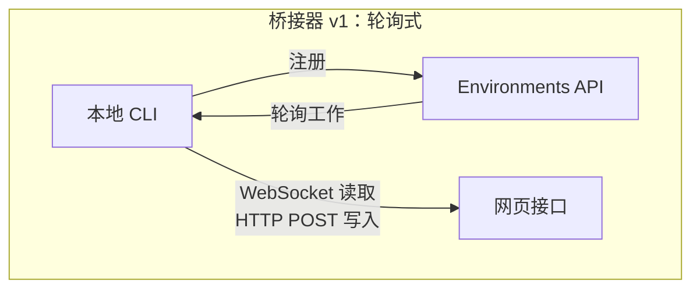
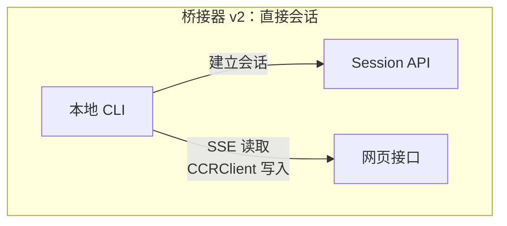
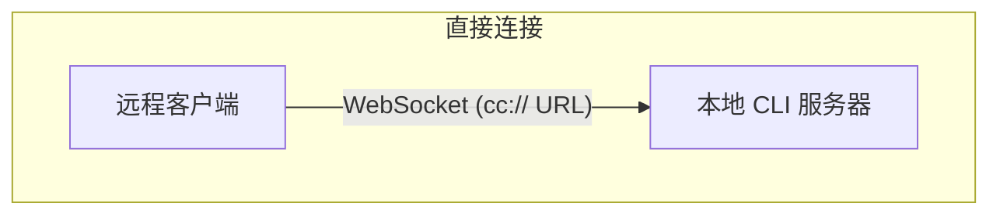
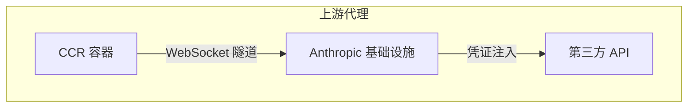

# 第十六章：远端控制与云端执行

## 代理延伸到 Localhost 之外

到目前为止，每一章都假设 Claude Code 在代码所在的同一台机器上执行。终端是本机的。文件系统是本机的。模型响应流回一个同时掌控键盘和工作目录的程序。

当你想从浏览器控制 Claude Code、在云端容器中执行它，或将它作为区域网络上的服务公开时，这个假设就崩溃了。代理需要一种方式来接收来自网页浏览器、移动应用或自动化管道的指令——将权限提示转发给不在终端前的人，并将 API 流量通过可能注入凭据或代替代理终止 TLS 的基础设施进行隧道传输。

Claude Code 用四个系统解决这个问题，每个系统处理不同的拓扑结构：

<div class="diagram-grid">









</div>

这些系统共享一个共同的设计哲学：读取和写入是非对称的，重新连接是自动的，失败会优雅降级。

---

## 桥接器 v1：轮询、分派、生成

v1 桥接器是基于环境的远端控制系统。当开发者执行 `claude remote-control` 时，CLI 向 Environments API 注册、轮询工作，并为每个会话生成一个子进程。

在注册之前，会执行一系列预检查：运行时功能闸门、OAuth token 验证、组织政策检查、过期 token 侦测（在连续三次使用同一过期 token 失败后的跨程序退避）、以及主动 token 重新整理——消除了大约 9% 原本在首次尝试时就会失败的注册。

注册完成后，桥接器进入长轮询循环。工作项目以会话（带有包含会话 token、API 基础 URL、MCP 设置和环境变量的 `secret` 字段）或健康检查的形式到达。桥接器将「无工作」的日志消息节流至每 100 次空轮询记录一次。

每个会话生成一个子 Claude Code 程序，通过 stdin/stdout 上的 NDJSON 通信。权限请求通过桥接器传输层流向网页接口，由用户批准或拒绝。往返必须在大约 10-14 秒内完成。

---

## 桥接器 v2：直接会话与 SSE

v2 桥接器消除了整个 Environments API 层——没有注册、没有轮询、没有确认、没有心跳、没有取消注册。动机是：v1 要求服务器在分派工作之前知道机器的能力。V2 将生命周期压缩为三个步骤：

1. **建立会话**：使用 OAuth 凭据 `POST /v1/code/sessions`。
2. **连接桥接器**：`POST /v1/code/sessions/{id}/bridge`。返回 `worker_jwt`、`api_base_url` 和 `worker_epoch`。每次 `/bridge` 调用都会递增 epoch——它本身「就是」注册。
3. **开启传输层**：SSE 用于读取，`CCRClient` 用于写入。

传输层抽象（`ReplBridgeTransport`）将 v1 和 v2 统一在一个共同接口之后，因此消息处理不需要知道它正在与哪一代通信。

当 SSE 连接因 401 而断开时，传输层通过新的 `/bridge` 调用用新鲜凭据重建，同时保留序号游标——不会遗失任何消息。写入路径使用逐实例的 `getAuthToken` 闭包而非程序范围的环境变量，防止 JWT 在并行会话间泄漏。

### FlushGate

一个微妙的排序问题：桥接器需要在接受来自网页接口的即时写入的同时传送对话历史。如果在历史刷新期间到达一个即时写入，消息可能会乱序传递。`FlushGate` 在刷新 POST 期间将即时写入排入队列，并在完成时按序清空它们。

### Token 重新整理与 Epoch 管理

v2 桥接器在 worker JWT 到期前主动重新整理。新的 epoch 告诉服务器这是同一个 worker，只是带有新鲜的凭据。Epoch 不匹配（409 响应）会被积极处理：两个连接都关闭，异常会回溯到调用者，防止脑裂情境。

---

## 消息路由与回音去重

两代桥接器共享 `handleIngressMessage()` 作为中央路由器：

1. 解析 JSON，规范化控制消息的键。
2. 将 `control_response` 路由到权限处理器，`control_request` 路由到请求处理器。
3. 对照 `recentPostedUUIDs`（回音去重）和 `recentInboundUUIDs`（重新传递去重）检查 UUID。
4. 转发已验证的用户消息。

### BoundedUUIDSet：O(1) 查询，O(capacity) 内存

桥接器有一个回音问题——消息可能会在读取流上被回音回来，或在传输层切换期间被重复传递。`BoundedUUIDSet` 是一个由环形缓冲区支撑的 FIFO 有界集合：

```typescript
class BoundedUUIDSet {
  private buffer: string[]
  private set: Set<string>
  private head = 0

  add(uuid: string): void {
    if (this.set.size >= this.capacity) {
      this.set.delete(this.buffer[this.head])
    }
    this.buffer[this.head] = uuid
    this.set.add(uuid)
    this.head = (this.head + 1) % this.capacity
  }

  has(uuid: string): boolean { return this.set.has(uuid) }
}
```

两个实例并行运作，每个容量为 2000。通过 Set 实现 O(1) 查询，通过环形缓冲区淘汰实现 O(capacity) 内存，无计时器或 TTL。未知的控制请求子类型会收到错误响应，而非沉默——防止服务器等待一个永远不会来的响应。

---

## 非对称设计：持久读取，HTTP POST 写入

CCR 协议使用非对称传输：读取通过持久连接（WebSocket 或 SSE）流动，写入通过 HTTP POST。这反映了通信模式中的根本性非对称。

读取是高频、低延迟、服务器发起的——在 token 流期间每秒数百条小消息。持久连接是唯一合理的选择。写入是低频、客户端发起的，且需要确认——每分钟几条消息，而非每秒。HTTP POST 提供可靠传递、通过 UUID 的幂等性，以及与负载平衡器的自然整合。

试图将它们统一在单一 WebSocket 上会产生耦合：如果 WebSocket 在写入期间断开，你需要重试逻辑，并且必须区分「未传送」和「已传送但确认遗失」。分离的通道让每个都能被独立优化。

---

## 远端会话管理

`SessionsWebSocket` 管理 CCR WebSocket 连接的客户端。其重连策略根据失败类型进行区分：

| 失败类型 | 策略 |
|---------|----------|
| 4003（未授权） | 立即停止，不重试 |
| 4001（找不到会话） | 最多重试 3 次，线性退避（压缩期间的瞬态问题） |
| 其他瞬态错误 | 指数退避，最多 5 次尝试 |

`isSessionsMessage()` 类型守卫接受任何带有字符串 `type` 字段的对象——刻意宽松。硬编码的允许清单会在客户端更新之前静默丢弃新的消息类型。

---

## 直接连接：本机服务器

直接连接是最简单的拓扑结构：Claude Code 作为服务器运行，客户端通过 WebSocket 连接。没有云端中介，没有 OAuth token。

会话有五种状态：`starting`、`running`、`detached`、`stopping`、`stopped`。中继数据持久化到 `~/.claude/server-sessions.json`，以便在服务器重启后恢复。`cc://` URL 方案为本机连接提供了干净的定址方式。

---

## 上游代理：容器中的凭据注入

上游代理运行在 CCR 容器内部，解决一个特定问题：将组织凭据注入来自容器的出站 HTTPS 流量——而该容器中的代理可能会执行不受信任的命令。

设置顺序经过精心安排：

1. 从 `/run/ccr/session_token` 读取会话 token。
2. 通过 Bun FFI 设置 `prctl(PR_SET_DUMPABLE, 0)`——阻止同 UID 的 ptrace 访问程序堆积。没有这个，一个被提示注入的 `gdb -p $PPID` 就能从内存中刮取 token。
3. 下载上游代理的 CA 凭据并与系统 CA 包串联。
4. 在临时埠上启动一个本机 CONNECT-to-WebSocket 中继器。
5. 取消链接 token 文件——token 现在只存在于堆积中。
6. 为所有子进程导出环境变量。

每个步骤都以开放失败方式处理：错误会禁用代理而非终止会话。这是正确的取舍——代理失败意味着某些整合将无法运作，但核心功能仍然可用。

### 手动 Protobuf 编码

通过隧道的字节被包装在 `UpstreamProxyChunk` protobuf 消息中。Schema 很简单——`message UpstreamProxyChunk { bytes data = 1; }`——Claude Code 用十行代码手动编码，而非引入 protobuf 运行时：

```typescript
export function encodeChunk(data: Uint8Array): Uint8Array {
  const varint: number[] = []
  let n = data.length
  while (n > 0x7f) { varint.push((n & 0x7f) | 0x80); n >>>= 7 }
  varint.push(n)
  const out = new Uint8Array(1 + varint.length + data.length)
  out[0] = 0x0a  // field 1, wire type 2
  out.set(varint, 1)
  out.set(data, 1 + varint.length)
  return out
}
```

十行代码取代了一整个 protobuf 运行时。单一字段的消息不值得引入一个依赖——位操作的维护负担远低于供应链风险。

---

## 实践应用：设计远端代理执行

**分离读取和写入通道。** 当读取是高频流而写入是低频 RPC 时，统一它们会产生不必要的耦合。让每个通道独立地失败和恢复。

**限制你的去重内存。** BoundedUUIDSet 模式提供固定内存的去重。任何至少一次传递系统都需要一个有界的去重缓冲区，而非无界的 Set。

**让重连策略与失败信号成正比。** 永久性失败不应重试。瞬态失败应带退避重试。模糊的失败应以低上限重试。

**在对抗性环境中让秘密只存在于堆积中。** 从文件读取 token、禁用 ptrace、然后取消链接文件——同时消除了文件系统和内存检查的攻击向量。

**辅助系统以开放方式失败。** 上游代理以开放方式失败，因为它提供的是增强功能（凭据注入），而非核心功能（模型推论）。

The remote execution systems encode a deeper principle: the agent's core loop (Chapter 5) should be agnostic about where instructions come from and where results go. The bridge, Direct Connect, and upstream proxy are transport layers. The message handling, tool execution, and permission flows above them are identical regardless of whether the user is sitting at the terminal or on the other side of a WebSocket.

The next chapter examines the other operational concern: performance -- how Claude Code makes every millisecond and token count across startup, rendering, search, and API costs.
