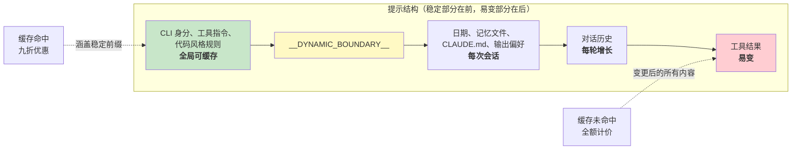

# 第十七章：性能 —— 每一毫秒与每一个 Token 都很重要

## 资深工程师的实战手册

代理式系统中的性能优化不是单一问题，而是五个：

1. **启动延迟** —— 从按下按键到产出第一个有用输出的时间。用户会放弃那些启动起来感觉很慢的工具。
2. **Token 效率** —— 上下文窗口中有用内容与额外开销的占比。上下文窗口是最受限的资源。
3. **API 成本** —— 每一轮对话的美元金额。提示缓存可以将此降低 90%，但前提是系统必须在各轮之间维持缓存稳定性。
4. **渲染吞吐量** —— 流输出期间的每秒帧数。第十三章涵盖了渲染架构；本章涵盖让它保持快速的性能测量与优化。
5. **搜索速度** —— 在每次按键时，从一个包含 270,000 个路径的代码库中找到一个文件所需的时间。

Claude Code 以从显而易见（记忆化）到精妙（用 26 位图预过滤模糊搜索）的各种技术来攻克这五大问题。关于方法论的说明：这些不是理论上的优化。Claude Code 内置了 50 多个启动分析检查点，对 100% 的内部用户和 0.5% 的外部用户进行取样。以下每一项优化都是由此仪器化产生的数据所驱动，而非靠直觉。

---

## 在启动时节省毫秒

### 模块级的 I/O 并行化

入口点 `main.tsx` 刻意违反了「不要在模块作用域产生副作用」的原则：

```typescript
profileCheckpoint('main_tsx_entry');
startMdmRawRead();       // 启动 plutil/reg-query 子进程
startKeychainPrefetch();  // 同时启动两个 macOS 钥匙串读取
```

两个 macOS 钥匙串项目否则会花费约 65ms 的串行同步子进程启动。通过在模块级以即发即忘的 promise 同时启动两者，它们与约 135ms 的模块加载并行执行——在此期间 CPU 原本只是闲置的。

### API 预连接

`apiPreconnect.ts` 在初始化期间向 Anthropic API 发出一个 `HEAD` 请求，让 TCP+TLS 握手（100-200ms）与设置工作重叠。在互动模式下，重叠是无上限的——连接在用户打字时就已暖机。该请求在 `applyExtraCACertsFromConfig()` 和 `configureGlobalAgents()` 之后发出，因此暖好的连接使用的是正确的传输配置。

### 快速路径分派与延迟导入

CLI 入口点包含针对专门子命令的提前返回路径——`claude mcp` 永远不会加载 React REPL，`claude daemon` 永远不会加载工具系统。重型模块仅在需要时才通过动态 `import()` 加载：OpenTelemetry（约 400KB + 约 700KB gRPC）、事件记录、错误对话框、上游代理。`LazySchema` 将 Zod schema 的构建延迟到首次验证时，将成本推移到启动之后。

---

## 在上下文窗口中节省 Token

### 插槽保留：默认 8K，截断时升级至 64K

影响最大的单一优化：

默认的输出插槽保留为 8,000 个 token，在截断时升级至 64,000。API 为模型的响应保留 `max_output_tokens` 的容量。SDK 的默认值为 32K-64K，但生产数据显示 p99 输出长度为 4,911 个 token。默认值超额保留了 8-16 倍，每轮浪费 24,000-59,000 个 token。Claude Code 限制在 8K，并在罕见的截断时（不到 1% 的请求）以 64K 重试。对于一个 200K 的窗口，这是可用上下文 12-28% 的改善——而且是免费的。

### 工具结果预算化

| 限制 | 值 | 用途 |
|------|-----|------|
| 每个工具的字符数 | 50,000 | 超过时将结果持久化到磁盘 |
| 每个工具的 token 数 | 100,000 | 约 400KB 文字上限 |
| 每则消息的汇总值 | 200,000 字符 | 防止 N 个并行工具在一轮中耗尽预算 |

每则消息的汇总值是关键洞见。没有它，「读取 src/ 中的所有文件」可能产生 10 个并行读取，每个返回 40K 字符。

### 上下文窗口大小调整

默认的 200K token 窗口可通过模型名称上的 `[1m]` 后缀或实验处理扩展至 1M。当使用量接近限制时，4 层压缩系统会渐进式地摘要较旧的内容。Token 计数以 API 实际的 `usage` 字段为准，而非客户端的估算——这涵盖了提示缓存抵扣、思考 token 和服务器端转换。

---

## 节省 API 调用的费用

### 提示缓存架构



Anthropic 的提示缓存基于精确的前缀匹配运作。如果前缀中有单一个 token 发生变化，其后的所有内容都是缓存未命中。Claude Code 将整个提示结构化，使稳定部分在前、易变部分在后。

当 `shouldUseGlobalCacheScope()` 返回 true 时，动态边界之前的系统提示项目会获得 `scope: 'global'` —— 两个执行相同 Claude Code 版本的用户共享前缀缓存。当存在 MCP 工具时会禁用全局范围，因为 MCP schema 是每个用户各自不同的。

### 黏性闩锁字段

五个布尔字段使用「一旦开启就不关闭」的模式——一旦为 true，在整个会话期间保持为 true：

| 闩锁字段 | 防止的问题 |
|----------|-----------|
| `promptCache1hEligible` | 会话中途的超额切换改变缓存 TTL |
| `afkModeHeaderLatched` | Shift+Tab 切换导致缓存失效 |
| `fastModeHeaderLatched` | 冷却期进出导致缓存双重失效 |
| `cacheEditingHeaderLatched` | 会话中途的配置切换导致缓存失效 |
| `thinkingClearLatched` | 在确认缓存未命中后翻转思考模式 |

每个闩锁对应一个 header 或参数，如果在会话中途变更，将会导致约 50,000-70,000 个已缓存提示 token 的缓存失效。这些闩锁牺牲了会话中途的切换能力，以保全缓存。

### 记忆化的会话日期

```typescript
const getSessionStartDate = memoize(getLocalISODate)
```

没有这个，日期会在午夜变更，导致整个已缓存前缀失效。日期过期只是外观问题；缓存失效则会重新处理整个对话。

### 区段记忆化

系统提示区段使用两层缓存。大多数内容使用 `systemPromptSection(name, compute)`，缓存到 `/clear` 或 `/compact` 为止。核武级选项 `DANGEROUS_uncachedSystemPromptSection(name, compute, reason)` 每轮都重新计算——命名惯例迫使开发者记录「为什么」需要破坏缓存。

---

## 在渲染中节省 CPU

第十三章深入涵盖了渲染架构——压缩的类型数组、基于池的字符串驻留、双缓冲和存储格层级的差异比对。这里我们聚焦于让它保持快速的性能测量和自适应行为。

终端渲染器通过 `throttle(deferredRender, FRAME_INTERVAL_MS)` 节流在 60fps。当终端失去焦点时，间隔加倍为 30fps。滚动排放帧以四分之一间隔运行，以达到最大滚动速度。这种自适应节流确保渲染永远不会消耗超过必要的 CPU。

React 编译器（`react/compiler-runtime`）在整个代码库中自动记忆化组件渲染。手动的 `useMemo` 和 `useCallback` 容易出错；编译器从构造上就做对了。预分配的冻结对象（`Object.freeze()`）消除了常见渲染路径上值的内存配置——在替代屏幕模式下每帧省下一次配置，累积到数千帧就很可观。

完整的渲染管道细节——`CharPool`/`StylePool`/`HyperlinkPool` 字符串驻留系统、blit 优化、损坏矩形追踪、OffscreenFreeze 组件——请参阅第十三章。

---

## 在搜索中节省内存和时间

模糊文件搜索在每次按键时执行，搜索 270,000 多个路径。三层优化将它保持在几毫秒以内。

### 位图预过滤器

每个索引路径都有一个 26 位的位图，记录它包含哪些小写字母：

```typescript
// 伪代码——说明 26 位元点阵图的概念
function buildCharBitmap(filepath: string): number {
  let mask = 0
  for (const ch of filepath.toLowerCase()) {
    const code = ch.charCodeAt(0)
    if (code >= 97 && code <= 122) mask |= 1 << (code - 97)
  }
  return mask  // 每个位元代表 a-z 的某个字母是否存在
}
```

搜索时：`if ((charBits[i] & needleBitmap) !== needleBitmap) continue`。任何缺少查询字母的路径都会立即失败——一次整数比较，不需要字符串操作。拒绝率：对于「test」这类广泛查询约 10%，对于包含罕见字母的查询则超过 90%。成本：每个路径 4 字节，270,000 个路径约 1MB。

### 分数上界拒绝与融合 indexOf 扫描

通过位图的路径在昂贵的边界/驼峰式命名评分之前，会先面临分数上界检查。如果最佳情况的分数无法超越当前的 top-K 门槛，该路径就会被跳过。

实际的匹配将位置查找与间隔/连续加分计算融合在一起，使用 `String.indexOf()`，这在 JSC（Bun）和 V8（Node）中都是 SIMD 加速的。引擎优化过的搜索比手动的字符循环快得多。

### 可部分查询的异步索引

对于大型代码库，`loadFromFileListAsync()` 每约 4ms 的工作后就让出事件循环（基于时间而非数量——适应机器速度）。它返回两个 promise：`queryable`（第一个区块完成时解析，启用立即的部分结果）和 `done`（完整索引完成）。用户可以在文件列表可用后的 5-10ms 内就开始搜索。

让出检查使用 `(i & 0xff) === 0xff` —— 一个无分支的模 256 运算，以分摊 `performance.now()` 的成本。

---

## 记忆相关性旁路查询

有一个优化位于 token 效率和 API 成本的交叉点。如第十一章所述，记忆系统使用一个轻量级的 Sonnet 模型调用——而非主要的 Opus 模型——来选择要包含哪些记忆文件。其成本（在快速模型上最多 256 个输出 token）与不包含无关记忆文件所省下的 token 相比微不足道。单一个无关的 2,000 token 记忆文件浪费的上下文成本，就超过旁路查询的 API 调用成本。

---

## 推测性工具执行

`StreamingToolExecutor` 在工具流进来时就开始执行，在完整响应完成之前。只读工具（Glob、Grep、Read）可以并行执行；写入工具需要独占访问。`partitionToolCalls()` 函数将连续的安全工具分组为批次：[Read, Read, Grep, Edit, Read, Read] 变成三个批次——[Read, Read, Grep] 并行，[Edit] 序列，[Read, Read] 并行。

结果始终按原始工具顺序产出，以确保模型推理的确定性。一个兄弟中止控制器会在 Bash 工具出错时终止并行子进程，防止资源浪费。

---

## 流与原始 API

Claude Code 使用原始流 API 而非 SDK 的 `BetaMessageStream` 辅助工具。该辅助工具在每个 `input_json_delta` 上调用 `partialParse()`——在工具输入长度上是 O(n^2)。Claude Code 累积原始字符串，在区块完成时才解析一次。

流看门狗（`CLAUDE_STREAM_IDLE_TIMEOUT_MS`，默认 90 秒）会在没有区块到达时中止并重试，当代理失败时回退到非流的 `messages.create()`。

---

## 实践应用：代理式系统的性能

**审核你的上下文窗口预算。** 你的 `max_output_tokens` 保留值与实际 p99 输出长度之间的差距就是被浪费的上下文。设置一个紧凑的默认值，在截断时再升级。

**为缓存稳定性而设计。** 你提示中的每个字段不是稳定的就是易变的。稳定的放前面，易变的放后面。将对话中途任何对稳定前缀的变更视为一个有美元成本的 bug。

**并行化启动 I/O。** 模块加载是 CPU 密集的。钥匙串读取和网络握手是 I/O 密集的。在导入之前启动 I/O。

**对搜索使用位图预过滤器。** 在昂贵的评分之前，一个廉价的预过滤器拒绝 10-90% 的候选项，以每个项目 4 字节的成本就能获得显着的性能提升。

**在重要的地方进行测量。** Claude Code 有 50 多个启动检查点，内部取样 100%、外部取样 0.5%。没有测量的性能工作就是瞎猜。

---

最后一个观察：这些优化大多不是算法上多复杂的。位图预过滤器、环形缓冲区、记忆化、字符串驻留——这些都是电脑科学的基本功。精妙之处在于知道在哪里应用它们。启动分析器告诉你毫秒花在哪里。API 的 usage 字段告诉你 token 花在哪里。缓存命中率告诉你钱花在哪里。先测量，再优化，始终如此。